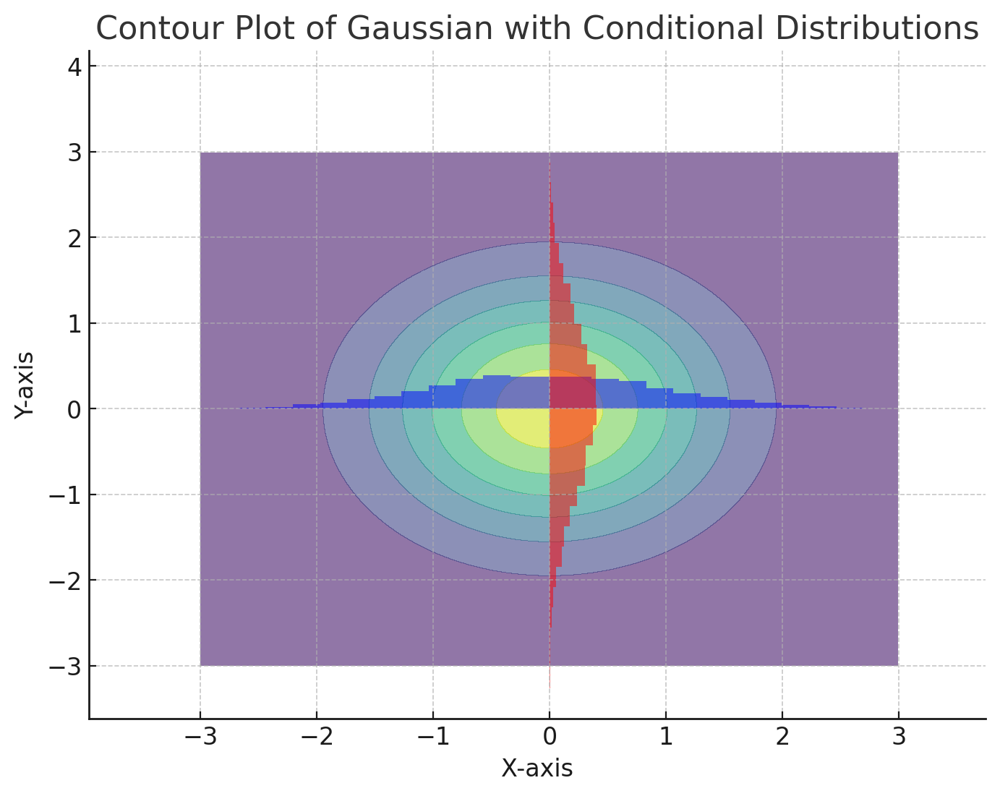
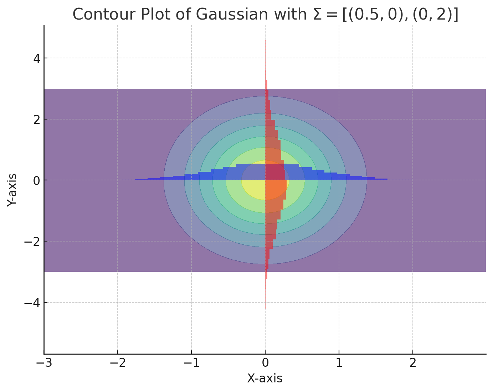
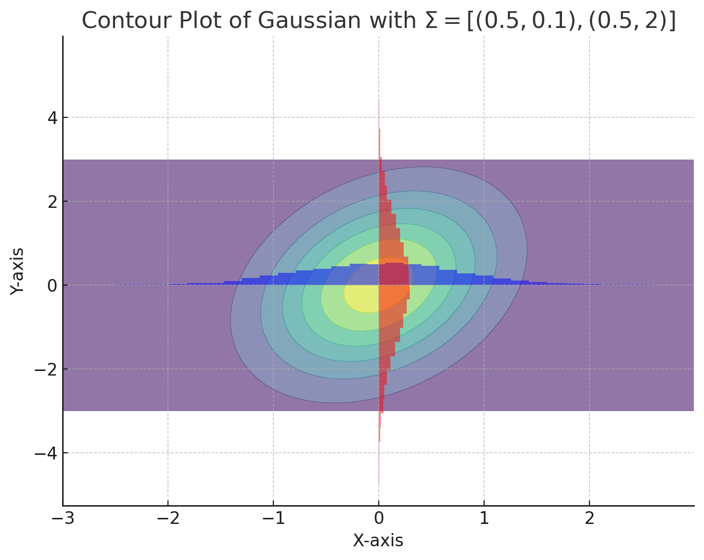
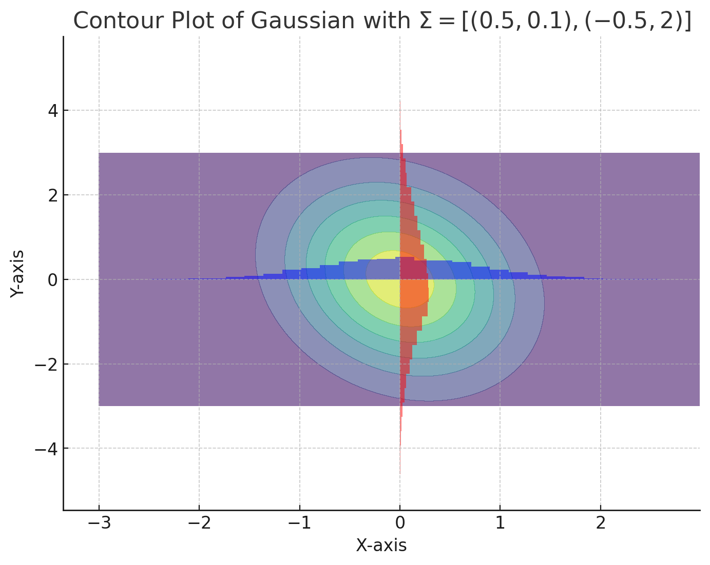

### 1.(a)
- (i)
  *  在这个问题中，我选择词袋模型BoW，每一个文档被表示为一个向量。向量中的每个元素是该词汇出现的次数。向量的维度取决于词汇表的长度。
  * In this case, I would like to choose the BoW model, and every document will be represented as a vector. Each element in the vector is the number of times the word appears. Moreover, the dimension of each vector deponds on the length of vocabulary list.
- (ii)
  * $L_0$ norm is defined as the number of non-zero element in the vector. Here, there are the number of occurrences of the word. 
- (iii)
    * $L_p(\mathbf{d}, \mathbf{d'}) = \left( \sum_{i=1}^{n} |d_i - d'_i|^p \right)^{\frac{1}{p}}$
- (iv)
    * When p=2 , this is $L_2$ norm, which is the square root of the sum of the difference of the vector, and it would measure the similarity between the current vector and given vector.
### 1.(b)
- (i)
   * $f(x)=(x-\mu)^T\Sigma^{-1}(x-\mu)$ 是多变量高斯（或正态）分布中的二次型部分。这个公式是多变量高斯分布的概率密度函数（PDF）的核心组成部分。$\mu$是均值向量，$\Sigma$是协方差矩阵
   * 协方差矩阵, 非对角线元素为0，则他们之间互相独立。
   * 步骤：
     * 定义高斯分布参数$\mu,\Sigma$ 
     * 计算高斯分布的值`rv = np.random.multivariate_normal(mu, sigma)`
     * 绘制等高线图`contourf(x, y, np.exp(-0.5 * (x**2 + y**2))`
     * 使用 plt.hist 分别绘制沿X轴和Y轴的条件分布直方图。
     * `plt.hist(rv[:, 0], bins=30, density=True, alpha=0.5,color='blue') `
  
    *  
    *  
- (ii)
  * $\Sigma=[(1,0),(0,1)]$这是一个标准正态分布，其中两个变量相互独立且方差相同。在这种情况下，两个主成分的方差是相同的。因此，使用PCA简化为单维分布会丢失一半的信息。
  * This is a standard normal distribution in which two variables are independent of each other and have the same variance. In this case, the variances of the two principal components are the same. Therefore, using PCA to simplify to a unidimensional distribution loses half of the information.
  * $\Sigma=[(0.5,0),(0,2)]$这个矩阵有不同的方差值。第二个变量的方差较大。在这种情况下，大部分方差集中在第二个变量上，因此可以用PCA简化为单维分布，且不会损失太多信息。
  * This matrix has different values of variance. The second variable has a higher variance. In this case, most of the variance is concentrated in the second variable, so it can be reduced to a unidimensional distribution using PCA without losing much information.
  * $\Sigma=[(0.5,0.1),(0.5,2)]$这个矩阵显示两个变量之间有轻微的正相关性。虽然有轻微的相关性，但由于第二个变量的方差仍然较大，大部分信息可能集中在一个方向上，因此PCA可能仍然能有效地将其简化为单维分布。
  * This matrix shows a slight positive correlation between the two variables.Although there is a slight correlation, PCA may still be effective in reducing it to a one-dimensional distribution since the variance of the second variable is still large and most of the information may be concentrated in one direction.
  * $\Sigma=[(0.5,0.1),(-0.5,2)]$这个矩阵在数学上是正定的,且两个方差差距较大，适用于PCA。特征值近似为方差，且行列式大于0，判断正定。This matrix is mathematically positive definite,and the difference between the two variances is large for PCA.The eigenvalues are approximated by the variances and the determinant is greater than 0. Positive definite is judged.

### 1.(c)
- (i)
1. **输入实例 Input Instances**：
   - The input features of the training samples are represented as $x_i \in \mathbb{R}^n$，Here, n is dimension of feature vector。
   - The known output value for each sample is represented as $y_i \in \mathbb{R}$。

2. **参数向量 Parameter Vectors**：
   - The parameters of the linear regression model are given by the weight vector $w \in \mathbb{R}^n$ and the bias term $b \in \mathbb{R}$。
   - For each training sample i, the predicted output of the model can be expressed as $\hat{y}_i = w^T x_i + b$。

3. **平方损失函数 Squared Loss Function**:
    
    For each training instance i, the squared loss function is denoted as
    $$L_i(w, b) = \frac{1}{2} (\hat{y}_i - y_i)^2$$  
    Here $\frac{1}{2}$ is used to simplify the computation in the subsequent derivation:

4. **梯度计算 Gradient Calculation**: 

    The core of stochastic gradient descent is to update the parameters w and b at each step and compute the gradient of the loss function $L_i(w, b)$ with respect to the parameters w and b. The loss function $L_i(w, b)$ is used to calculate the gradient of the loss function.

- **w gradient**：{\nabla}
  $$ \nabla_{w} L_i(w, b) = (\hat{y}_i - y_i) x_i $$
  $\hat{y}_i - y_i$ is the difference between the predicted and actual values.

- **b gradient**：
  $$ \nabla_{b} L_i(w, b) = \hat{y}_i - y_i $$

5. **更新规则 Update Rule**:
 
    Using the gradient calculated above, we can update the weights and bias. Let the learning rate be $\alpha$ and the update rule is as follows:：

- Update w：$w \leftarrow w - \alpha \nabla_{w} L_i(w, b)$
- Update b：$b \leftarrow b - \alpha \nabla_{b} L_i(w, b)$

    These updates are typically performed over multiple training **epochs**, each of which randomly selects samples across the training set to update the parameters.

6. **输出实例 Output Instances**：
    * testing vector is $x_t$ final parameters are $\hat w,\hat b$ 
    * final output is $y_t = \hat w^T x_t + \hat b$ 
- (ii)
  * use the polynomial instead of the linear regression.
  * For example, it's a simple linear regression model $y=w_0+w_1x$, and we can extend it by increasing the high powers of x, such as $y=w_0+w_1x+w_2x^2+w_3x^3+w_4x^4$
  * For alleviating this issue, we can use normalisation into loss function to limit the complexity of the model,such as L1 or L2 normalisation.
  * Moreover, we also would use cross-validation to assess the generalisation ability of the model and choose an appropriate polynomial number of times. This can help find a model with a trade-off between bias and variance.
  * Finally, we additionally use some feature selection methods to remove unimportant features.

- (iii)
  * I perfer to choose a) method. Due to with increase of t, the learning rate $\alpha$ would be small. It can help the algorithm to move forward quickly in the early stages and make finer adjustments in the later stages.
