#  优化 optimisation
## 概念 notion of word
derivative of function 导函数  
polynomial 多项式  
parameters and objective function 参数和目标函数  
synthesiser 合成器  
constraint 约束  
geometric median 几何中值

# Introduction 
**Optimisation** is the process of adjusting things to make them better. In computer science, we want to do this *automatically* by a algorithm. An enormous number of problems can be framed as optimisation, and there are a plethora of algorithms which can then do the automatic adjustment *efficiently*, in that they find the best adjustments in few steps. In this sense, *optimisation is search*, and optimisation algorithms search efficiently using mathematical structure of the problem space.

**优化** 是调整事物以使其变得更好的过程。在计算机科学中，我们希望通过算法“自动”做到这一点。大量的问题可以被视为优化，并且有大量的算法可以“有效”地进行自动调整，因为它们只需几个步骤即可找到最佳调整。从这个意义上说，优化就是搜索，优化算法使用问题空间的数学结构进行有效搜索。

**parameters**: the things we can adjust, which might be a scalar or vector or other array of values, denoted $\theta$. The parameters exist in a **parameter space** -- the set of all possible configurations of parameters denoted $\Theta$. This space is often a **vector space** like $\Re ^n$, but doesn't need to be.

**参数**：我们可以调整的事物，可能是一个标量、向量或其他值数组，表示为 $\theta$。参数存在于一个参数空间中——所有可能的参数配置集合表示为 $\Theta$。这个空间通常是一个向量空间，如 $\mathbb{R}^n$，但不必须是。  

**the objective function**: a function that maps the parameters onto a *single numerical measure* of how good the configuration is. $L(\theta)$.  The output of the objective function is a single scalar. The objective function is sometimes called the *loss function*, the *cost function*, *fitness function*, *utility function*, *energy surface*, all of which refer to (roughly) the same concept. It is a quantitative ("objective") measure of "goodness".  

**目标函数**：一个将参数映射到配置好坏的单一数值度量上的函数，表示为 $L(\theta)$。目标函数的输出是一个单一的标量。目标函数有时被称为损失函数、成本函数、适应度函数、效用函数、能量面，所有这些都是指（大致）相同的概念。它是“好坏”的定量（“客观”）度量。  

$$\theta^* = \argmin_{\theta\in\Theta} L(\theta)$$  

* $\theta^*$ is the configuration that we want to find; the one for which the objective function is lowest. 
* $\Theta$ is the set of all possible configurations that $\theta$ could take on, e.g. $\Re ^N$.   

$\theta^*$ 是我们想要找到的配置；也就是使目标函数最小值

$\Theta$ 是所有可能的 $\theta$ 配置的集合，例如 $\mathbb{R}^N$  

在这我们为了避免混淆，常用loss函数来代替目标函数这一概念

**constraints**: the limitations on the parameters. This defines a region of the parameter space that is feasible, the **feasible set** or **feasible region**. For example, the synthesizer above has knobs with a fixed physical range, say 0-10; it isn't possibl e to turn them up to 11. Most optimisation problems have constraints of some kind;   

**约束**：参数的限制。这定义了参数空间中可行的区域，即可行集或可行区域。例如，上面的合成器有固定物理范围的旋钮，比如 0-10；它不可能调到 11。大多数优化问题都有某种约束；  

### Loss的基本定义
正如这个例子所示，通常会把问题表达成目标函数是输出与参考之间的距离测量的形式。不是每个目标函数都有这种形式，但许多目标函数确实如此。  

也就是说，我们有某个函数 $y' = f(\vec{x};\theta)$，它从输入 $\vec{x}$ 产生输出，该输入受一组参数 $\theta$ 的控制，并且我们测量输出和某个参考值 $y$ 之间的差异（例如，使用向量范数）：

$$ \ L(\theta) = \|y^\prime - y\| = \|f(\vec{x};\theta) - y\| $$  

这里，$L(\theta)$ 是根据参数 $\theta$ 定义的损失函数，$| \cdot |$ 是某种向量范数，用于度量 $f(\vec{x};\theta)$（模型的预测或输出）与目标 $y$（实际值或期望值）之间的差异或距离。在优化过程中，我们的目标是找到参数 $\theta$ 的配置，以使得这个损失函数的值最小，从而使输出尽可能接近参考值。  

这在逼近问题中非常常见，我们想找到一个函数来逼近一组测量观察值。这是机器学习的核心问题。

注意，记号 $f(\vec{x};\theta)$ 意味着函数 $f$ 的输出既依赖于某个（向量）输入 $\vec{x}$，也依赖于参数向量 $\theta$。优化过程只调整 $\theta$，而在优化期间认为向量 $\vec{x}$ 是固定的（例如，它可能代表一系列实世界的测量值）。 

### 验证
对于验证loss函数来说，验证会将消耗一定的计算能力，因此会有时间成本。

这意味着一个好的优化算法将通过少量的查询（评估目标函数）找到参数的最优配置。为了做到这一点，必须有数学上的结构可以帮助指导搜索。如果完全没有任何结构，最好的办法可能就是随机猜测参数配置，并在一定次数的迭代后选择成本最低的配置。这通常不是一个可行的方法。

因此，优化算法经常利用目标函数的某种结构来指导搜索，这可能包括使用梯度（在可微分的情况下）、凸性（在凸优化问题中）、或者是其他一些可以指示参数调整方向的特性。算法可能还会利用历史信息来预测参数的更好配置，从而减少目标函数评估的次数。在现代优化算法中，如贝叶斯优化等，甚至会构建目标函数的代理模型（surrogate model），在代理模型上进行评估和搜索，从而减少对实际目标函数评估的需求。

## Discrete vs. continuous 离散 vs 连续

确实，当参数位于连续空间（通常是 $\mathbb{R}^n$）中时，问题就是连续优化问题；如果参数是离散的，那么问题就是离散优化问题。连续优化通常更容易处理，因为我们可以利用平滑性和连续性的概念。

**优化的属性**
每个优化问题都有两个部分：
- 参数，可以调整的事物。  
- 目标函数，用来衡量一组特定参数的好坏。  

一个优化问题通常也包括：
- 约束，定义了参数的可行集。
- 目标函数是， 一个关于参数的函数，它返回一个单一的标量值，表示该参数集的优良程度。

## Example 1： throwing a stone
例如，如果我想要优化我能将石头扔多远，我可能能够调整投掷角度。这是我可以调整的参数（在这种情况下，只有一个参数 $\theta=[\alpha]$）。

目标函数必须是一个依赖于这个参数的函数。我将不得不模拟投掷球以计算它投掷的距离，并尝试让它投得越来越远。 

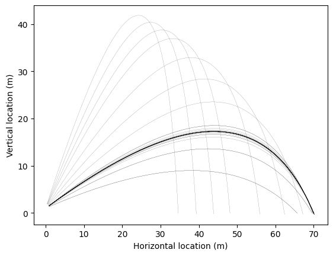

### Focus: continuous optimisation in real vector spaces
### 重点： 实向量空间中的连续优化

本课程将专注于在 $\Re^n$ 中连续问题的优化。即  
$$\theta \in \Re^n = [\theta_1, \theta_2, \dots, \theta_n],$$ 
并且优化问题是：
$$\theta^* = \argmin_{\theta \in \Re^n} L(\theta), \text{subject to constraints}$$

这是在连续向量空间中搜索的问题，以找到使 $L(\theta)$ 最小的点。我们通常会遇到目标函数在该向量空间中是平滑和连续的问题；注意，参数是连续空间的元素，并不必然意味着目标函数在该空间中是连续的。 

一些优化算法是迭代的，它们生成越来越接近解决方案的近似值。其他方法是直接的，比如线性最小二乘法，涉及一步找到最小值。在本课程中，我们将主要关注迭代的、近似的优化。

### Geometric median: optimisation in  $\Re^2$
### 几何中值： 在$\Re^2$的优化
找到一个 `>1D` 数据集的中位数。标准的中位数是通过排序然后选择中间元素计算的（对于偶数大小的数据集有各种规则）。这对于更高维度不适用，而且没有简单直接的算法。但中位数有一个简单的定义：它是最小化到数据集中所有向量的距离和的向量。  

一个非常简单的优化例子是找到一个点，该点最小化到一组其他点的距离（关于某种规范）。我们可以定义：

参数 $\theta=[x, y\dots]$，二维空间中的位置。  
目标函数 一个点与一系列目标点 $\vec{x_i}$ 之间距离的总和：

$$
L(\theta) = \sum_i ||\theta - \vec{x_i}||_2
$$

这将尝试找到空间中的一个点（表示为 $\theta$），该点最小化到目标点的距离。我们可以从某个随机初始条件（对 $\theta$ 的猜测）开始解决这个问题：

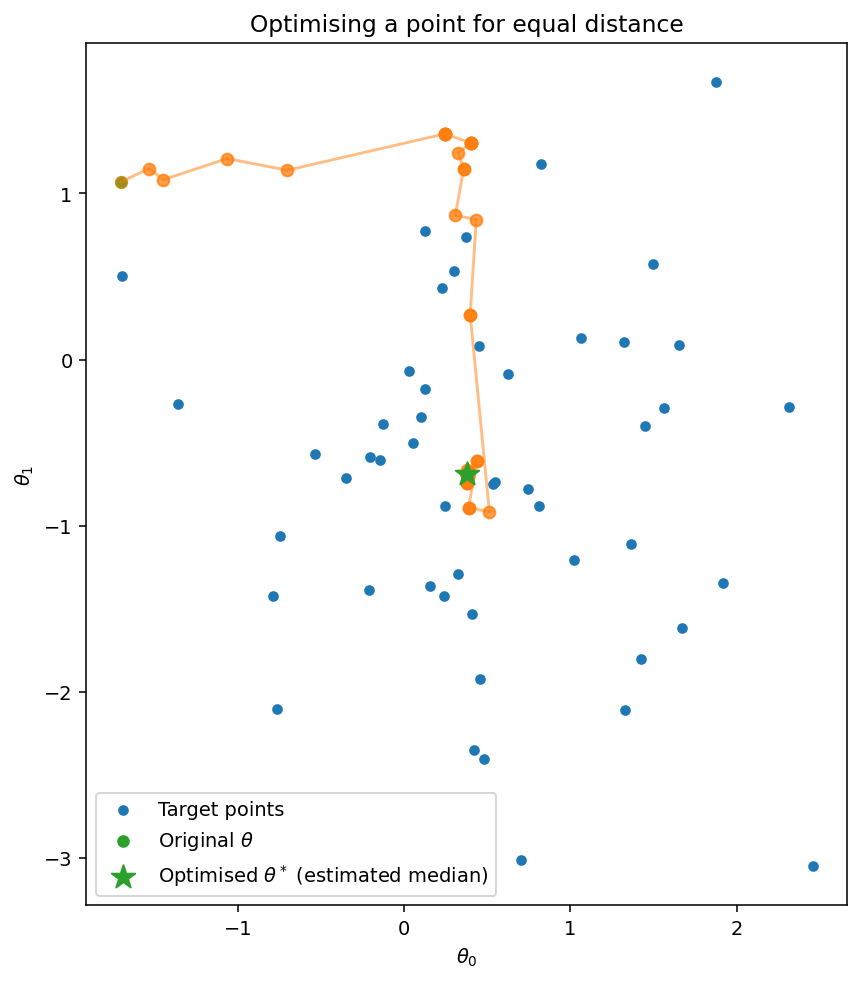

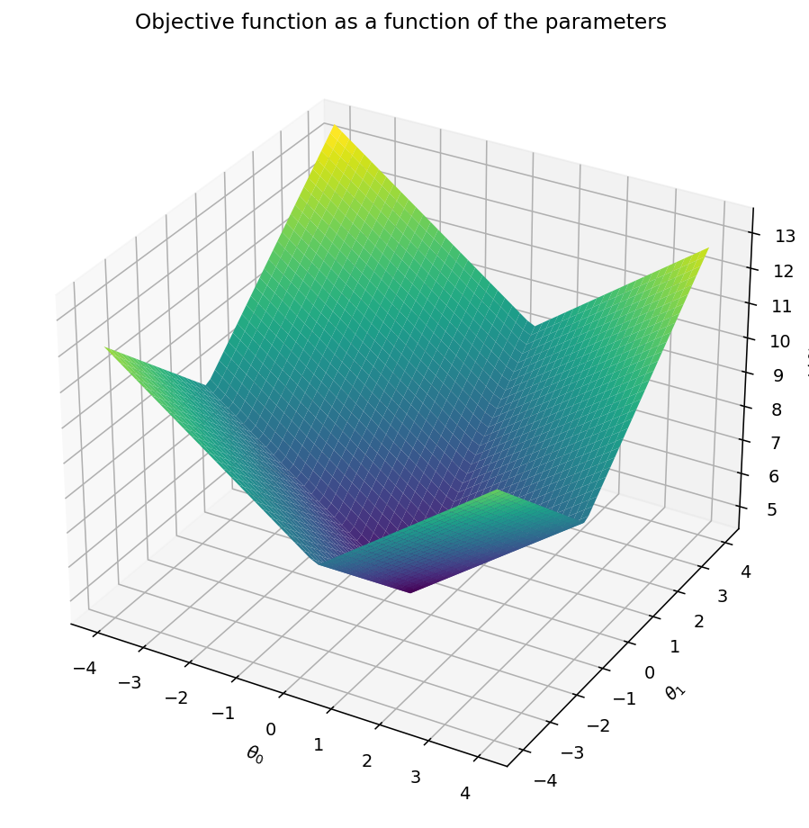

上述图：$\theta_1$ 对应x  ; $\theta_2$ 对应y

### optimisation in  $\Re^n$
### 在$\Re^n$的优化
我们可以同样容易地在更高维度中工作。一个略有不同的问题是尝试找到一个点的布局，使得这些点是均匀分布的（针对某种规范）。在这种情况下，我们必须优化一整组点，我们可以通过将它们全部合并到一个单一的参数向量中来做到这一点。

我们可以定义：  
**参数** $\theta=[x_1, y_1, x_2, y_2, \dots]$, 二维中点位置的数组，注意：我们已将二维点序列 "解包 "为高维向量，因此点的*整体配置*就是向量空间中的一个点。  
**损失函数** 点与某个目标欧氏距离之差的平方和：  
$$ \sum_i \sum_j (\alpha - ||x_i - x_j||_2)^2 $$
这将尝试找到所有点之间相隔 $\alpha$ 单位的点的配置。
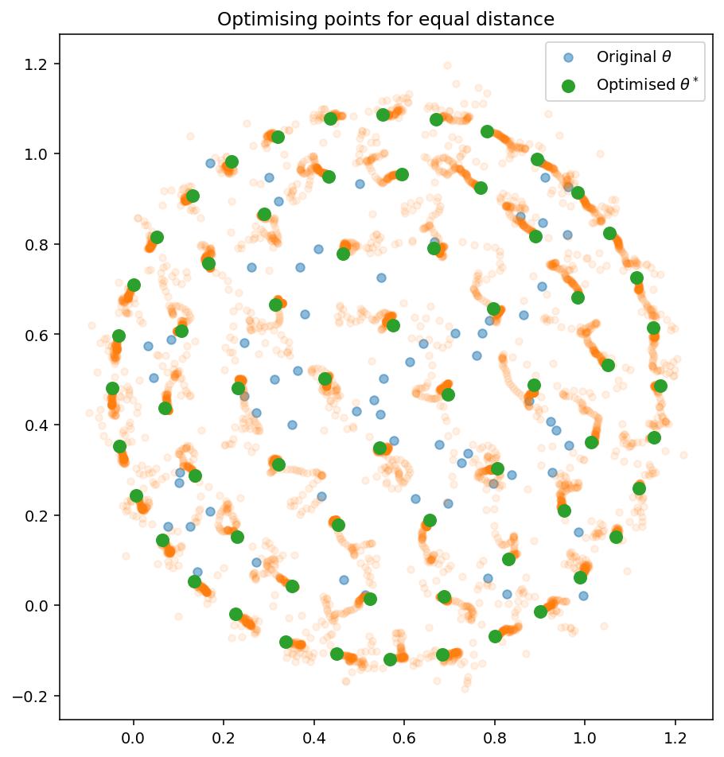

原始点是蓝色的，最后优化的点是绿色的。最后进行了优化，绿色和橙色的是优化后的效果。每个点的迭代轨迹。
- 很明显，最后绿色的点比蓝色的点间距更均匀。所以优化的效果似乎不错。

- 橙色轨迹表明，确实是逐步有效地移动到这些位置的。这并不是瞬间解决的。它是通过将这些蓝色点逐渐移向橙色、绿色的最佳位置。

## 约束优化 Constrained optimisation
A constrained optimisation might be written in terms of an equality constraint:    
$$ \theta^* = \argmin_{\theta\in\Theta} L(\theta) \text{ subject to } c(\theta)=0,$$
or an inequality:
$$ \theta^* = \argmin_{\theta\in\Theta} L(\theta) \text{ subject to } c(\theta)\leq0,$$
where $c(\theta)$ is a function that represents the constraints.

等式约束可以被看作是将参数约束在一个表面上，来代表一种权衡。例如，$c(\theta) =|\theta|_2-1$ 强制参数位于单位球面上。等式约束可能用于在总值必须保持不变的情况下进行权衡（例如，卫星的有效载荷重量可能事先就被固定）。

不等式约束可以被看作是将参数约束在一个体积内，来代表值的范围限制。例如，$c(\theta) =|\theta|_\infty-10$ 强制参数位于以原点为中心，范围为(-10, 10)的盒子内——这也许是合成器旋钮的范围。

### 常见的优化类型
**box constraint** 是一种简单的约束类型，它只是要求 $\theta$ 在 $R^n$ 内的一个盒子里；例如，每个元素 $0<\theta_i<1$（所有参数在正单元立方体内）或 $\theta_i>0$（所有参数在正象限内）。这是一个形式简单的不等式约束 $c(\vec{\theta})$。许多优化算法支持盒约束。

**convex constraint**  是另一种简单的约束，其中约束是参数 $\theta$ 的凸和的一系列不等式。box constraint是convex constrain的一个特定子类。这相当于可行集被许多平面/超平面（在曲线凸约束的情况下可能是无限多个）的交集所限制。

**Unconstrained optimization** 不对参数施加任何约束，搜索空间中的任何参数配置都是可能的。在许多问题中，纯无约束优化会导致无用的结果

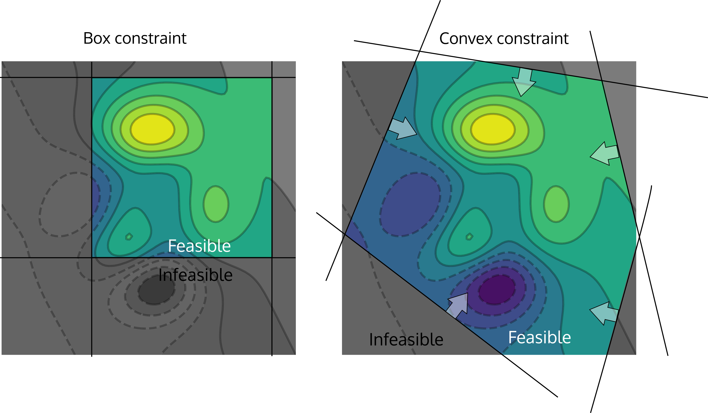

## 约束与惩罚 constraints and penalties
无约束优化很少能单独给出有用的答案。虽然我们通常将 $\theta$ 表示为在 $\Re^N$ 中，但可行集通常不是整个向量空间。有两种方法来处理这个问题：
### 约束优化
使用本身支持硬约束的优化算法。这对某些类型的优化很直接，但对一般优化来说比较棘手。直接使用convex或者box约束

优点：
- 保证解决方案将满足约束。
- 可能能够利用约束来加速优化。  

缺点：
- 可能比无约束优化效率低。
- 可用于优化的算法较少。
- 可能很难用优化器中可用的参数指定可行区域。

### 软约束
对目标函数应用惩罚，以“阻止”违反约束的解决方案。
$$L(\theta^\prime) = L(\theta) + \lambda(\theta),$$
其中 $\lambda(\theta)$ 是一个惩罚函数，随着约束的违反程度的增加而值增加。

优点：
- 任何优化器都可以使用
- 能够合理地处理软约束

缺点：
- 可能不服从一些重要的约束
- 可能难以将约束形式化为惩罚
- 不能利用在空间受限区域中的高效搜索

## 目标函数的松弛
解决离散优化和约束优化问题可能更困难；有些算法尝试寻找类似的连续或无约束优化问题来替代解决。这称为松弛；解决的是问题的松弛版本，而不是原始的难优化问题。例如，有时可以将问题中的约束吸收进目标函数，以将一个受约束问题转换为一个无约束问题。

### 惩罚
**惩罚** 指的是增加目标函数的项以最小化解决方案的某些其他属性，通常用来近似约束优化。这在近似问题中广泛使用，以找到能够良好泛化的解决方案；也就是调整得既能近似一些数据，但又不是太近。

这是对需要专门算法的具有硬约束问题的松弛，变为一个简单的目标函数问题，该目标函数适用于任何目标函数。拉格朗日乘子法就是一个例子

### 惩罚函数
惩罚函数只是一个增加到目标函数中的项，它会不利于“坏的解决方案”。

我们可以回到投掷石头的例子，并扩展我们的模型。假设我可以控制投掷角度；也许我还可以控制我投掷的力度。但是我力量的极限是有上限的。这是一个约束（一个不等式约束，它限制了力量参数的最大值）。

目标函数：石头落地有多远？  
$L(\theta) = \mathrm{throw_distance}(\theta)$  
参数：投掷角度 $\alpha$ 和投掷力度 $v$（退出速度），$\theta=[\alpha, v]$
约束：投掷力度 $0 \leq v \leq v_k$，大于零且小于某个最大力量。
有两个选项：

- 使用受约束的优化算法，这种算法甚至不会搜索超过最大力量的解决方案。
- 改变目标函数，使过度的投掷力度变得不可接受。

### 受约束的优化算法
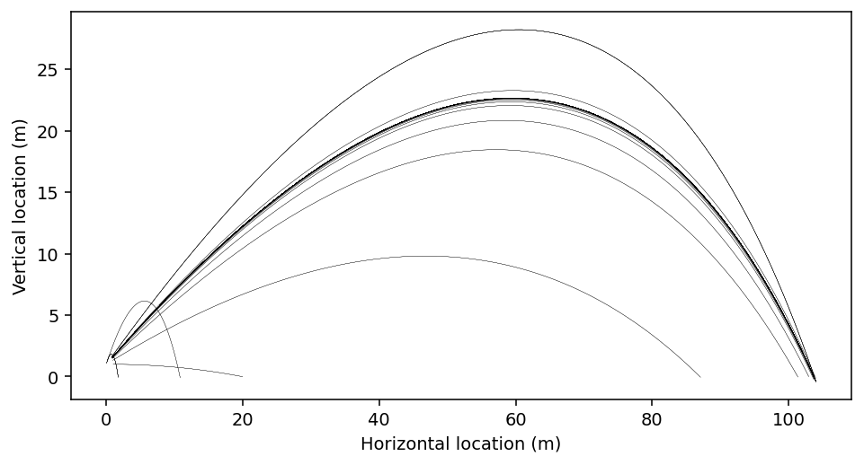

### 加入惩罚函数
惩罚函数
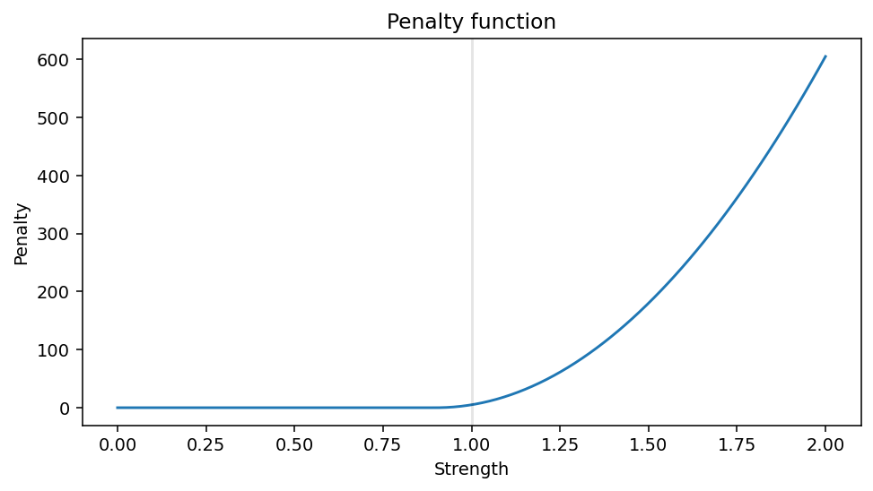
结果
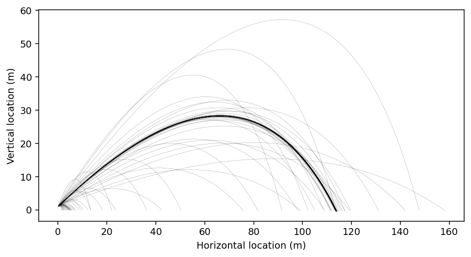

## 目标函数的属性
### 凸性，全局最小值和局部最小值
一个目标函数可能有局部最小值。局部最小值是指在该点周围的每个方向上目标函数都在增加的任何点（那个参数设置）。在该点改变参数会增加目标函数。

如果目标函数有一个单一的、全局最小值，那么它就是凸函数。例如，每个二次函数都是一个抛物线（在任何数量的维度中），因此恰好有一个最小值。其他函数可能有具有局部最小值的区域，但这些最小值不是函数可能取得的最小可能值。

凸性意味着找到任何最小值等同于找到全局最小值——保证的最佳可能解决方案。这个最小值是全局最小值。在一个凸问题中，如果我们找到了一个最小值，我们可以停止搜索。如果我们可以证明不存在最小值，我们也可以停止搜索。

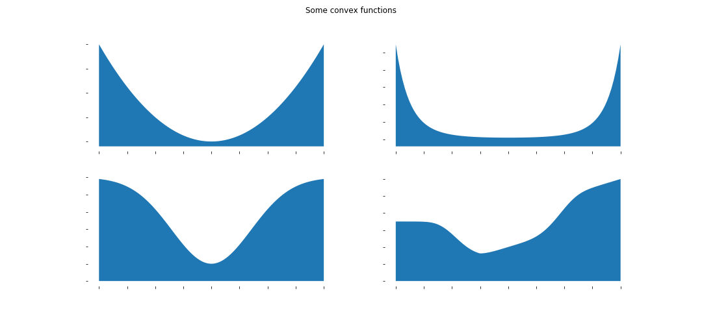
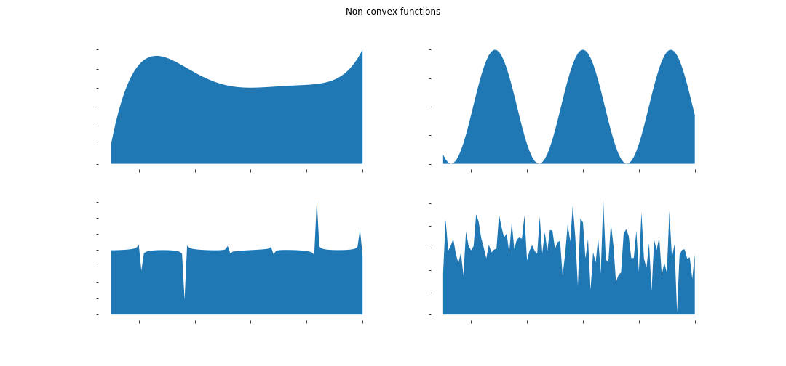

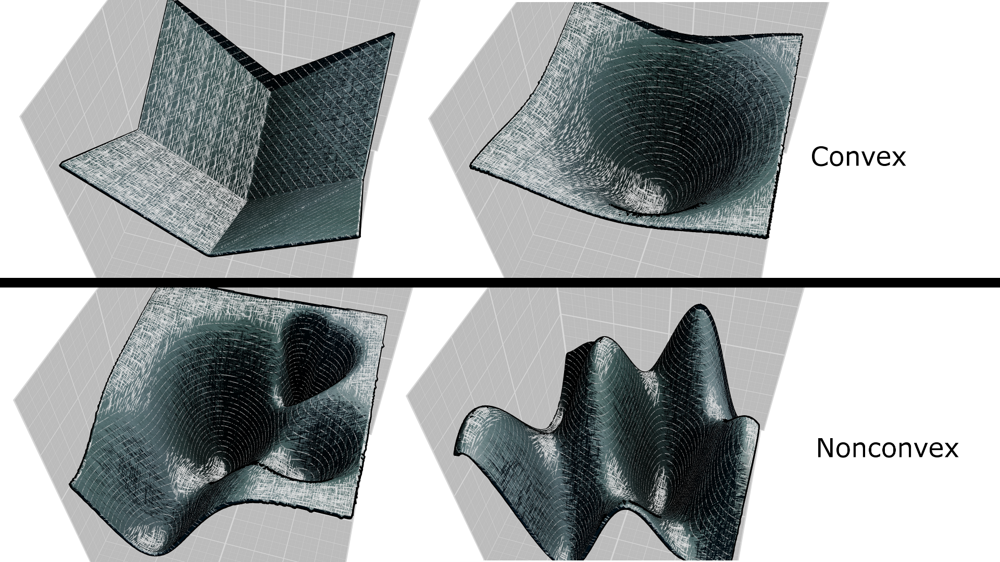

### 凸优化
如果目标函数是凸函数，并且任何约束形成了搜索空间的凸部分，那么这个问题就是凸优化问题。即便是对于有成千上万变量的问题，也有非常有效的方法来解决凸优化问题，这些方法包括：

- 约束和目标函数都是线性的（线性规划）
- 二次目标函数和线性约束（二次规划）
- 或者一些特殊情况（半二次规划，二次约束的二次规划）。

### 连续性
如果对于$\theta$的一些非常小的调整，存在一个任意小的$L(\theta)$的变化，那么目标函数是连续的。  

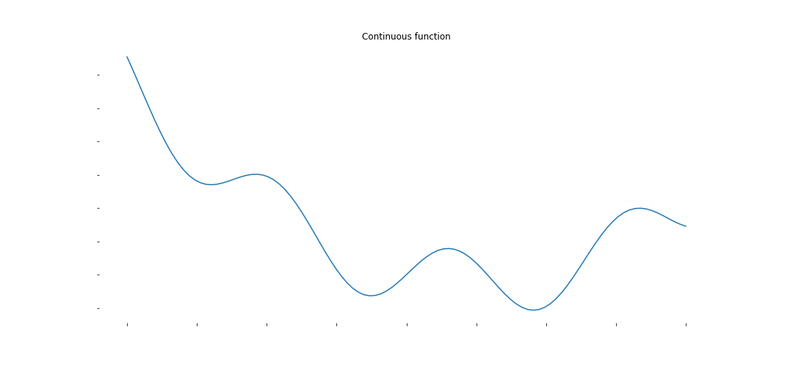    

如果一个函数是不连续的，局部搜索方法不能保证收敛到一个解。对于不连续目标函数的优化通常比连续函数的优化要困难得多。这是因为对参数的任何调整都可能导致目标函数发生任意变化。最好的情况时离散且可微
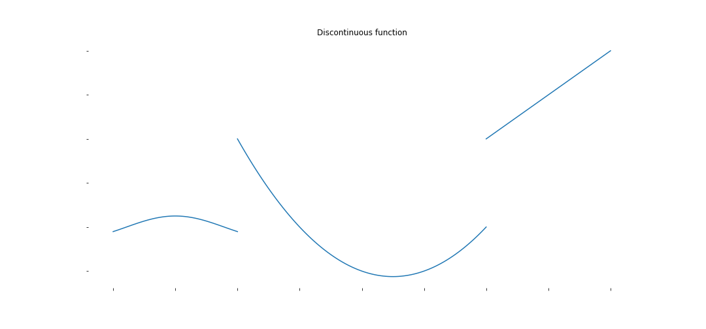

## 直接凸优化：最小二乘法
有时我们有一个优化问题，可以指定为一步求解。一个例子是线性最小二乘，它解决的是形如下面的目标函数：
$$\argmin_x L(\vec{x}) = \|A\vec{x}-\vec{y}\|_2^2, $$

也就是说，它找到的 $\vec{x}$ 最接近于解 $A\vec{x}=\vec{y}$，在最小化平方 
范数的意义上。平方范数只是为了使得代数推导更简单。

这个方程是凸的——它是一个二次函数，即使在多个维度中它也必须有一个唯一的全局最小值，可以直接找到。我们知道它是凸的是因为它没有高于2的次幂项（没有$x^3$等），所以它是二次的。二次函数最多只有一个最小值。

The solution is given by solving the system of **normal equations**: 
$$
\left(A^\top A\right) \vec{x} = A^\top \vec{y}
$$
and therefore our solution is
$$
\vec{x}^* = \left(A^\top A\right)^{-1}A^\top \vec{y}
$$
which can also be written as
$$
\vec{x}^* = A^+ \vec{y}
$$
where $A^+$ is the **Pseudo-Inverse** of $A$.

对于表达式 $w^T X^T X w$，我们可以将其看作是 $u^T v$ 的形式，其中 $u = Xw$ 和 $v = Xw$。这种情况下，导数是 $2X^T X w$。

### 线性拟合
我们将检查这个过程中最简单的线性回归示例：找到线性方程 $y=mx+c$ 的梯度 $m$ 和偏移量 $c$，使得与一组观测到的 $(x,y)$ 数据点的平方距离最小化。这是在 $\theta=[m,c]$ 空间中的搜索；这些是参数。  

目标函数是 $L(\theta) = \sum_i (y - mx_i-c)^2$，对于一些已知的数据点 $[x_0, y_0], [x_1, y_1],$ 等等。

我们可以通过 SVD 直接使用伪逆来解决这个问题。这是一个可以直接一步解决的问题。

作为示范，我们将使用方程式 $y=2x+1, m=2, c=1$的线，其中我们有从这个函数获得的一些带噪声的观测数据。

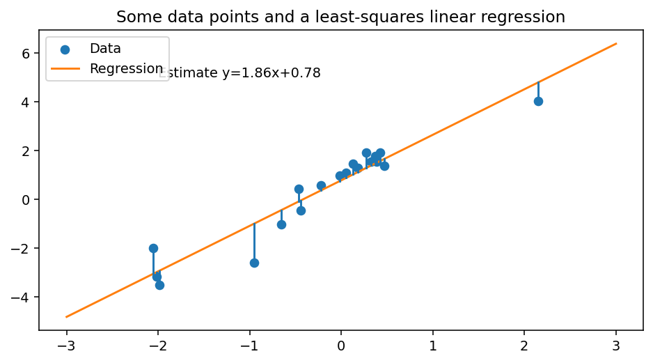  

## 迭代优化
迭代优化涉及在参数空间中进行一系列步骤。有一个当前参数向量（或它们的集合），在每次迭代中调整，希望能减少目标函数的值，直到在满足一些终止条件后优化终止。

迭代优化算法：

1. 选择一个起始点 x_0
1. 当目标函数在变化时
    1. 调整参数
    1. 评估目标函数
    1. 如果找到比迄今为止更好的解决方案，记录下来
1. 返回找到的最佳参数集

## 常规搜索：网格搜索
网格搜索是一种直接但效率不高的多维问题优化算法。参数空间通过在每个维度上均等划分可行集来进行简单采样，通常每个维度采用固定数量的划分。

在这个网格上的每个 $\theta$ 处都会评估目标函数，并追踪到目前为止发现的最低损失 $\theta$。这种方法简单，并且可以用于一维优化问题。它有时用于优化机器学习问题的超参数，在这些问题中目标函数可能很复杂，但找到绝对最小值并不是必需的。

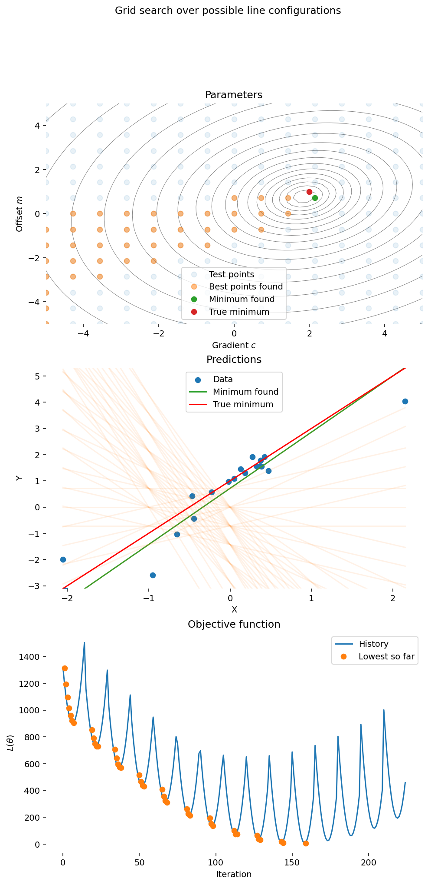

### 维数的爆炸
为什么要费心优化？为什么不搜索每一种可能的参数配置？

即使在相对较小的参数空间中，以及目标函数被认为是平滑的情况下，这种方法的扩展性也不好。简单地将每个维度划分为若干点（比如8个），然后尝试这样形成的点网格上的每一种组合，选择最小的结果。

虽然在一维（只检查8个点）和二维（只检查64个点）中这是可行的，但如果你有一个100维的参数空间，这种方法就完全行不通了。这将需要 $8^{10}$

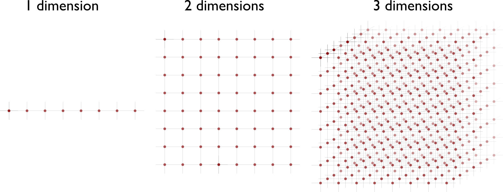

### 网格搜索的密度
如果目标函数不是非常平滑，那么需要一个更密集的网格来捕捉所有的极小值。

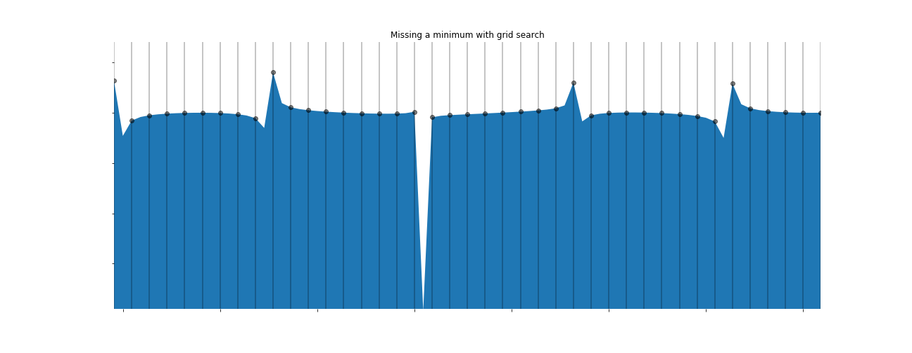

实际的优化问题可能有数百个、数千个甚至数十亿个参数（在大型机器学习问题中）。网格搜索和类似的方案在参数空间的维度上是指数级的。

### 优点
- 适用于任何连续的参数空间。
- 不需要了解目标函数的知识。
- 实现起来非常简单。
### 缺点
- 极其低效
- 必须提前指定搜索空间的界限。
- 极易偏向于在空间的“前角”附近找到东西。
- 高度依赖于选择的划分数量。
- 难以调整以免完全错过极小值。

## 超参数
网格搜索依赖于被搜索的范围以及网格划分的**间距**。大多数优化算法都有类似的特性，这些特性可以进行调整。

这些影响优化器寻找解决方案方式的属性称为 **超参数**。它们不是目标函数的参数，但它们确实会影响得到的结果。

一个完美的优化器将没有超参数——解决方案不应该依赖于如何找到它。但实际上，所有有用的优化器都有一些数量的超参数，这些超参数会影响它们的性能。超参数较少通常更好，因为这样调整优化器的工作就不那么繁琐。

## 简单随机搜索
最简单的这类算法，它除了我们可以从参数空间中随机抽取样本之外，不做任何假设，这就是**随机搜索**。

过程很简单：
- 随机猜测一个参数 $\theta$
- 检查目标函数 
- 如果 $L(\theta)<L(\theta^*)$ (之前最佳的参数 $\theta^*$), 则设置  $\theta^*=\theta$

终止条件有很多可能性，比如在最佳损失最后一次变化后的一定次数迭代后停止。下面的简单代码使用了一个固定的迭代计数，因此不保证它会找到一个好的解决方案。

### 优点
- 随机搜索不会陷入局部最小值，因为它不使用任何局部结构来指导搜索。
- 不需要了解目标函数的结构 - 甚至不需要拓扑结构。
- 非常简单实现。
- 几乎总是比网格搜索好。
### 缺点
- 极度低效，通常只在没有其他数学结构可以利用的情况下适用。
- 必须能够从参数空间中随机抽样（通常不是问题）。
- 结果不一定随时间改善。最佳结果可能在第一步或一百万步之后找到。没有办法预测优化将如何进行。 

# 元启发优化 Metaheuristics
有许多标准的元启发式方法可以用来改善随机搜索。

这些方法包括：

- 局部性，它利用了一个事实：对于相似的参数配置，目标函数可能会有相似的值。这假设了目标函数的连续性。
- 温度，它可以在优化过程中改变参数空间中移动的速率。这假设了局部最优解的存在。
- 种群，它可以跟踪多个同时的参数配置，并在它们之间进行选择/混合。
- 记忆，它可以记录过去的好的或坏的步骤，并避免/重访它们。

## 局部性
**局部搜索** 指的是那些对解进行增量式改变的算法。当目标函数具有一定的连续性时，这些算法可以比随机搜索或网格搜索更加高效。然而，它们可能会陷入局部最小值而无法达到全局最小值。由于它们通常专门用于非凸问题，这可能会成为一个问题。

这意味着优化的输出取决于**初始条件**。结果可能会从一个位置找到一个局部最小值，而从另一个起始参数集找到不同的局部最小值。

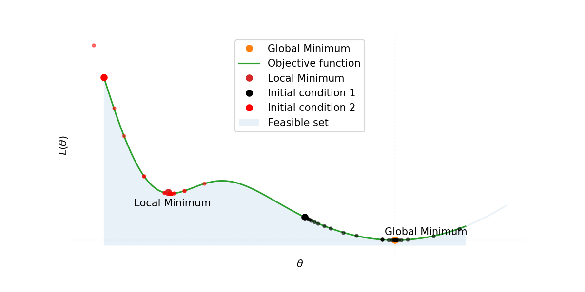

局部搜索可以被视为在参数空间中形成轨迹（一条路径），这条路径应该希望从高损失向低损失移动。

### 爬山算法：局部搜索
**爬山算法**是随机搜索的一个变种，它假设参数空间具有某种拓扑结构，因此有一个有意义的邻域概念，我们可以对参数向量进行增量式改变。爬山算法是**局部搜索**的一种形式，与其从参数空间中随机抽样，不如说是在当前最佳参数向量的附近随机抽取配置。它进行增量调整，只有在改善损失时才保留到邻近状态的转换。

**简单爬山算法**一次只调整参数向量的一个元素，轮流检查每个“方向”，如果情况有所改善就进行一步。**随机爬山算法**对参数向量进行随机调整，然后根据结果是否有改善来接受或拒绝这一步。

爬山这个名字来自于算法随机漫步的事实，它只采取上坡（或下坡，用于最小化）步骤。因为爬山算法是一种**局部搜索**算法，它容易被困在局部最小值中。基本的爬山算法对最小值没有防御措施，如果存在较差的解决方案很容易被困住。简单的爬山算法也可能被**山脊**阻挡，所有形式的爬山算法在损失函数变化缓慢的**稳定阶段**都会遇到困难。

#### 优点
- 不比随机搜索复杂多少
- 可以比随机搜索快得多
#### 缺点
- 难以选择调整的幅度
- 容易陷入最小值
- 在目标函数较为平坦的区域难以应对
- 要求目标函数（近似地）连续

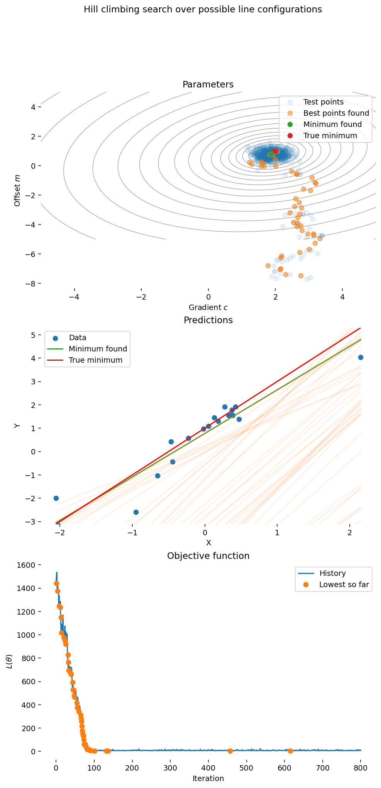

#### 同样，这种基础算法有许多调整方法：

- 自适应局部搜索，其中邻域的大小可以适应性地调整（例如，如果$n$次迭代没有改进，增加随机步骤的大小）
- 多重启动可以用来尝试避免陷入局部最小值，方法是对随机初始猜测运行多次过程。这是另一种元启发式 —— 应用于搜索算法本身的启发式。

### 模拟退火：温度时间表和逃离局部最小值
**模拟退火**通过有时随机上坡（而不是总是下坡）的能力来扩展爬山算法。它使用温度时间表在优化开始时允许更多上坡步骤，在过程的后期则减少这种步骤。这用于克服山脊和避免被困在局部最小值中。

这个想法是，允许在过程早期进行随机的“坏跳跃”，有助于找到更好的整体配置。

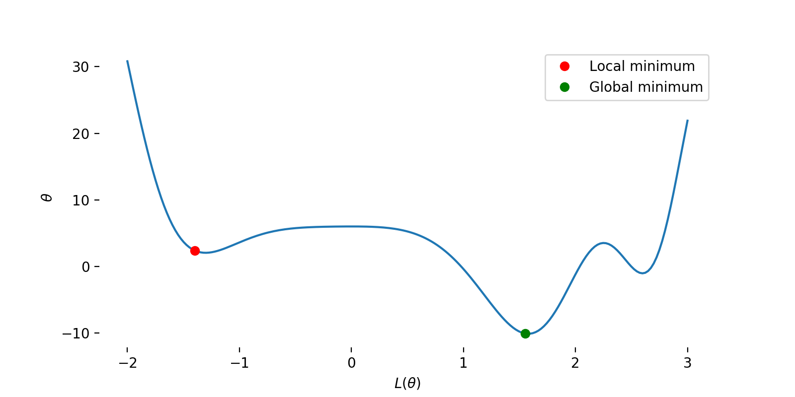

图片：爬山算法会被困在左边的局部最小值中。模拟退火有时会接受“不良”的局部变化以跨越山丘，达到更好的最小值。

“温度时间表”的概念来自于退火金属。熔融的金属分子在各处跳跃。当它们冷却时，随机的跳跃变得越来越小，因为分子锁定在一个紧密的晶格中。快速冷却的金属结构不如慢冷却的金属结构良好。

<video src="imgs/anneal.mp4" autoplay="true" loop="true" controls="true">-

#### 可以更多的向上动作
模拟退火使用了接受概率的概念。它不仅仅接受任何能减少损失的随机变化，还会随机接受可能暂时增加损失的跳跃的某些比例，并且随着时间的推移逐渐减少这些比例。

假定当前的损失为 $l = L(\theta)$ 和提出的新损失 $l^\prime = L(\theta+\Delta\theta)$，其中 $\Delta\theta$ 代表 $\theta$ 的一个随机扰动，我们可以定义一个概率 $P(l, l^\prime, T(i))$，这是在第 $i$ 次迭代时从 $\theta$ 跳到 $\Delta\theta$ 的概率。

一个常见的规则是：

如果 $l^\prime < l$，则 $P(l, l^\prime, T(i))=1$，即总是下坡。
$P(l,l^\prime,T(i)) = e^{-(l^\prime-l)/T(i)}$，即如果相对减少很小，也会接受向上的跳跃。

$T(i)$ 通常是迭代次数的指数衰减函数，这样一开始即使是大的跳跃也会被接受，即使它们是向上的，但随着时间的推移，向上跳跃的倾向会减少。

例如，$T(i) = e^{\frac{-i}{r}},$  其中 $i$ 是迭代次数，$r$ 是冷却率，$T$ 是温度。

​

#### 优点
- 比爬山算法对被困在局部最小值中的敏感性小得多
- 易于实施
- 经验上非常有效
- 即使在连续/离散混合设置中也相当有效。
#### 缺点
- 取决于温度时间表和邻域函数的良好选择，这些是额外的自由参数，需要担心。
- 没有收敛性保证
- 如果不需要向上的步骤，会显得很慢。

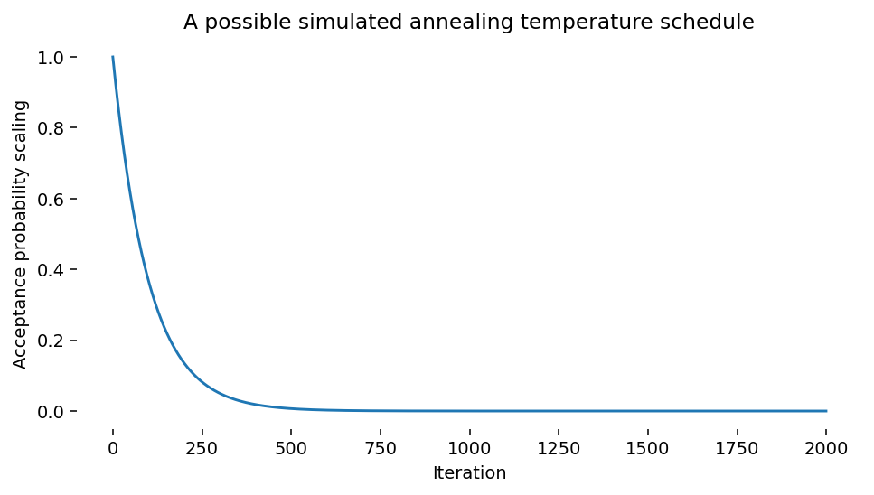

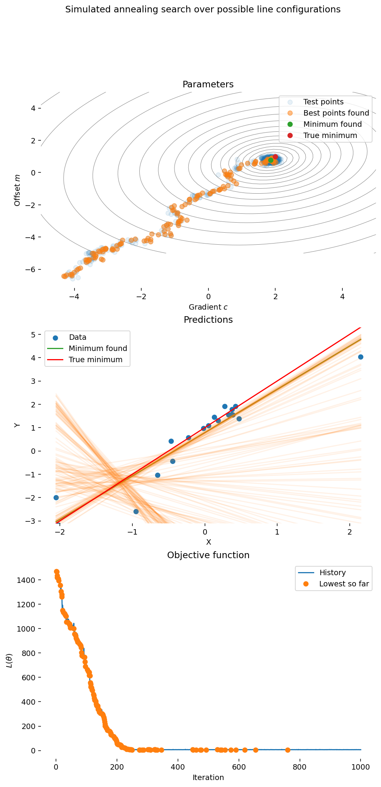

### 更复杂的示例：寻找等距点
对于线性拟合来说，这并不是非常令人印象深刻，因为它是一个非常简单的凸函数；它没有局部最小值来让你陷入困境。我们可以看看找到一组等间距点的问题。这是非凸的（并且有无数个相同的最小值），解决起来比拟合一些点的线要困难得多。这是一个特别适合模拟退火风格方法的任务。

### 种群
另一个受自然启发的随机搜索变体是使用一个种群，即多个竞争潜在解决方案，以及应用某种类似进化的方法来解决优化问题。这包括一些：

**变异**（引入随机变化）
**自然选择**（解决方案选择）
**繁殖**（解决方案之间的交换）

这类算法通常被称为遗传算法，原因显而易见。所有遗传算法都维护着某种潜在解决方案的种群（一组向量$\vec{\theta_1}, \vec{\theta_2}, \vec{\theta_3}, \dots$），以及某种规则，用于保留种群中的某些成员并淘汰其他成员。参数集合被称为解决方案的基因型。

简单的种群方法仅仅使用小的随机扰动和一个简单的选择规则，比如“保留前25%的解决方案，按损失排序”。每次迭代都会通过随机变异略微扰动解决方案，淘汰最弱的解决方案，然后复制剩余的“最适应”的解决方案多次，以产生下一步的后代。种群大小从迭代到迭代保持不变。这只是带有种群的随机局部搜索。其想法是，这可以比简单的局部搜索探索更大的空间区域，并在此期间维护关于什么可能是好的多个可能的假设。

### 遗传算法：种群搜索
#### 优点
- 易于理解，适用于许多问题。
- 只需要对目标函数有最基本的了解。
- 可以应用于具有离散和连续部分的问题。
- 对局部最小值有一定的鲁棒性，尽管难以控制。
- 在参数化方面有极大的灵活性：变异方案、交叉方案、适应度函数、选择函数等。
#### 缺点
- 需要调整许多极大影响优化性能的“超参数”。你应该如何选择它们？
- 无收敛保证；随意。
- 与使用对目标函数更深刻理解的方法相比（非常）慢。
- 需要进行大量的目标函数评估：每个种群成员每次迭代一次。

## 记忆
我们迄今为止看到的优化算法都是无记忆的。它们探索解空间的某些部分，检查损失，然后继续前进。他们可能会一次又一次地检查相同或非常相似的解决方案。使用某种形式的记忆可以缓解这种低效率，其中优化器记住参数空间中“好”的和“坏”的部分，并使用这个记忆做出决策。特别是，我们想要记住解空间中好的路径。

### 记忆+种群
### 蚁群优化
蚂蚁非常擅长寻找食物（探索），然后引导整个蚁群到食物来源去探索和提取所有食物（开发）。它们能够做到这一点，而无需任何复杂的协调。相反，蚂蚁四处游荡，直到它们找到一些东西吃。然后，它们在回到蚁丘的路上留下了信息素（气味）的痕迹。其他蚂蚁可以跟随这个痕迹找到食物并检查整个区域是否有任何特别美味的东西。

蚁群优化结合了记忆和种群启发式方法。它使用了信息素机制来优化问题：

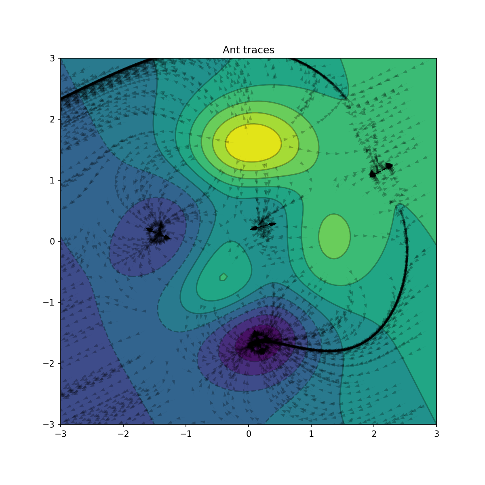

**信息素机制**：一种自发的、间接的协调机制，通过行为或动作在环境中留下的痕迹刺激随后的动作执行。

在优化方面，这意味着：
- 拥有一群参数集合（“蚂蚁”）
- 记忆穿过空间的好路径（“信息素”）

找到空间中好部分（即低目标函数值）的蚂蚁会留下积极的“信息素”，通过存储标记向量。其他蚂蚁将朝向这些信息素移动，并最终跟随通往好解决方案的路径。随着时间的推移（即迭代次数增加），信息素会蒸发，以免蚂蚁被限制在空间的一小部分。我们使用辅助数据结构来记忆参数空间中的好路径，而不是利用物理环境，以避免重复搜索。

ACO(蚁群优化)特别适合寻径和路线查找算法，其中信息素痕迹的记忆结构对应于解决方案结构。
#### 优点
- 在被大而狭窄的谷地分隔开的空间中可能非常有效。
- 如果信息素有效，相比遗传算法可以使用更少的目标函数评估次数。
- 当它有效时，其效果通常非常显著。
#### 缺点
- 实现起来算法复杂度适中。
- 没有收敛性保证；特设的。
- 相比遗传算法有更多的超参数。

# 优化质量
## 收敛性
优化算法被称为**收敛**到一个解决方案。在凸优化中，这意味着已找到**全局最小值**，问题已解决。在非凸优化中，这意味着找到了**局部最小值**，算法无法摆脱该局部最小值。

一个好的优化算法能够快速收敛。这意味着目标函数的下降应该是陡峭的，以便每次迭代都能带来较大的变化。一个不好的优化算法根本不会收敛（它可能会永远徘徊，或发散到无穷大）。许多优化算法只在某些条件下才会收敛；收敛性取决于优化的初始条件。

## 收敛性保证
一些优化算法如果存在解决方案则保证收敛；而其他一些（如大多数启发式优化算法）即使问题有解也不保证会收敛。例如，随机搜索可能会永远漫游在可能性空间中，永远找不到最小化（或甚至减少）损失的特定配置。

对于迭代解决方案，目标函数值对迭代次数的图表是诊断收敛问题的有用工具。理想情况下，损失应该尽可能快地下降。