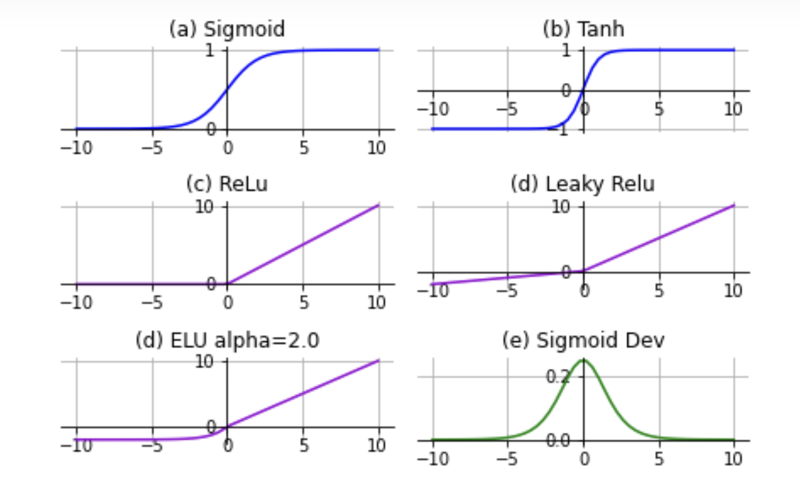
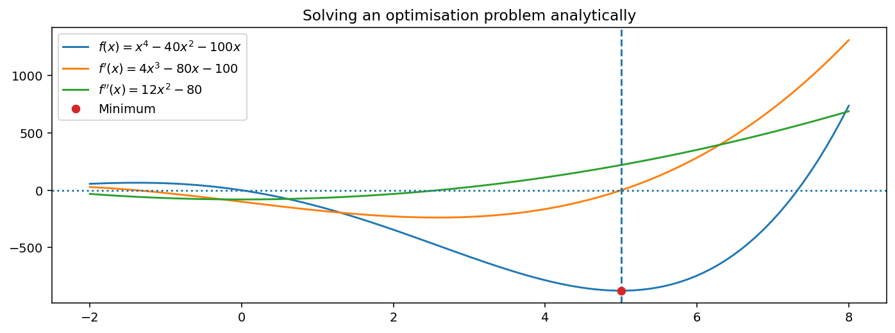

 # 深度神经网络
 **深度学习**或**深度神经网络**已成为现代机器学习研究的重要组成部分。它们在语音识别、机器翻译、图像分类和图像合成等领域取得了惊人的成功。深度学习的基本问题是寻找一个近似函数。在一个简单的模型中，这可能如下工作：给定一些观察值 $\vec{x}_1, \vec{x}_2, \dots, \vec{x}_n$ 和一些相应的输出 $y_1, y_2, \dots, y_n$，找到一个函数 $y^\prime = f(\vec{x};\theta)$，带有参数 $\theta$，以便我们拥有
 
 $$\theta^* = \argmin_{\theta}  \sum_i ||f(\vec{x}_i;\theta)- y_i||$$

 其中距离是衡量$f$的输出和期望输出$y_i$有多接近的某种度量（具体使用的距离会随问题而变）。其思想是我们可以学习$f$，使我们能够将变换泛化到我们尚未看到的$\vec{x}$。这显然是一个优化问题。但是深度神经网络可以有数十亿的参数——一个非常长的$\theta$向量。在如此庞大的参数空间内，如何在合理的时间内进行优化？
上述例子中有数千万个参数需要调整。

## 反向传播 Backpropagation
答案是这些网络以一种非常简单（但聪明）的方式构建。传统的神经网络由一系列层组成，每一层都是一个线性映射（仅仅是矩阵乘法）后面跟着一个简单的、固定的非线性函数。想象一下：旋转、伸展（线性映射）和折叠（简单的固定非线性折叠）。一个层的输出是下一个层的输入。

图像：一个3层深度网络。每一层由应用于前一层输入$x$的线性映射$W$组成，然后是一个固定的非线性函数$G(\vec{x})$

每一层中的线性映射（当然）由一个矩阵指定，这个矩阵被称为权重矩阵。网络完全由每层的权重矩阵的条目参数化（这些矩阵的所有条目可以视为参数向量$\theta$）。非线性函数$G(\vec{x})$对于每一层都是固定的，不能变化；它通常是一个以某种方式“压缩”输出范围的简单函数（比如tanh、relu或sigmoid——你不需要了解这些）。只有在优化过程中权重矩阵会发生变化。

$$\vec{y_i} = G(W_i\vec{x_i}+\vec{b_i})$$

  

而这种特定的构造（在某些条件下）具有巨大的优势，即目标函数**对权重的导数**可以同时为网络中的每一个权重计算，即使是多个层组合在一起的情况。执行此操作的算法称为反向传播，它是一种**自动微分算法**。"对权重的导数"意味着我们可以一次性知道每个权重对预测的影响程度，对于网络中的所有权重。

如果我们想象将所有权重矩阵的元素串联成一个单一向量$\theta$，我们就可以获得目标函数相对于$\theta$的梯度。这使得优化变得“容易”；我们只需朝着最快下降的方向前进即可。

## 为什么不使用启发式搜索算法
启发式搜索方法如随机搜索、模拟退火和遗传算法易于理解、实现简单，且几乎没有限制，它们可以适用于哪些问题。那么为什么不总是使用这些方法呢？

- 它们可能非常慢；可能需要很多次迭代才能接近最小值，并且每次迭代都需要大量计算。无法保证收敛，甚至无法保证进步。搜索可能会卡住，或者在高原地区缓慢漂移。

- 有大量的超参数可以调整（温度计划、种群大小、记忆结构等）。这些参数应该如何选择？这些参数的最佳选择本身就是一个优化问题。

- 对于像深度神经网络这样的优化问题，启发式搜索完全不够用。在训练有数百万参数的网络时，它简直是太慢了，无法取得进展。相反，应用了一阶优化。我们今天将讨论的一阶算法可以比启发式搜索快几个数量级。

注：如果目标函数已知是凸的，约束也是凸的，那么还有更好的优化方法，这些方法通常可以非常快速地运行，并保证收敛。

## 扔一个球：物理层面上的搜索
通过考虑一个在（光滑）表面上滚动的球来形成对高阶优化的直觉，这个表面代表了一个2D域上目标函数的值（即，如果我们有一个包含两个元素的参数向量$\theta$）。

重力对球施加一个垂直于表面平面的力。表面沿着表面法线的方向对球施加力，表面法线是一个从表面“直接指出”的向量。这导致了在表面最陡峭斜坡方向上的力分量，使球朝那个方向加速。这个梯度向量总是指向最陡斜坡的方向。

球最终会稳定在一个力平衡的配置中。例如，如果球在一个最小点稳定下来，表面的法线与重力平行，就会发生这种情况。

### Attractors: flowing towards a solution
我们可以将其视为一个**Attractors**，它将我们的搜索吸引到解决方案。搜索的轨迹与目标函数的“流场”平行。我们的物理直觉是，我们可以通过沿着这些流线滚动进入“盆地”来找到最小值。

### 雅可比矩阵：导数矩阵
如果$f(x)$是一个标量$x$的标量函数，$f^\prime(x)$是$f$关于$x$的一阶导数，即$\frac{d}{dx}f(x)$。二阶导数写作$f^{\prime\prime}(x) = \frac{d^2}{dx^2}f(x)$。

如果我们将其推广到向量函数$\vec{y}= f(\vec{x})$，那么我们在任意特定输入$\vec{x}$时，有输入的每个分量与输出的每个分量之间的变化率（导数）。我们可以将这些导数信息收集到一个称为雅可比矩阵的矩阵中，它描述了*在特定点$\vec{x}$*的斜率。如果输入$\vec{x} \in \real^n$且输出$\vec{y} \in \real^m$，那么我们有一个$m\times n$矩阵：

$$f'(\vec{x}) = \vec{J} =  \begin{bmatrix}
\frac{\partial y_0}{\partial x_0} & \frac{\partial y_0}{\partial x_1} & \dots & \frac{\partial y_0}{\partial x_n} \\
\frac{\partial y_1}{\partial x_0} & \frac{\partial y_1}{\partial x_1} & \dots & \frac{\partial y_1}{\partial x_n} \\
\dots \\
\frac{\partial y_m}{\partial x_0} & \frac{\partial y_m}{\partial x_1} & \dots & \frac{\partial y_m}{\partial x_n} \\
\end{bmatrix}
$$

这简单地告诉我们，当我们改变输入的任何一个分量时，输出的每个分量变化了多少——向量值函数的广义“斜率”。这是在点$\vec{x}$处表征向量函数变化的一种非常重要的方法，并且在许多上下文中广泛使用。在$f$将$\real^n$映射到$\real^n$（从一个向量空间映射到相同的向量空间）的情况下，我们有一个正方形的$n\times n$矩阵$\vec{J}$，我们可以用它来做标准的操作，比如计算行列式，进行特征分解或（在某些情况下）求逆。

在许多情况下，我们有一个非常简单的雅可比矩阵：只有一个单独的行。这适用于我们有一个标量函数$y = f(\vec{x})$的情况，其中$y\in\real$（即从$n$维输入到一维输出）。这是我们有一个损失函数$L(\theta)$作为向量输入的标量函数的情况。在这种情况下，我们有一个单行雅可比矩阵：梯度向量。

## 梯度向量：雅可比方程的一行
* $\nabla f(\vec{x})$ 是向量函数的（标量）函数的梯度向量，相当于向量函数的一阶导数。我们对$\vec{x}$的每个分量都有一个（偏）导数。这告诉我们，如果我们对每个维度独立地进行微小的变化，$f(\vec{x})$会变化多少。注意，在这门课程中我们只处理输出为标量但输入为向量的函数$f(x)$。我们将处理参数向量$\theta$的标量目标函数$L(\theta)$

$$\nabla L(\vec{\theta}) = \left[ \frac{\partial L(\vec{\theta})}{\partial \theta_1},  
\frac{\partial L(\vec{\theta})}{\partial \theta_2}, \dots, \frac{\partial L(\vec{\theta})}{\partial \theta_n},\right]$$
    
* 如果$L(\theta)$是一个映射$\real^n \rightarrow \real$（即一个标量函数，比如一个普通的目标函数），那么$\nabla L(\theta)$是一个值为向量的映射$\real^n \rightarrow \real^n$； 

* 如果$L(\theta)$是一个映射$\real^n \rightarrow \real^m$，那么$\nabla L(\theta)$是一个值为矩阵的映射$\real^n \rightarrow \real^{m\times n}$；  

$\nabla L(\theta)$ 是一个*指向$L(\theta)$变化最陡的方向*的向量。

##  海森矩阵：梯度向量的雅可比矩阵 
##  Hessian: Jacobian of the gradient vector

* $\nabla^2 f(\vec{x})$ 是向量函数的（标量）函数的*海森矩阵*，相当于向量函数的二阶导数。
按照我们上面的规则，它只是一个值为向量的函数的雅可比矩阵，所以我们知道：
* $\nabla^2 L(\theta)$ 是一个值为矩阵的映射$\real^n \rightarrow \real^{n\times n}$
这很重要，因为我们可以看到，即使是标量值函数的二阶导数也与其输入的维度呈二次方地增长！

（如果原始函数是一个向量，我们将得到一个海森张量而不是矩阵）。

$$H(L) = \nabla \nabla L(\vec{\theta}) = \nabla^2 L(\vec{\theta}) = 
\begin{bmatrix}
\frac{\partial^2 L(\vec{\theta})}{\partial \theta_1^2} & 
\frac{\partial^2 L(\vec{\theta})}{\partial \theta_1\partial \theta_2} & 
\frac{\partial^2 L(\vec{\theta})}{\partial \theta_1\partial \theta_3} & \dots &
\frac{\partial^2 L(\vec{\theta})}{\partial \theta_1\partial \theta_n}\\
\frac{\partial^2 L(\vec{\theta})}{\partial \theta_2\partial\theta_1} & 
\frac{\partial^2 L(\vec{\theta})}{\partial \theta_2^2} & 
\frac{\partial^2 L(\vec{\theta})}{\partial \theta_2\partial \theta_3} & \dots &
\frac{\partial^2 L(\vec{\theta})}{\partial \theta_2\partial \theta_n}\\
\dots\\
\frac{\partial^2 L(\vec{\theta})}{\partial \theta_n\partial\theta_1} & 
\frac{\partial^2 L(\vec{\theta})}{\partial \theta_n\partial \theta_2} & 
\frac{\partial^2 L(\vec{\theta})}{\partial \theta_n\partial \theta_3} & \dots &
\frac{\partial^2 L(\vec{\theta})}{\partial \theta_n^2}\\
\end{bmatrix},$$

reference
- [海森矩阵 - bilibili](https://www.bilibili.com/video/BV13V4y197dG/?spm_id_from=333.337.search-card.all.click&vd_source=d37f5f69997b21d81e19a377ec7cdb1e)
- [雅可比矩阵 -bilibili](https://www.bilibili.com/video/BV1NJ411r7ja/?spm_id_from=333.788&vd_source=d37f5f69997b21d81e19a377ec7cdb1e)

### 可微的目标函数
对于某些目标函数，我们可以计算出目标函数相对于参数$\theta$的（精确的）导数。例如，如果目标函数有一个单一的标量参数$\theta \in \real$，函数为：$$L(\theta) = \theta^2$$
那么，从基础微积分知识来看，关于$\theta$的导数就是：
$$L^\prime(\theta) = 2\theta.$$

如果我们知道导数，我们可以使用它来朝着“好的方向”移动——沿着目标函数的斜坡向下移动到最小值。

对于多维目标函数（其中$\theta$有多个分量），问题会稍微复杂一些，我们会有一个**梯度向量**而不是简单的标量导数（写作$\nabla L(\theta)$）。然而，同样的原理适用。

阶数：**零阶**、一阶、二阶
迭代算法可以根据它们所需的导数阶数进行分类：

零阶优化算法只需要评估目标函数$L(\theta)$。例子包括随机搜索和模拟退火。

一阶优化算法需要评估$L(\theta)$及其导数$\nabla L(\theta)$。这一类包括**梯度下降**方法家族。

二阶优化算法需要评估$L(\theta)$、$\nabla L(\theta)$以及$\nabla^2 L(\theta)$。这些方法包括**类牛顿**优化。

# 利用导数的优化
如果我们知道（或可以计算）目标函数的梯度，我们就知道在任何给定点的函数的斜率。这给了我们两个信息：

- 最快增长的方向和
- 该斜率的陡峭程度。
这是微积分的主要应用之一。

知道目标函数的导数足以大大提高优化的效率。

## 状态
### 可微性
一个光滑函数具有连续的导数，直到某个阶数。光滑函数通常更容易进行迭代优化，因为当前近似的小变化很可能导致目标函数的小变化。如果函数的第$n$阶导数是连续的，我们称这个函数是**$C^n$连续的**。

图片：从左到右，从上到下分别是不连续的、$C^0$、$C^1$、$C^2$连续函数  

拥有连续导数与知道这些导数是什么之间有区别。

一阶优化使用目标函数相对于参数的（一阶）导数。这些技术只能在目标函数至少是：

$C^1$连续的，即函数及其导数中无处有阶跃变化
可微的，即梯度在任何地方都是定义好的
（尽管我们会看到，这些约束在实践中可以有所放宽）。

许多目标函数满足这些条件，一阶方法比零阶方法有效得多。对于特定类别的函数（例如凸函数），已知特定一阶优化器收敛所需的步骤数量有明确的界限。

### 利普希茨连续性
一阶（和更高阶）连续优化算法对函数的要求比仅仅是$C^1$连续性更高，它们要求函数具有利普希茨连续性。

对于函数$\real^n \rightarrow \real$（即我们关心的目标函数$L(\theta)$），这等同于说梯度是有界的，函数的变化速率不能超过某个常数；存在一个最大的陡度。对于所有的$i$和某个固定的$K$，有$ \frac{\partial L(\theta)}{di} \leq K $。

#### Small Lipschitz constant
<video src="imgs/smooth_lipschitz.mp4" controls="true" width="50%"> -

视频中的白色圆锥体无论如何沿着函数滑动，都不会与函数相交。这个函数是利普希茨连续的；梯度在任何地方都是有界的，因此没有任何地方足够陡峭到可以与圆锥体相交。

<video src="imgs/lipschitz_big.mp4" controls="true" width="50%">-

### Lipschitz 常数
我们可以想象在一个表面上滑动一个特定陡度的圆锥体。我们可以检查它是否曾经触摸到表面。这是衡量函数陡峭程度的一个指标；或者等价于一阶导数的上界。函数$f(x)$的利普希茨常数$K$是一次只触摸函数一次的圆锥体的宽度的度量。这是一个衡量函数平滑程度的指标，或者等价于目标函数在其定义域上任何一点的最大陡度。它可以定义为：
$$K = \sup \left[\frac{ |f(x)-f(y)|}{|x-y|}\right],$$
其中$\sup$是上确界；比这个函数的每一个值都大的最小值。

较小的$K$意味着函数更加光滑。$K=0$完全平坦。我们将假设我们要处理的函数有一些有限的$K$，尽管其值可能不会被精确知道。

Lipschitz 连续 是比一致连续更强的条件，但比Lipschitz 连续更强的约束是可导，这都是建立在数学的基础上。

reference:
- [Lipschitz连续 - bilibili](https://www.bilibili.com/video/BV1L84y1S7ox/?spm_id_from=333.337.search-card.all.click&vd_source=d37f5f69997b21d81e19a377ec7cdb1e)

## 分析导数
如果我们有**分析导数**（即我们知道函数的导数的封闭形式；我们可以直接写下数学公式），你可能还记得高中数学优化的过程：
- 计算导数 $f^\prime(x) = \frac{d}{dx}f(x)$
- 解导数为零的方程（即解$x$使得$f^\prime(x)=0$）。这找到了函数的所有转折点或极值点。
- 然后检查解中是否有二阶导数为正的 $f^{\prime \prime}(x)>0$，这表示解是最小值。

### Example
This is how we might find the minimum of $$f(x) = x^4 -40x^2 -100x.$$ The derivative is: $$f^\prime(x) = 4x^3 - 80x - 100$$ and the second derivative is $$f^{\prime\prime}(x) = 12x^2 - 80.$$ We can solve for: $$f^\prime(x) = 4x^3-20x-100 = 0,$$ and check the sign of $$f^{\prime\prime}(x) = 12x^2 -20$$ to find if we have a minimum. 

