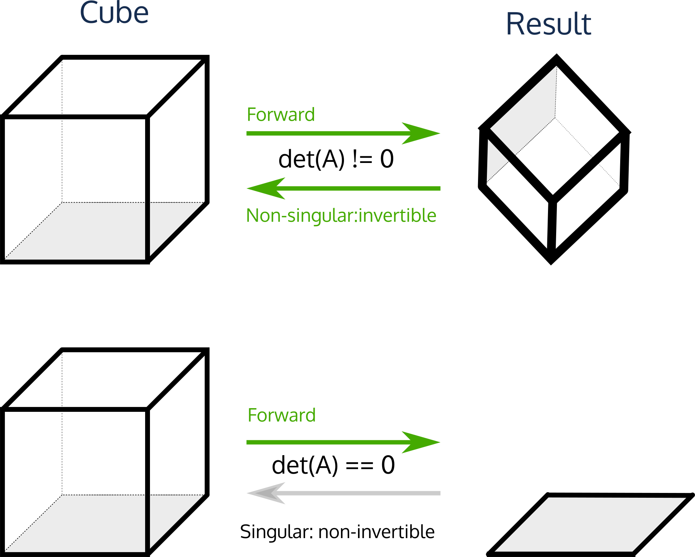

## Linear algebra
**Adjancency matrix 邻接矩阵** : with edges being the weights of the connection between sites.   

**Matrix powers**: Since we have already defined matrix multiplication, we can now define $A^2=AA$, $A^3=AAA$, $A^4=AAAA$, etc. These are the **powers** of a matrix, and are only defined for square matrices(正方形矩阵).

# Eigenvalues and eigenvectors
A matrix represents a special kind of function: a **linear transform**; an operation that performs rotation and scaling on vectors. However, there are certain vectors which don't get rotated when multiplied by the matrix. 矩阵代表一种特殊的函数：**线性变换**；一种对向量进行旋转和缩放的运算。不过，有些向量与矩阵相乘时不会发生旋转。

Special vectors: They only get scaled (stretched or compressed). These vectors are called **eigenvectors**, and they can be thought of as the "fundamental" or "characteristic" vectors of the matrix, as they have some stability. The prefix **eigen** just means **characteristic** (from the German for "own"). The scaling factors that the matrix applies to its eigenvectors are called **eigenvalues**. 特殊矢量： 它们只会被缩放（拉伸或压缩）。这些向量被称为**特征向量**，它们可以被视为矩阵的 "基本 "或 "特征 "向量，因为它们具有一定的稳定性。矩阵应用于其特征向量的缩放因子称为**特征值**。
`evals,evecs = np.linalg.eig(A)`

#### np的eigenvalues缺陷
* 数值稳定性问题：在处理非常大或非常小的数值时，计算特征值和特征向量可能会出现数值稳定性问题。这可能导致结果的精度不高或者计算过程中出现数值上的不稳定。
  
* 计算复杂性：对于非常大的矩阵，计算特征值和特征向量的算法可能非常耗时。尤其是在需要高精度结果的情况下，计算量会显著增加。

* Numerical stability issues: Numerical stability issues may arise in the calculation of eigenvalues and eigenvectors when dealing with very large or very small values. This may lead to poor accuracy of the results or numerical instability in the computation.
Computational complexity:

* For very large matrices, the algorithms for computing eigenvalues and eigenvectors can be very time consuming. Especially if high precision results are required, the computational effort can increase significantly.
  
### PCA 主成分分析 Principal Component Analysis
```
# Step 1: 数据标准化
# 计算每个特征的均值和标准差
mean = np.mean(X, axis=0)
std = np.std(X, axis=0)

# 标准化数据
X_normalized = (X - mean) / std

# Step 2: 计算协方差矩阵
cov_matrix = np.cov(X_normalized.T)

# Step 3: 计算协方差矩阵的特征值和特征向量
eigenvalues, eigenvectors = np.linalg.eig(cov_matrix)

# Step 4: 对特征向量进行排序，并选择主成分
# 对特征值从大到小排序，获取排序后的特征值的索引
sorted_indices = np.argsort(eigenvalues)[::-1]

# 选择前k个特征向量，k是你想要的主成分数量
k = 2  # 例如，选择前2个主成分
principal_components = eigenvectors[:, sorted_indices[:k]]

# Step 5: 将原始数据转换到新的特征空间
X_pca = X_normalized.dot(principal_components)

# X_pca 是降维后的数据
```
### 特征分解
- **定义**：特征分解是将一个矩阵分解为特征值和特征向量。它只适用于方阵。It only applies to square matrices.
- **优点**：
  - 提供了矩阵的直接分解，可以揭示矩阵的基本特性，如可逆性、秩等。
  - 特征值和特征向量的概念在理解线性变换中非常重要。
  - Provides a direct decomposition of a matrix that reveals the basic properties of a matrix such as invertibility, rank, etc.
  - The concepts of eigenvalues and eigenvectors are important in understanding linear transformations.
- **缺点**：
  - 仅限于方阵，不能应用于非方阵（例如，大多数现实世界的数据集是非方阵）。
  - 计算上可能不够稳定，特别是对于大型矩阵。
  - Limited to square matrices, cannot be applied to non-square matrices (e.g., most real-world datasets are non-square).
  - May not be computationally stable, especially for large matrices.

### 主成分分析（PCA）
- **定义**：PCA是一种统计方法，通过正交变换将可能相关的变量转换为线性不相关的变量集合。它不限于方阵，并通常用于降维。
- **优点**：
  - 可以应用于任何大小的矩阵，特别适用于高维数据集。
  - 有效的数据压缩工具，可以减少数据集的维度，同时保留最重要的信息。
  - 有助于去除噪声，强化数据集中最重要的信号。
  - Can be applied to matrices of any size and is particularly suitable for high-dimensional datasets.
  - Effective data compression tool that reduces the dimensionality of a dataset while retaining the most important information.
  - Helps to remove noise and enhance the most important signals in the dataset.
- **缺点**：
  - PCA依赖于线性假设，对于非线性数据结构不是最佳选择。
  - 结果的解释可能不直观，特别是在高维数据上。
  - 对数据的标准化或规范化高度敏感。
  - PCA relies on linear assumptions and is not optimal for non-linear data structures.
  - Interpretation of results may not be intuitive, especially on high-dimensional data.
  - Highly sensitive to standardisation or normalisation of data.

### 比较
- 特征分解是PCA的数学基础。实际上，PCA涉及到协方差矩阵或数据矩阵的奇异值分解（SVD），这可以视为特征分解的一种形式。
- PCA通常被视为特征分解在数据分析和降维方面的实际应用。
- 在实际操作中，PCA更加普遍，因为它适用于非方阵，并且与特定的应用（如数据压缩、特征提取、噪声减少）密切相关。In practice, PCA is more common because it is applicable to non-square matrices and is closely related to specific applications (e.g., data compression, feature extraction, noise reduction).

### Trace(迹)
The trace of a square matrix can be computed from the sum of its diagonal values:

$$ \text{Tr}(A) = a_{1,1} + a_{2,2} + \dots + a_{n,n} $$

It is also equal to the sum of the eigenvalues of $A$

$$ \text{Tr}(A) = \sum_{i=1}^n \lambda_i $$

The trace can be thought of as measuring the  **perimeter** of the parallelotope of a unit cube transformed by the matrix. [Strictly, it is *proportional* to the perimeter, with the constant of proportionality being $\text{Perimiter}(A)=2^{n-1} \text{Tr}(A)$].

### Determinant 行列式
The determinant $\text{det}(A)$ is an important property of square matrices. It can be thought of as the **volume** of the parallelotope  of a unit cube transformed by the matrix -- it measures how much the space expands or contracts after the linear transform.

It is equal to the product of the eigenvalues of the matrix.

$$ \text{det}(A) = \prod_{i=1}^n \lambda_i  $$

If any eigenvalue $\lambda_i$ of $A$ is 0, the determinant $\det(A)=0$, and the transformation collapses at least one dimension to be completely flat. This means that the transformation **cannot be reversed**; information has been lost.

### Definite and semi-definite matrices

A matrix is called 

- **positive definite** if all of its eigenvalues are greater than zero: $\lambda_i > 0$. 正定矩阵

- **positive semi-definite** if all of its eigenvalues are greater than or equal to zero: $\lambda_i \geq 0$.  半正定矩阵

- **negative definite** if all of the eigenvalues are less than zero: $\lambda_i < 0$, -  负定矩阵

- **negative semi-definite** if all the eigenvalues are less than or equal to zero: $\lambda_i \leq 0$. 半负定矩阵

在统计数据分析中，协方差矩阵通常是正定的，这意味着它保留了数据的某些基本性质和结构。换句话说，正定矩阵在变换空间中保持了向量的“方向”。在数值优化中，海森矩阵被用于判断函数的凸性，其正定性是找到最优解的重要条件。In statistical data analysis, the covariance matrix is usually positive definite, which means that it preserves some of the fundamental properties and structure of the data. In other words, a positive definite matrix maintains the "direction" of the vectors in the transformation space. In numerical optimisation, the Hessian matrix is used to determine the convexity of a function, and its positive definiteness is important for finding the optimal solution.

### Matrix Inversion
We have seen four basic algebraic operations on matrices:
* scalar multiplication $cA$;
* matrix addition $A+B$;
* matrix multiplication $BA$
* matrix transposition $A^T$

There is a further important operation: **inversion** $A^{-1}$, defined such that:
* $A^{-1}(A\vec{x}) = \vec{x}$, 
* $A^{-1}A = I$ 
* $(A^{-1})^{-1} = A$
* $(AB)^{-1} = B^{-1}A^{-1}$

`np.linalg.inv()`  矩阵可逆的条件为是方阵且det(A)也就是行列式不为0 det(𝐴)≠0。如果 det(A)=0 ，那么变换 A 至少折叠了一个维度，这意味着它不是双射的。 If det(A)=0, then the transformation A collapses at least one dimension, whichmeans it's not bijective.

### 奇异矩阵 与 非奇异矩阵 Singular and non-singular matrices

A matrix with $\det(A)=0$ is called **singular** and has no inverse.

A matrix which is invertible is called **non-singular**. 

The geometric intuition for this is simple. Going back to the paralleogram model, a matrix with zero determinant has at least one zero eigenvalue. This means that at least one of the dimensions of the parallelepiped has been squashed to nothing at all. Therefore it is impossible to reverse the transformation, because information was lost in the forward transform. 

All of the original dimensions must be preserved in a linear map for inversion to be meaningful; this is the same as saying $\det(A) \neq 0$.


## BUT only square matrices can be inverted !

Inversion is only defined for square matrices, representing a linear transform $\real^n \rightarrow \real^n$. This is equivalent to saying that the determinant of the matrix must be non-zero: $\det(A) \neq 0$. Why?

A matrix which is non-square maps vectors of dimension $m$ to dimension $n$. This means the transformation collapses or creates dimensions. Such a transformation is not uniquely reversible.

For a matrix to be invertible it must represent a **bijection** (a function that maps every member of a set onto exactly one member of another set).

## Singular and non-singular matrices

A matrix with $\det(A)=0$ is called **singular** and has no inverse.

A matrix which is invertible is called **non-singular**. 

The geometric intuition for this is simple. Going back to the paralleogram model, a matrix with zero determinant has at least one zero eigenvalue. This means that at least one of the dimensions of the parallelepiped has been squashed to nothing at all. Therefore it is impossible to reverse the transformation, because information was lost in the forward transform. 

All of the original dimensions must be preserved in a linear map for inversion to be meaningful; this is the same as saying $\det(A) \neq 0$.



### Time complexity
Matrix inversion, for a general $n \times n$ matrix, takes $O(n^3)$ time. It is *provable* that no general matrix inversion algorithm can ever be faster than $O(n^3)$ (one of the few problems for which a tight polynomial time bound is known). 矩阵运算涉及大量重复的浮点运算（舍入累加）--反演特别难以直接以稳定的形式计算，许多理论上可以反演的矩阵无法使用浮点表示法进行反演。时间复杂性--对于一般的𝑛×𝑛矩阵，矩阵反演需要𝑂(𝑛3) 时间。可以证明，没有一种通用矩阵反演算法能比 𝑂(𝑛3)更快。

### Special cases
* orthogonal matrix (rows and columns are all orthogonal unit vectors): $O(1)$, $A^{-1}= A^T$ 正交矩阵
* diagonal matrix (all non-diagonal elements are zero): $O(n)$, $A^{-1} = \frac{1}{A}$ (i.e. the reciprocal of the diagonal elements of $A$). 对角矩阵
* positive-definite matrix: $O(n^2)$ via the *Cholesky decomposition*. We won't discuss this further.正定矩阵
* triangular matrix (all elements either above or below the main diagonal are zero): $O(n^2)$, trivially invertible by **elimination algorithms**.  三角形矩阵（主对角线上下的所有元素均为零）： O(n^2)$，通过**消除算法**可反转。

## SVD Singular Value Decomposition 奇异值分解
The **singular value decomposition** (SVD) is a general approach to decomposing any matrix $A$. It is the powerhouse of computational linear algebra.

The SVD produces a decomposition which splits ***ANY*** matrix up into three matrices:
$$A = U \Sigma V^T $$
where 
* $A$ is any $m \times n$ matrix, 
* $U$ is a **square unitary** $m \times m$ matrix, whose columns contain the **left singular vectors**, 左奇异向量
* $V$ is an **square unitary** $n \times n$ matrix, whose columns contain the **right singular vectors**, 右奇异向量
* $\Sigma$ is a diagonal $m \times n$ matrix, whose diagonal contains the **singular values**. 其对角线上的元素是奇异值，这些奇异值是矩阵 A 的非负实数，通常按降序排列。

一个**单元**矩阵的共轭转置等于其逆矩阵。如果 $A$ 为实数，那么 $U$ 和 $V$ 将是**正交**矩阵（$U^T = U^{-1}$），其行都具有单位矩，其列也都具有单位矩。A **unitary** matrix is one whose conjugate transpose is equal to its inverse. If $A$ is real, then $U$ and $V$ will be **orthogonal** matrices ($U^T = U^{-1}$), whose rows all have unit norm and whose columns also all have unit norm. 

矩阵 $\Sigma$ 的对角线是**奇异值**的集合，与特征值密切相关，但**并不完全相同（特殊情况除外，如当 $A$ 是正半有限对称矩阵时）！奇异值**总是正实数。The diagonal of the matrix $\Sigma$ is the set of **singular values**, which are closely related to the eigenvalues, but are *not* quite the same thing (except for special cases like when $A$ is a positive semi-definite symmetric matrix)! The **singular values** are always positive real numbers.

We can compute the SVD with `np.linalg.svd`:

### 与PCA的关系
PCA是一种统计方法，用于通过正交变换将可能相关的变量转换为线性不相关的变量集合，通常用于降维。
  - PCA可以通过SVD实现。具体来说，对数据矩阵 \( A \) 进行SVD，得到 $( A = U\Sigma V^T )$。
  - 在PCA中，主成分就是SVD中的右奇异向量 \( V \)（或 \( V^T \) 的行）。
  - 通过SVD，可以更稳定和高效地计算PCA，尤其是在处理大型数据集时。

###  Fractional powers
We can use the SVD to compute interesting matrix functions like the square root of a matrix $A^{1/2}$. 
$$ A^n = U \Sigma^n V^T $$

**Note: $A^{1/2}$ is not the elementwise square root of each element of A!** 

Rather, we must compute the elementwise square root of $\Sigma$, then compute $A^{1/2} = U \Sigma^{1/2} V^T$.

### Inversion - relation to SVD
We can efficiently invert a matrix once it is in SVD form. For a non-symmetric matrix, we use:
$$A ^{-1} = V \Sigma^{-1} U^T$$

### Rank of a matrix 矩阵的秩

矩阵的**秩**等于非零奇异值的个数。The **rank** of a matrix is equal to the number of non-zero singular values. 

* 如果非零奇异值的个数等于矩阵的大小，那么矩阵就是**全秩**。
* 全秩矩阵的行列式不为零，并且可以反转。
* 秩告诉我们变换所代表的平行矩阵有多少维。
* 如果矩阵没有满秩，它就是**奇数**（不可反转），具有**缺秩**。
* 如果非零奇异值的数量远小于矩阵的大小，则该矩阵为**低阶矩阵**。

### Condition number of a matrix 矩阵的条件数
矩阵的**条件数**是最大奇异值与最小奇异值的比值。The **condition number** number of a matrix is the ratio of the largest singular value to the smallest. 
* 这只针对全秩矩阵。
* 条件数衡量矩阵的反转对微小变化的敏感程度。
* 条件数小的矩阵称为**条件良好**，不太可能引起数值问题。
* 条件数大的矩阵是**条件差的**，数值问题可能会很严重。
  
条件不良的矩阵几乎是奇异的，因此对其进行反演将导致无效结果，因为浮点舍入错误。

### 白化 Whitening
### 使用SVD进行白化的步骤
1. **中心化数据**：
   - 对数据进行中心化，即从每个特征中减去其均值。这样做的目的是使数据在各个维度上的平均值为零。

2. **计算SVD**：
   - 对中心化后的数据矩阵 $X$ 进行奇异值分解。SVD将数据矩阵分解为三个矩阵的乘积：$X = U \Sigma V^T 
   $
   - 其中，$U$ 和 $V$ 是正交矩阵，而 $\Sigma$ 是对角矩阵，对角线上的元素是奇异值。

1. **构建白化矩阵**：
   - 白化矩阵通常是通过取  $\Sigma$  中奇异值的逆平方根来构建的，记为  $\Sigma^{-\frac{1}{2}}$ 。

2. **应用白化变换**：
   - 使用白化矩阵对原始数据矩阵 $X$ 进行变换，得到白化后的数据 $X_{\text{whitened}} = U \Sigma^{-1/2} U^T X 
    $

### 白化的目的
- **去除相关性** **Removal of correlation**：
  - 白化的主要目的是去除数据特征间的相关性。通过这种变换，数据的协方差矩阵将变为单位矩阵，意味着变换后的特征彼此统计独立。The main purpose of whitening is to remove the correlation between the features of the data. With this transformation, the covariance matrix of the data is changed to a unit matrix, meaning that the transformed features are statistically independent of each other.

- **方差归一化** **Covariance Normalisation**：
  - 白化过程中，每个特征的方差都被标准化为1。这样做可以确保没有任何一个特征在数值上主导整个数据集。During whitening, the variance of each feature is normalised to 1. This ensures that no single feature numerically dominates the entire data set.

- **改善算法性能** **Improved algorithm performance**：
  - 白化后的数据有助于改善许多机器学习算法的性能，特别是在涉及距离计算的算法（如k-means聚类）和深度学习模型中。Whitened data helps to improve the performance of many machine learning algorithms, especially in algorithms that involve distance calculations (e.g. k-means clustering) and deep learning models.

- **数据可视化和进一步处理** **Data visualisation and further processing**：
  - 白化处理可以使数据更适合进行可视化和进一步的分析处理，因为它确保了数据在所有维度上具有相似的规模。Whitening makes the data more suitable for visualisation and further analytical processing as it ensures that the data has a similar scale in all dimensions.
