 # 深度神经网络
 **深度学习**或**深度神经网络**已成为现代机器学习研究的重要组成部分。它们在语音识别、机器翻译、图像分类和图像合成等领域取得了惊人的成功。深度学习的基本问题是寻找一个近似函数。在一个简单的模型中，这可能如下工作：给定一些观察值 $\vec{x}_1, \vec{x}_2, \dots, \vec{x}_n$ 和一些相应的输出 $y_1, y_2, \dots, y_n$，找到一个函数 $y^\prime = f(\vec{x};\theta)$，带有参数 $\theta$，以便我们拥有
 
 $$\theta^* = \argmin_{\theta}  \sum_i ||f(\vec{x}_i;\theta)- y_i||$$

 其中距离是衡量$f$的输出和期望输出$y_i$有多接近的某种度量（具体使用的距离会随问题而变）。其思想是我们可以学习$f$，使我们能够将变换泛化到我们尚未看到的$\vec{x}$。这显然是一个优化问题。但是深度神经网络可以有数十亿的参数——一个非常长的$\theta$向量。在如此庞大的参数空间内，如何在合理的时间内进行优化？
上述例子中有数千万个参数需要调整。

## 反向传播 Backpropagation
答案是这些网络以一种非常简单（但聪明）的方式构建。传统的神经网络由一系列层组成，每一层都是一个线性映射（仅仅是矩阵乘法）后面跟着一个简单的、固定的非线性函数。想象一下：旋转、伸展（线性映射）和折叠（简单的固定非线性折叠）。一个层的输出是下一个层的输入。
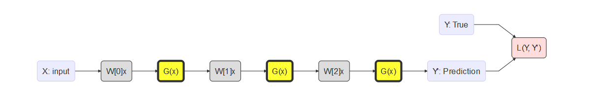

图像：一个3层深度网络。每一层由应用于前一层输入$x$的线性映射$W$组成，然后是一个固定的非线性函数$G(\vec{x})$

每一层中的线性映射（当然）由一个矩阵指定，这个矩阵被称为权重矩阵。网络完全由每层的权重矩阵的条目参数化（这些矩阵的所有条目可以视为参数向量$\theta$）。非线性函数$G(\vec{x})$对于每一层都是固定的，不能变化；它通常是一个以某种方式“压缩”输出范围的简单函数（比如tanh、relu或sigmoid——你不需要了解这些）。只有在优化过程中权重矩阵会发生变化。

$$\vec{y_i} = G(W_i\vec{x_i}+\vec{b_i})$$

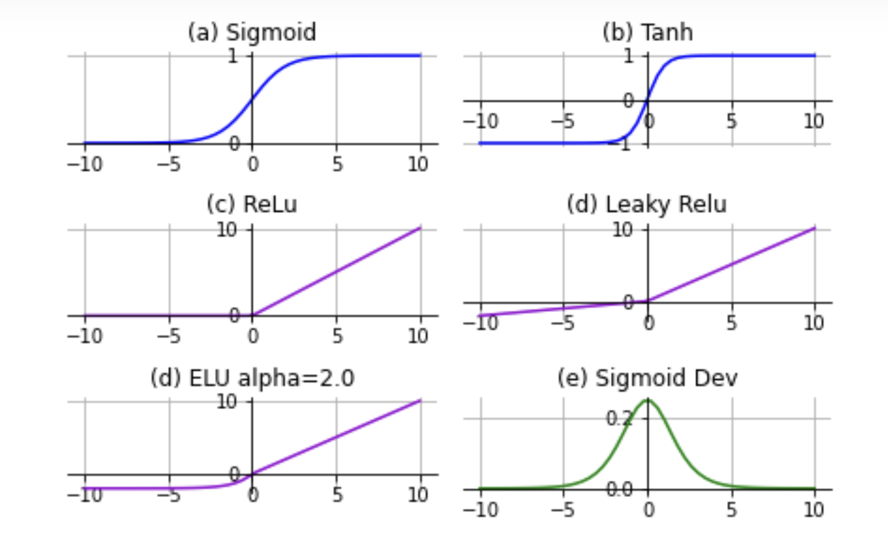  

而这种特定的构造（在某些条件下）具有巨大的优势，即目标函数**对权重的导数**可以同时为网络中的每一个权重计算，即使是多个层组合在一起的情况。执行此操作的算法称为反向传播，它是一种**自动微分算法**。"对权重的导数"意味着我们可以一次性知道每个权重对预测的影响程度，对于网络中的所有权重。

如果我们想象将所有权重矩阵的元素串联成一个单一向量$\theta$，我们就可以获得目标函数相对于$\theta$的梯度。这使得优化变得“容易”；我们只需朝着最快下降的方向前进即可。

## 为什么不使用启发式搜索算法
启发式搜索方法如随机搜索、模拟退火和遗传算法易于理解、实现简单，且几乎没有限制，它们可以适用于哪些问题。那么为什么不总是使用这些方法呢？

- 它们可能非常慢；可能需要很多次迭代才能接近最小值，并且每次迭代都需要大量计算。无法保证收敛，甚至无法保证进步。搜索可能会卡住，或者在高原地区缓慢漂移。

- 有大量的超参数可以调整（温度计划、种群大小、记忆结构等）。这些参数应该如何选择？这些参数的最佳选择本身就是一个优化问题。

- 对于像深度神经网络这样的优化问题，启发式搜索完全不够用。在训练有数百万参数的网络时，它简直是太慢了，无法取得进展。相反，应用了一阶优化。我们今天将讨论的一阶算法可以比启发式搜索快几个数量级。

注：如果目标函数已知是凸的，约束也是凸的，那么还有更好的优化方法，这些方法通常可以非常快速地运行，并保证收敛。

## 扔一个球：物理层面上的搜索
通过考虑一个在（光滑）表面上滚动的球来形成对高阶优化的直觉，这个表面代表了一个2D域上目标函数的值（即，如果我们有一个包含两个元素的参数向量$\theta$）。


重力对球施加一个垂直于表面平面的力。表面沿着表面法线的方向对球施加力，表面法线是一个从表面“直接指出”的向量。这导致了在表面最陡峭斜坡方向上的力分量，使球朝那个方向加速。这个梯度向量总是指向最陡斜坡的方向。


球最终会稳定在一个力平衡的配置中。例如，如果球在一个最小点稳定下来，表面的法线与重力平行，就会发生这种情况。

### Attractors: flowing towards a solution
我们可以将其视为一个**Attractors**，它将我们的搜索吸引到解决方案。搜索的轨迹与目标函数的“流场”平行。我们的物理直觉是，我们可以通过沿着这些流线滚动进入“盆地”来找到最小值。


### 雅可比矩阵：导数矩阵
如果$f(x)$是一个标量$x$的标量函数，$f^\prime(x)$是$f$关于$x$的一阶导数，即$\frac{d}{dx}f(x)$。二阶导数写作$f^{\prime\prime}(x) = \frac{d^2}{dx^2}f(x)$。

如果我们将其推广到向量函数$\vec{y}= f(\vec{x})$，那么我们在任意特定输入$\vec{x}$时，有输入的每个分量与输出的每个分量之间的变化率（导数）。我们可以将这些导数信息收集到一个称为雅可比矩阵的矩阵中，它描述了*在特定点$\vec{x}$*的斜率。如果输入$\vec{x} \in \real^n$且输出$\vec{y} \in \real^m$，那么我们有一个$m\times n$矩阵：

$$f'(\vec{x}) = \vec{J} =  \begin{bmatrix}
\frac{\partial y_0}{\partial x_0} & \frac{\partial y_0}{\partial x_1} & \dots & \frac{\partial y_0}{\partial x_n} \\
\frac{\partial y_1}{\partial x_0} & \frac{\partial y_1}{\partial x_1} & \dots & \frac{\partial y_1}{\partial x_n} \\
\dots \\
\frac{\partial y_m}{\partial x_0} & \frac{\partial y_m}{\partial x_1} & \dots & \frac{\partial y_m}{\partial x_n} \\
\end{bmatrix}
$$

这简单地告诉我们，当我们改变输入的任何一个分量时，输出的每个分量变化了多少——向量值函数的广义“斜率”。这是在点$\vec{x}$处表征向量函数变化的一种非常重要的方法，并且在许多上下文中广泛使用。在$f$将$\real^n$映射到$\real^n$（从一个向量空间映射到相同的向量空间）的情况下，我们有一个正方形的$n\times n$矩阵$\vec{J}$，我们可以用它来做标准的操作，比如计算行列式，进行特征分解或（在某些情况下）求逆。

在许多情况下，我们有一个非常简单的雅可比矩阵：只有一个单独的行。这适用于我们有一个标量函数$y = f(\vec{x})$的情况，其中$y\in\real$（即从$n$维输入到一维输出）。这是我们有一个损失函数$L(\theta)$作为向量输入的标量函数的情况。在这种情况下，我们有一个单行雅可比矩阵：梯度向量。

## 梯度向量：雅可比方程的一行
* $\nabla f(\vec{x})$ 是向量函数的（标量）函数的梯度向量，相当于向量函数的一阶导数。我们对$\vec{x}$的每个分量都有一个（偏）导数。这告诉我们，如果我们对每个维度独立地进行微小的变化，$f(\vec{x})$会变化多少。注意，在这门课程中我们只处理输出为标量但输入为向量的函数$f(x)$。我们将处理参数向量$\theta$的标量目标函数$L(\theta)$

$$\nabla L(\vec{\theta}) = \left[ \frac{\partial L(\vec{\theta})}{\partial \theta_1},  
\frac{\partial L(\vec{\theta})}{\partial \theta_2}, \dots, \frac{\partial L(\vec{\theta})}{\partial \theta_n},\right]$$
    
* 如果$L(\theta)$是一个映射$\real^n \rightarrow \real$（即一个标量函数，比如一个普通的目标函数），那么$\nabla L(\theta)$是一个值为向量的映射$\real^n \rightarrow \real^n$； 

* 如果$L(\theta)$是一个映射$\real^n \rightarrow \real^m$，那么$\nabla L(\theta)$是一个值为矩阵的映射$\real^n \rightarrow \real^{m\times n}$；  

$\nabla L(\theta)$ 是一个*指向$L(\theta)$变化最陡的方向*的向量。

##  海森矩阵：梯度向量的雅可比矩阵 
##  Hessian: Jacobian of the gradient vector

* $\nabla^2 f(\vec{x})$ 是向量函数的（标量）函数的*海森矩阵*，相当于向量函数的二阶导数。
按照我们上面的规则，它只是一个值为向量的函数的雅可比矩阵，所以我们知道：
* $\nabla^2 L(\theta)$ 是一个值为矩阵的映射$\real^n \rightarrow \real^{n\times n}$
这很重要，因为我们可以看到，即使是标量值函数的二阶导数也与其输入的维度呈二次方地增长！

（如果原始函数是一个向量，我们将得到一个海森张量而不是矩阵）。

$$H(L) = \nabla \nabla L(\vec{\theta}) = \nabla^2 L(\vec{\theta}) = 
\begin{bmatrix}
\frac{\partial^2 L(\vec{\theta})}{\partial \theta_1^2} & 
\frac{\partial^2 L(\vec{\theta})}{\partial \theta_1\partial \theta_2} & 
\frac{\partial^2 L(\vec{\theta})}{\partial \theta_1\partial \theta_3} & \dots &
\frac{\partial^2 L(\vec{\theta})}{\partial \theta_1\partial \theta_n}\\
\frac{\partial^2 L(\vec{\theta})}{\partial \theta_2\partial\theta_1} & 
\frac{\partial^2 L(\vec{\theta})}{\partial \theta_2^2} & 
\frac{\partial^2 L(\vec{\theta})}{\partial \theta_2\partial \theta_3} & \dots &
\frac{\partial^2 L(\vec{\theta})}{\partial \theta_2\partial \theta_n}\\
\dots\\
\frac{\partial^2 L(\vec{\theta})}{\partial \theta_n\partial\theta_1} & 
\frac{\partial^2 L(\vec{\theta})}{\partial \theta_n\partial \theta_2} & 
\frac{\partial^2 L(\vec{\theta})}{\partial \theta_n\partial \theta_3} & \dots &
\frac{\partial^2 L(\vec{\theta})}{\partial \theta_n^2}\\
\end{bmatrix},$$

reference
- [海森矩阵 - bilibili](https://www.bilibili.com/video/BV13V4y197dG/?spm_id_from=333.337.search-card.all.click&vd_source=d37f5f69997b21d81e19a377ec7cdb1e)
- [雅可比矩阵 -bilibili](https://www.bilibili.com/video/BV1NJ411r7ja/?spm_id_from=333.788&vd_source=d37f5f69997b21d81e19a377ec7cdb1e)

### 可微的目标函数
对于某些目标函数，我们可以计算出目标函数相对于参数$\theta$的（精确的）导数。例如，如果目标函数有一个单一的标量参数$\theta \in \real$，函数为：$$L(\theta) = \theta^2$$
那么，从基础微积分知识来看，关于$\theta$的导数就是：
$$L^\prime(\theta) = 2\theta.$$

如果我们知道导数，我们可以使用它来朝着“好的方向”移动——沿着目标函数的斜坡向下移动到最小值。

对于多维目标函数（其中$\theta$有多个分量），问题会稍微复杂一些，我们会有一个**梯度向量**而不是简单的标量导数（写作$\nabla L(\theta)$）。然而，同样的原理适用。

阶数：**零阶**、一阶、二阶
迭代算法可以根据它们所需的导数阶数进行分类：

零阶优化算法只需要评估目标函数$L(\theta)$。例子包括随机搜索和模拟退火。

一阶优化算法需要评估$L(\theta)$及其导数$\nabla L(\theta)$。这一类包括**梯度下降**方法家族。

二阶优化算法需要评估$L(\theta)$、$\nabla L(\theta)$以及$\nabla^2 L(\theta)$。这些方法包括**类牛顿**优化。

# 利用导数的优化
如果我们知道（或可以计算）目标函数的梯度，我们就知道在任何给定点的函数的斜率。这给了我们两个信息：

- 最快增长的方向和
- 该斜率的陡峭程度。
这是微积分的主要应用之一。

知道目标函数的导数足以大大提高优化的效率。

## 状态
### 可微性
一个光滑函数具有连续的导数，直到某个阶数。光滑函数通常更容易进行迭代优化，因为当前近似的小变化很可能导致目标函数的小变化。如果函数的第$n$阶导数是连续的，我们称这个函数是**$C^n$连续的**。

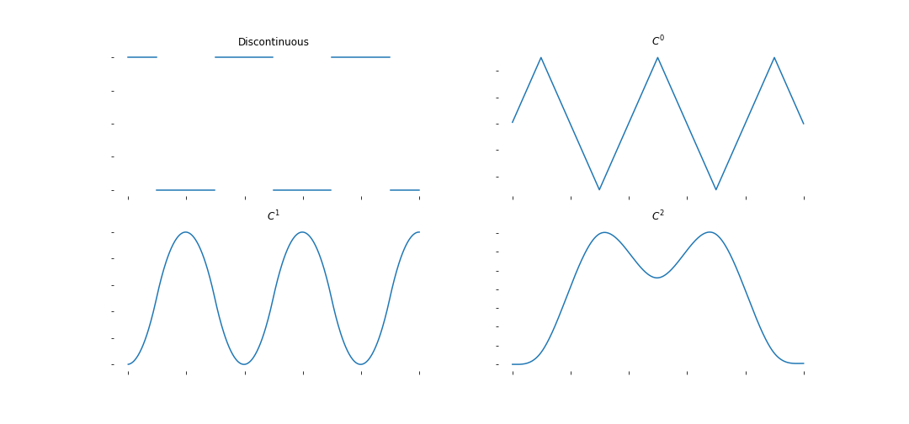
图片：从左到右，从上到下分别是不连续的、$C^0$、$C^1$、$C^2$连续函数  

拥有连续导数与知道这些导数是什么之间有区别。

一阶优化使用目标函数相对于参数的（一阶）导数。这些技术只能在目标函数至少是：

$C^1$连续的，即函数及其导数中无处有阶跃变化
可微的，即梯度在任何地方都是定义好的
（尽管我们会看到，这些约束在实践中可以有所放宽）。

许多目标函数满足这些条件，一阶方法比零阶方法有效得多。对于特定类别的函数（例如凸函数），已知特定一阶优化器收敛所需的步骤数量有明确的界限。

### 利普希茨连续性
一阶（和更高阶）连续优化算法对函数的要求比仅仅是$C^1$连续性更高，它们要求函数具有利普希茨连续性。

对于函数$\real^n \rightarrow \real$（即我们关心的目标函数$L(\theta)$），这等同于说梯度是有界的，函数的变化速率不能超过某个常数；存在一个最大的陡度。对于所有的$i$和某个固定的$K$，有$ \frac{\partial L(\theta)}{di} \leq K $。

#### Small Lipschitz constant
<video src="imgs/smooth_lipschitz.mp4" controls="true" width="50%"> -

视频中的白色圆锥体无论如何沿着函数滑动，都不会与函数相交。这个函数是利普希茨连续的；梯度在任何地方都是有界的，因此没有任何地方足够陡峭到可以与圆锥体相交。

<video src="imgs/lipschitz_big.mp4" controls="true" width="50%">-

### Lipschitz 常数
我们可以想象在一个表面上滑动一个特定陡度的圆锥体。我们可以检查它是否曾经触摸到表面。这是衡量函数陡峭程度的一个指标；或者等价于一阶导数的上界。函数$f(x)$的利普希茨常数$K$是一次只触摸函数一次的圆锥体的宽度的度量。这是一个衡量函数平滑程度的指标，或者等价于目标函数在其定义域上任何一点的最大陡度。它可以定义为：
$$K = \sup \left[\frac{ |f(x)-f(y)|}{|x-y|}\right],$$
其中$\sup$是上确界；比这个函数的每一个值都大的最小值。

较小的$K$意味着函数更加光滑。$K=0$完全平坦。我们将假设我们要处理的函数有一些有限的$K$，尽管其值可能不会被精确知道。

Lipschitz 连续 是比一致连续更强的条件，但比Lipschitz 连续更强的约束是可导，这都是建立在数学的基础上。

reference:
- [Lipschitz连续 - bilibili](https://www.bilibili.com/video/BV1L84y1S7ox/?spm_id_from=333.337.search-card.all.click&vd_source=d37f5f69997b21d81e19a377ec7cdb1e)

## 分析导数
如果我们有**分析导数**（即我们知道函数的导数的封闭形式；我们可以直接写下数学公式），你可能还记得高中数学优化的过程：
- 计算导数 $f^\prime(x) = \frac{d}{dx}f(x)$
- 解导数为零的方程（即解$x$使得$f^\prime(x)=0$）。这找到了函数的所有转折点或极值点。
- 然后检查解中是否有二阶导数为正的 $f^{\prime \prime}(x)>0$，这表示解是最小值。

### Example
This is how we might find the minimum of $$f(x) = x^4 -40x^2 -100x.$$ The derivative is: $$f^\prime(x) = 4x^3 - 80x - 100$$ and the second derivative is $$f^{\prime\prime}(x) = 12x^2 - 80.$$ We can solve for: $$f^\prime(x) = 4x^3-20x-100 = 0,$$ and check the sign of $$f^{\prime\prime}(x) = 12x^2 -20$$ to find if we have a minimum. 

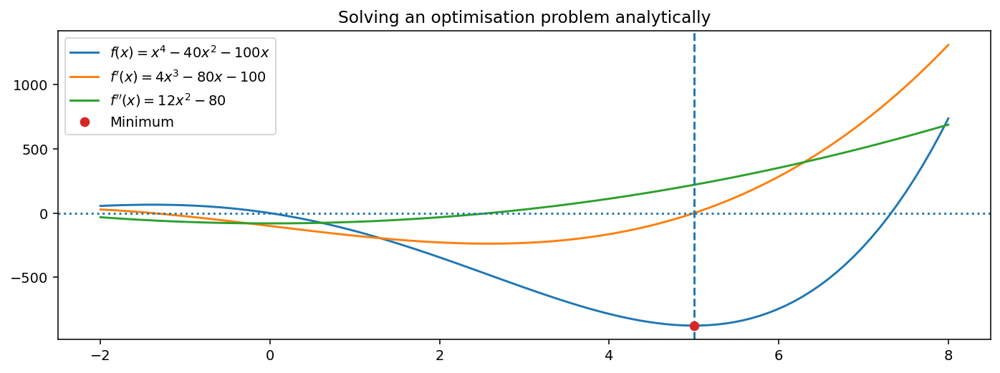

## 可计算的精确导数
解析导数方法根本不需要迭代。只要解出导数，我们就能立刻得到解。但通常我们没有简单的导数解，我们可以在特定点评估导数；我们有**精确的逐点导数**。我们可以评估函数$f^\prime(x)$在任何$x$处的值，但不能用封闭形式写下它。在这种情况下，我们仍然可以通过采取步骤使我们“尽可能快地下山”来大大加速优化。这要求我们能够在目标函数的任何点计算梯度。

## 梯度：导数向量
我们将处理输入向量并输出标量的目标函数：
```
    # vector -> scalar
    def objective(theta): 
        ...
        return score
```
我们希望**生成**函数:
``` 
    # vector -> vector
    def grad_objective(theta):
        ...
    return score_gradient
```    
数学上，我们可以将导数向量写为：
$$
\nabla L(\vec{\theta}) = \left[ \frac{\partial L(\vec{\theta})}{\partial \theta_1},  
\frac{\partial L(\vec{\theta})}{\partial \theta_2}, \dots, \frac{\partial L(\vec{\theta})}{\partial \theta_n},\right]
$$

注意：$\frac{\partial L(\vec{\theta})}{\partial \theta_1}$仅表示在点$\vec{\theta}$处，沿$\theta_1$方向上$L$的变化。

这个向量$\nabla L(\vec{\theta})$被称为梯度或梯度向量。在任意给定点，函数的梯度指向函数增长最快的方向。这个向量的大小是函数变化的速率（“陡度”）。

## 梯度下降
基本的一阶算法称为梯度下降，它非常简单，从某个初始猜测$\theta^{(0)}$开始：

$$\vec{\theta^{(i+1)}} = \vec{\theta^{(i)}} - \delta \nabla L(\vec{\theta^{(i)}})$$    

其中$\delta$是一个缩放超参数——步长。步长可能是固定的，也可能根据像线搜索这样的算法自适应地选择。

这意味着优化器会进行移动，在那里目标函数下降得最快。

用更简单的术语来说：

从某个地方开始 $\theta^{(0)}$
重复以下步骤：
检查在每个方向上地面有多陡 $v = \nabla L(\vec{\theta^{(i)}})$
在最陡的方向 $v$ 上移动一小步 $\delta$，以找到新的位置 $\vec{\theta^{(i+1)}}$。
符号说明：$\vec{\theta^{(i)}}$ 并不意味着 $\theta$ 的第 $i$ 次幂，而只是迭代序列中的第 $i$ 个 $\vec{\theta}$：$\vec{\theta}^{(0)}, \vec{\theta}^{(1)}, \vec{\theta}^{(2)}, \dots$

### 下坡不总是最短路径
虽然梯度下降可以非常快，但沿梯度方向并不一定是达到最小值的最快路线。在下面的例子中，从红点到最小值的路线非常短。然而，沿梯度方向，却需要绕一个很远的路才能到达最小值。

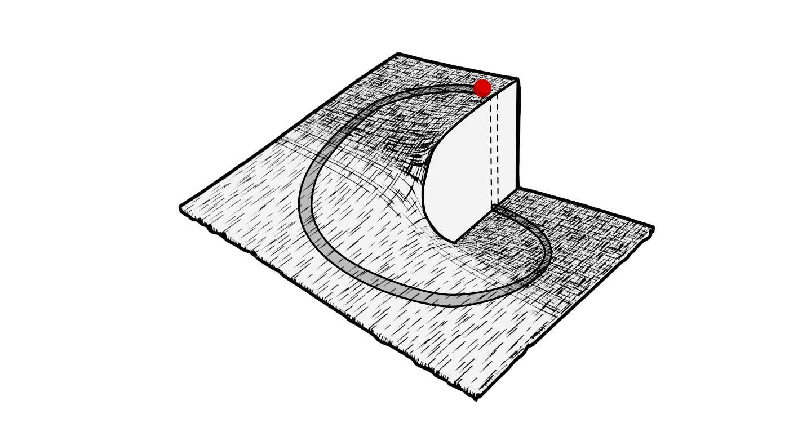

图像：梯度下降意味着沿最陡峭的坡下降——但这不总是最短的路线

不过，它通常比盲目地四处跳跃希望到达底部要快得多！

## Implementing gradient descent
The implementation follows directly from the equations:
```
import utils.history
import imp; imp.reload(utils.history)
from utils.history import History

# 
# note: fixed step size isn't a good idea!

def gradient_descent(L, dL, 
                     theta_0, 
                     delta, tol=1e-4):
    """
     L: scalar loss function
     dL: gradient of loss function w.r.t parameters
     theta_0: starting point
     delta: step size
     tol: termination condition; 
         when change in loss is less than tol, stop iterating
     """
    theta = np.array(theta_0) # copy theta_0    
    o = History()    
    o.track(np.array(theta), L(theta))
    
    # while the loss changes
    while np.sum(np.abs(dL(theta)))>tol:
        # step along the derivative        
        theta += -delta * dL(theta)        
        o.track(np.array(theta), L(theta))        
        
    return o.finalise()

def L(theta):
    return theta**2

def dL(theta):
    # we can differentiate L(theta) in our heads :)
    return 2*theta

def plot_gradient_descent(xs, L, dL, x_0, step):
    # do descent
    res = gradient_descent(L, dL, x_0, step)
    
    # plot
    fig = plt.figure()
    ax = fig.add_subplot(1,1,1)    
    ax.fill_between(xs, L(xs), label="Objective function")    
    ax.set_title("Step size=%f" % step)
    ax.set_xlabel("$\\theta_1$")
    ax.set_ylabel("Loss")
    ax.plot(res.best_thetas, res.best_losses, 'k-x', label='Steps')
    ax.legend()
    print("Converged in {0} steps".format(res.iters))

xs = np.linspace(-10,10,200)
```

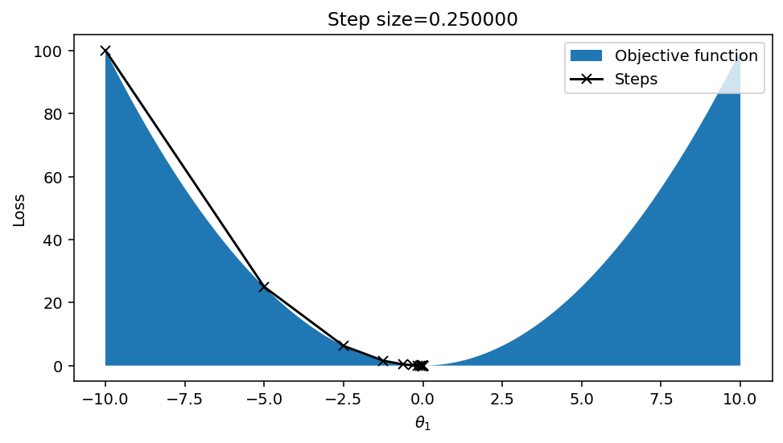


### 步长的重要性
步长 $\delta$ 对成功至关重要。如果它太小，步伐会非常小，收敛会很慢。如果步伐太大，优化的行为可能变得相当不可预测。如果在一步的空间内梯度函数变化显著（例如，如果梯度在步长中改变符号），就会发生这种情况。

- 步长为0.01
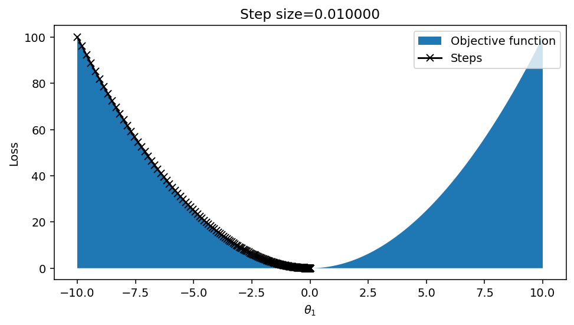
- 步长为0.5
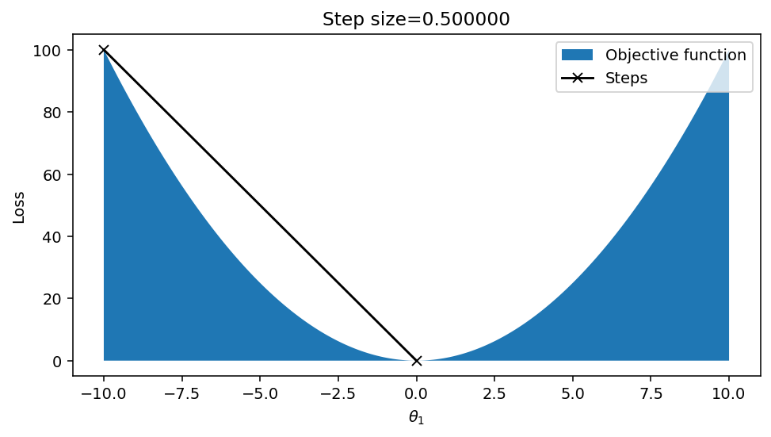
- 步长过长 - 震荡现象
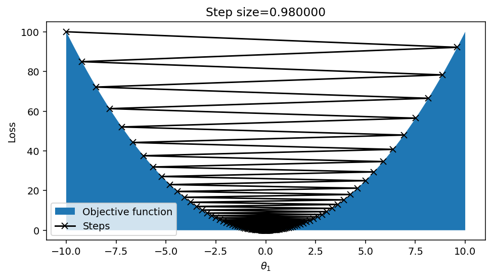
- 步长太大 -发散
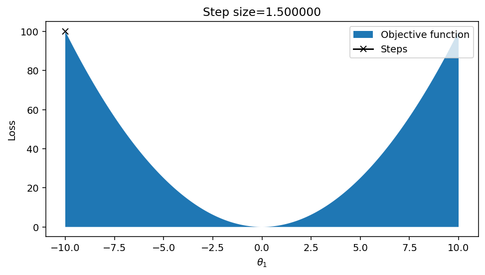

###  与Lipschitz 常数的联系
的确，步长 $\delta$ 与目标函数的Lipschitz常数 $K$ 直接相关。理论上，如果我们知道Lipschitz常数，我们可以选择一个保证收敛性的步长，不会太大以致于引起振荡，也不会太小导致收敛过慢。具体来说，步长通常选择为Lipschitz常数的倒数。

然而，实际情况是在许多现实世界的优化任务中，我们很少能精确知道 $K$，因此步长往往是通过近似方法（如线搜索）来设定的。线搜索是一种动态调整步长的方法，它在每次迭代中尝试找到一个能够减少目标函数值的步长。这样做的好处是可以适应目标函数的局部性质，但也增加了每次迭代的计算负担

### 在二维空间中的梯度下降
这种技术可以扩展到任意数量的维度，只要我们能够在参数空间的任意点获得梯度向量。我们只是有一个梯度向量 $\nabla L(\theta)$ 而不是简单的一维导数。代码不需要改变。

在二维空间中，梯度下降算法会考虑两个参数的梯度，并在这两个方向上同时进行优化。这意味着每一次迭代中，算法都会根据两个参数的偏导数来更新这两个参数的值。在高维空间中，算法的这个性质是一样的，每个参数都根据它的偏导数进行更新，尽管在更高的维度中，直观理解和可视化就更加困难。

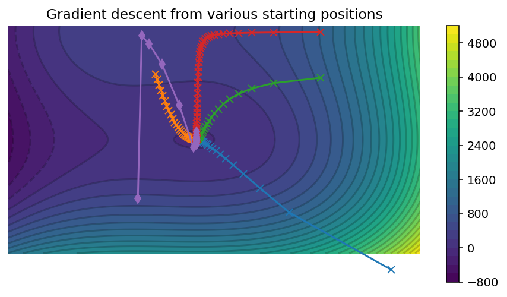

## 目标函数的梯度
为了能够进行一阶优化，必须能够得到目标函数的导数。显然，这并不直接适用于经验优化（例如，在实验中测试组件质量的真实世界制造过程——没有导数），但在许多我们拥有可优化的计算模型的情况下，这种方法是可行的。这也是在优化过程中倾向于构建模型的另一个原因。

当目标函数是一个已知的数学表达式时，我们可以直接计算它的梯度。在机器学习等领域，目标函数通常是一个损失函数，它衡量的是模型预测和真实数据之间的差异。在这些情况下，可以使用自动微分工具（如TensorFlow或PyTorch）来计算梯度，即使是对于非常复杂的函数。

在那些无法直接计算梯度的情况下，比如实验或制造过程优化，可能会采用基于梯度的估计方法，如有限差分法，或者采用其他类型的优化方法，如进化算法或模拟退火，它们不需要目标函数的梯度。

### 为什么不使用数值差分法？
函数 $f(x)$ 微分的定义是众所周知的公式：

鉴于这个定义，如果我们能够在任何地方评估 $L(\theta)$，为什么我们需要知道真正的导数 $\nabla L(\theta)$ 呢？为什么不仅仅是评估 $L(\theta+h)$ 和 $L(\theta-h)$ 对于一些小的 $h$ 呢？这种方法称为数值微分，这些是有限差分。

$$
\frac{d}{dx}f(x) = \lim_{h \rightarrow 0} \frac{f(x+h) - f(x-h)}{2h}
$$  

对于相当平滑的一维函数，这种方法效果不错：
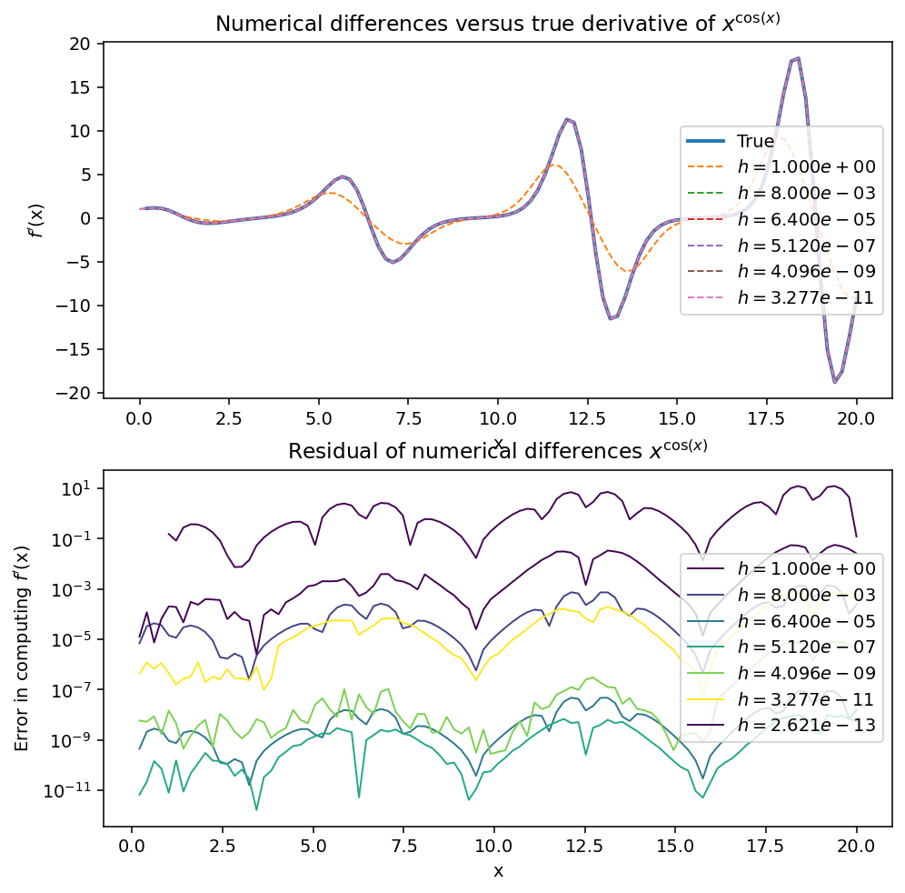


### 数值问题
选择一个既不会导致函数表示不准确又不会让数值问题主导结果的 $h$ 也是困难的。记住，有限差分违反了所有良好的浮点结果规则：
​ $$\frac{f(x+h) - f(x-h)}{2h}$$

* (a) 它将一个小数 $h$ 加到可能大得多的数 $x$ 上 (量级误差)
* (b) 然后它减去两个非常相似的数 $f(x+h)$ 和 $f(x-h)$ (消除误差)
* (c) 然后它将结果除以一个非常小的数 $2h$ (除法放大)

由于这些问题，有限差分方法虽然在数学上是可行的，但在实际的计算实践中往往是次优的。特别是在机器学习等领域，其中包含大量参数的复杂函数，采用自动微分技术来准确且高效地计算梯度是非常重要的。自动微分利用链规则，可以避免有限差分中的数值不稳定性和高计算成本，因此在需要频繁和准确地计算梯度的情况下，它成为了首选方法。

### 维数诅咒的复仇
然而，即使我们能够处理数值问题，在高维中这也是不可行的。**维数诅咒**再次出现。为了在点 $\vec{x}$ 处评估梯度，我们需要在每一个维度 $x_i$ 计算数值差分。如果 $\vec{\theta}$ 有一百万个维度，那么每一个单独的导数评估都将需要两百万次 $L(\theta)$ 的计算！这是一个完全不合理的开销。与零阶方法相比，一阶方法的加速会因为梯度的评估而消失。

正因为这样，在实践中，对于大型机器学习模型和其他高维优化问题，自动微分成为了一种必不可少的工具。自动微分技术，如反向传播算法，使我们能够有效地同时计算所有维度的导数，从而显著减少了所需的函数评估次数。这样一来，一阶优化算法就能够有效地应用于具有大量参数的复杂系统，使得深度学习等高维机器学习任务成为可能

# 改进梯度下降
梯度下降可以非常有效，并且通常比零阶方法**好得多**。然而，它也有缺点：

损失函数 $L^\prime(\theta) = \nabla L(\theta)$ 的梯度必须能够在任何点 $\theta$ 处计算。**自动微分**在这方面提供了帮助。

梯度下降可能会陷入局部最小值。这是梯度下降方法的固有特点，除非函数是凸的并且步长是最优的，否则它不会找到全局最小值。**随机重新启动**和**动量**方法可以减少对局部最小值的敏感性。

梯度下降只适用于平滑、可微的目标函数。**随机松弛**引入了随机性，允许对非常陡峭的函数进行优化。 -[随机松弛 - bilibili](https://www.bilibili.com/video/BV1vu411S7cu/?spm_id_from=333.337.search-card.all.click&vd_source=d37f5f69997b21d81e19a377ec7cdb1e)


如果目标函数（和/或梯度）评估起来很慢，梯度下降可能会非常慢。如果目标函数可以表示为许多子问题的简单总和，随机梯度下降可以大大加速优化。

这些改进措施可以帮助梯度下降方法克服一些基本的限制，从而在更广泛的问题上更为有效和可靠。通过结合这些技术，可以改善梯度下降方法的鲁棒性，尤其是在复杂或非标准的优化问题中。

## 自动微分
如果我们能够以封闭形式精确地知道目标函数的解析导数，这个问题就可以解决。例如，我们在上一讲中看到的最小二乘线性回归的导数（相对而言）很容易确切地作为公式计算出来。然而，手动计算目标函数的导数似乎非常限制性，对于一个复杂的多维问题，这可能确实非常复杂。这是**算法微分**（或**自动微分**）的主要动机。

自动微分可以接受一个函数，通常是用一个完整编程语言的子集编写的，并自动构造一个在任何给定点评估精确导数的函数。这使得执行一阶优化变得可行。

## 编程语言的进步
在这个模块中，我们将看到支持数据科学的三个主要的编程进步。

* **向量化编程**

    * *例如*： NumPy，eigen，nd4j，J
    * 提供对张量的原生操作，可能有GPU加速。
    * 可微分编程

* **可微分编程**
    * *例子*： autograd，JAX，pytorch，tensorflow
    * 自动微分向量化代码，生成张量算法的精确导数。

* **概率编程**
    * *例子*： pymc，stan，edward，Uber，Pyro，webppl
    * 允许值是不确定的，具有（张量，可微分）的随机变量作为一等值

这些进步中的每一个都为语言的表达能力提供了巨大的飞跃，使得能够优雅而紧凑地处理那些否则会繁琐且晦涩的算法。

### 数据科学现代进步背后的魔法
一些最常见的实现技术体现在像TensorFlow、Theano、Torch/PyTorch这样的深度学习软件包中。这些软件提供了定义**计算图**的方法（隐式或显式），该计算图定义了要执行的操作，并且可以从中推导出相应的导数计算。这些实现往往专注于在神经网络中使用的操作，如矩阵乘法和逐元素非线性函数，并且它们通常不包括分支或迭代（或仅支持有限形式的条件/循环表达式）。

### Autograd
例如autograd，为几乎所有NumPy代码提供自动微分。下面的例子来自autograd文档。它是一个可以直接替换的工具，它可以“神奇地”估计导数（尽管只支持某些操作）。

autograd 现在已经发展成为 Google JAX，可能是最有前途的机器学习库。JAX支持使用自动微分的GPU和TPU计算。我在这里没有使用它，因为它安装起来比较困难。

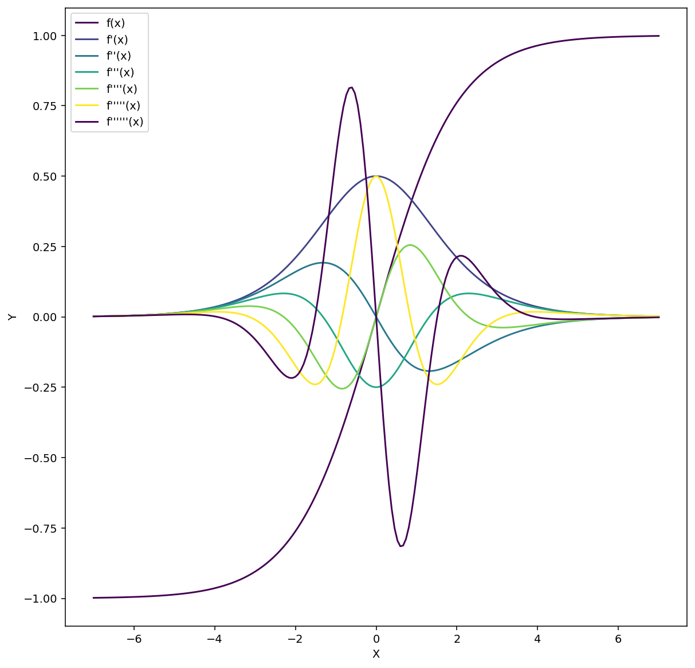

### Vectorised example
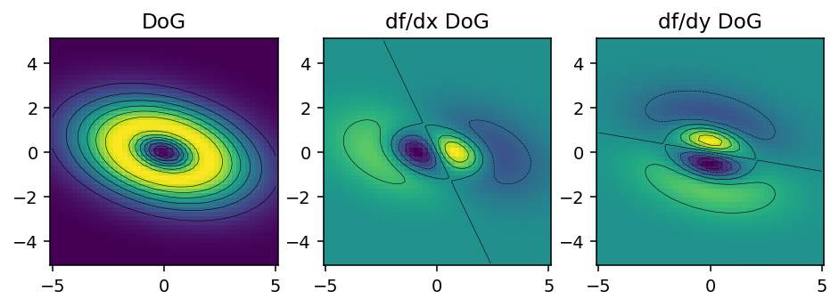

## 导数技巧
[旁注：如果你有一个函数的梯度，你可以做一些巧妙的事情，比如计算从表面反射的光线，假设有一个固定的光源。这对IDSS直接并不重要，但展示了能够对函数进行微分是多么有用]

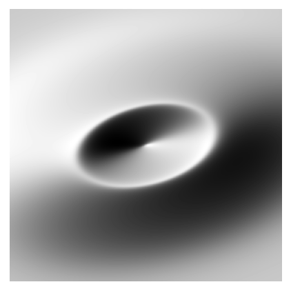

## 在优化中使用自动微分
利用自动微分技术，我们可以将目标函数的形式直接写成计算过程，并且“免费”获得该函数的导数。这使得执行一阶优化变得极为高效。

这正是机器学习库所做的事情。它们让编写在GPU/TPU硬件上运行的向量化、可微代码变得简单。其余的只是附加操作

### 一阶线性拟合
让我们重新解决第6讲中的最佳拟合直线问题。我们想要找到 $m$ 和 $c$；即直线的参数，使得直线与一组数据点之间的平方差最小化（目标函数）。

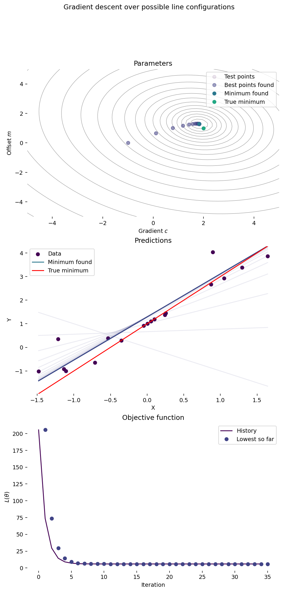

## 自动微分的限制
显然，微分只适用于可微分的函数。 虽然一阶梯度向量通常可以在合理的时间内计算，但正如我们稍后将看到的，计算多维函数的二阶导数变得非常困难。

**"The Blind Watchmaker"**一书中提出并讨论了如何动物进化出伪装能力的问题。进化是一个逐步的优化过程，而为了能够被接受的步骤，需要从"较差的适应性"到"良好的适应性"之间有一个平滑的路径。


那么，像蛾这样的动物是如何进化出伪装的呢？它要么被看到而被捕食者吃掉，要么捕食者没看到它。这是一个二元函数，没有梯度。虽然进化不需要梯度，但它确实需要存在大致连续的适应性函数。

解决方案
争论点是，尽管每一个特定的案例都是简单的二元选择，但它是平均在许多随机情况下，其中条件会略有不同（可能接近黑暗，可能捕食者视力不佳，可能天气多雾）并且平均所有这些情况，一些非常微小的颜色变化可能会带来优势。从数学角度讲，这是随机弛豫；表面上不可能的陡峭梯度通过整合许多不同的随机条件被渲染成（大约）Lipschitz连续的。

这适用于进化之外的许多问题。例如，一个非常陡峭的函数在某点有一个非常大的导数；或者它在部分区域内可能导数为零。但如果我们对许多情况进行平均，其中步骤位置略有不同，我们就会得到一个平滑的函数。

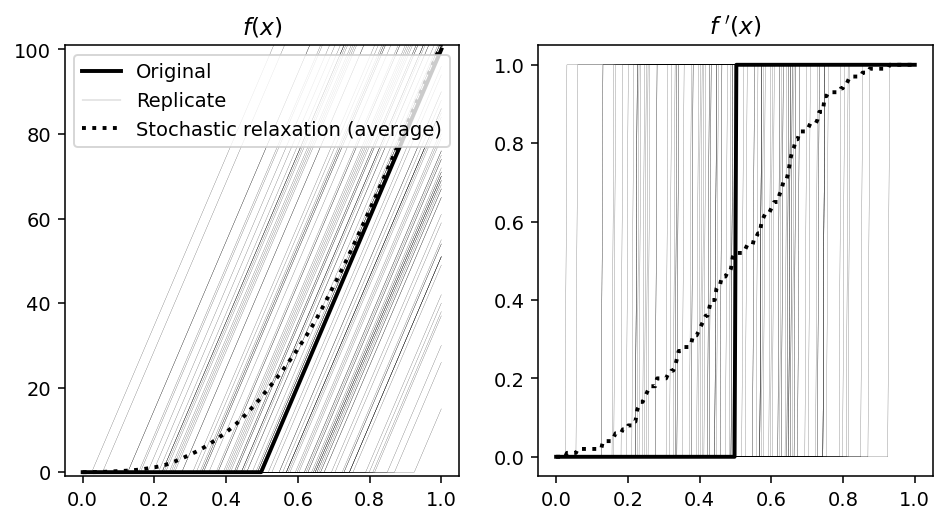

## 随机梯度下降
梯度下降在每次迭代之前都会评估目标函数及其梯度，然后再进行一步操作。这在优化大数据集的函数近似时尤其昂贵（例如，在机器学习中）。

如果目标函数可以分解为小的部分，优化器可以独立地对随机选择的部分进行梯度下降，这可能会快得多。这称为随机梯度下降（SGD），因为它采取的步骤取决于目标函数部分的随机选择。

如果目标函数可以写成和的形式：
$$L(\theta) = \sum_i L_i(\theta),$$
即目标函数由许多简单的子目标函数 $L_1(\theta), L_2(\theta), \dots, L_n(\theta)$ 的和组成。

这种形式在参数匹配观测值的近似问题中经常出现，如在机器学习应用中。在这些情况下，我们有许多训练样本 $\vec{x_i}$ 与已知的输出 $y_i$ 匹配，我们希望找到参数向量 $\theta$ 

$$L(\theta) = \sum_i ||f(\vec{x_i};\vec{\theta}) - y_i||$$

使得上述式子被最小化，即模型输出和期望输出之间的差异被最小化，对所有训练样例求和。

微分是一个线性运算符。这意味着我们可以交换求和、标量乘法和微分 $\frac{d}{dx}\left(a f(x)+ b g(x)\right) = a\frac{d}{dx}f(x) + b\frac{d}{dx}g(x)$，我们有：

$$\nabla \sum_i ||f(\vec{x_i};\vec{\theta}) - y_i|| = \sum_i \nabla ||f(\vec{x_i};\vec{\theta}) - y_i||$$

在这种情况下，我们可以取任何一组子集的训练样本和输出，计算每个样本的梯度，然后根据子集的计算梯度进行移动。随着时间的推移，随机子集选择将（希望）平均分布。每个子集称为一个**小批量**（minibatch），并且遍历整个数据集的一次运行（即足够的小批量，以便每个数据项都被优化器“看到”）称为一个**轮次**（epoch）。

### 内存优势
SGD(随机梯度下降)在内存消耗方面具有主要优势，因为计算可以应用于**小批量**的少量样本。我们只计算一个子样本的梯度，并朝着那个方向移动。这不会是完全正确的整个目标函数的导数，但它将是一个很好的近似。

特别是在内存受限的设备上，如GPU（即使是强大的GPU，也可能只有12-16GB的RAM），将整个数据集存储在设备上可能是不可能的。分成批次可以绕过这个限制。这也可以在内存层次结构方面具有优势——小批量数据可能会引起更少的缓存未命中，从而提高性能。

### 启发式增强
SGD(随机梯度下降)不仅在内存效率上有优势，实际上在目标函数下降方面也可以提高优化性能，特别是通过减少陷入极小值的可能性。这是因为在每个小批量中对目标函数的随机划分向优化过程中增加了噪声。这一开始看起来像是一个问题；我们不希望优化是不准确的。但噪声意味着梯度下降有可能不下降，而是可能上升并越过一个极大值。

虽然增加噪声是一种**启发式搜索方法**（没有保证它会改善情况，甚至不会让情况变得更糟），但通常非常有效。我们本质上得到了一种有限形式的**随机松弛**的好处——通过对随机子样本进行平均，我们的目标函数可以被“平滑化”，所以即使它不是完全的Lipschitz连续（或者有一个不好的Lipschitz常数），SGD也可以工作得很好。

### 使用SGD
SGD并没有保证会朝着正确的方向移动。在实践中，它对许多现实世界问题来说可以非常高效。例如，让我们再次考虑将一条线拟合到观察结果（线性回归）的问题。

给定一组对 $x_i, y_i$，我们想要找到参数 $\vec{\theta} = [m,c]$ 来最小化函数 $y^\prime=f(x;m,c)=mx+c$ 和真实已知输出 $y$ 之间的平方误差。目标函数是：

$$\sum_i ||f(\vec{x_i};\vec{\theta}) - y_i||_2^2$$
$$=\sum_i ||(mx_i+c) - y_i||_2^2$$

我们可以计算一个随机子集上的梯度，而不是计算整个和。代码实现：

```
import autograd.numpy as np
def sgd(L, dL, theta_0, xs, ys, step=0.1, batch_size=10, epochs=10):
    """L: Objective function, in the form L(theta, xs, ys)
       dL: derivative of objective function in form dL(theta, xs, ys)
       theta_0: starting guess       
       xs: vector of inputs 
       ys: vector of outputs
       step: step size
       batch_size: batchsize
    """
    theta = np.array(theta_0)
    grad = np.zeros_like(theta_0)
    
    o = History()
    
    # One epoch is one run through the whole dataset
    for epoch in range(epochs):
        batch = np.arange(len(xs))
        # randomize order
        np.random.shuffle(batch)
        subset_index = 0        
        # iterate over subsets                
        
        ## One batch
        while subset_index + batch_size <= len(xs):                   
            
            # accumulate partial gradient            
            i,j = subset_index, subset_index+batch_size
            
            # compute gradient on the random subset
            # accumulating the gradient direction as we go
            grad = dL(theta, xs[batch[i:j]], ys[batch[i:j]])  / (j-i)    
            # next batch please!
            subset_index += batch_size            
            
            # make a step
            theta = theta - grad * step
            o.track(theta, L(theta, xs, ys))  
               
        #o.track(theta, L(theta, xs, ys))    
    return o.finalise()
```
### 使用SGD的线性回归
我们可以使用10000个点来进行线性回归示例——并且只通过数据一次就找到了一个很好的拟合。这是因为我们可以将问题分解为许多小问题的和（一次在几个随机点上拟合线），这些都是一个大问题的一部分（拟合所有点的线）。

当这种情况成为可能时，它比计算我们可用的全部数据集的梯度要高效得多。
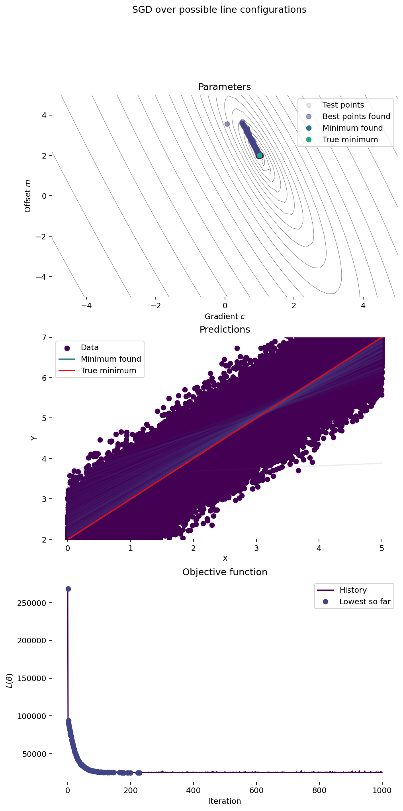

## 一个噩梦般的函数
这个函数包含了所有困难的特性：

- 到处是狭窄的山谷
- 多个局部最小值
- 中间穿过一个巨大的山脊

梯度下降几乎无望——它会被困在一个山谷中，并在一个巨大的弧形路径中徘徊，甚至永远不会接近任何一个局部最小值

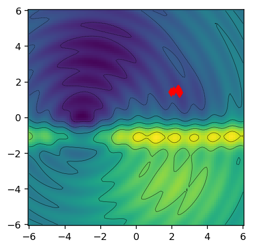

梯度下降法不能很好地解决问题。调整步长也无济于事；问题并不在于我们选择了一个糟糕的步长。**弹性梯度下降**也无济于事；我们的目标函数并不是一个简单的子目标函数之和。我们能做什么呢？

## 随机重启
梯度下降法很容易陷入局部极小值。一旦陷入局部极小值的**吸引盆地**，就很难脱身。梯度下降法可以增加一点噪音，使优化器越过小的山脊和山峰，但无法脱离深度最小值。一个简单的启发式方法就是运行梯度下降法，直到它卡住为止，然后随机地以不同的初始条件重新开始，再试一次。如此反复多次，希望其中一条优化路径最终能达到全局最小值。这种元启发式适用于任何局部搜索方法，包括爬山法、模拟退火法等。

## 简单记忆：动量项
一个物理上的球在表面滚动时不会因为表面的小不平整而停下来。一旦它开始下坡滚动，它可以跳过小坑坑和小凹陷，穿过平坦的平原，并且稳定地沿着狭窄的山谷向下，而不会从边缘弹开。这是因为它有动量；它会倾向于继续向它刚才前进的方向移动。这是记忆启发式的一种形式。与其拥有蚁群风格的路径，优化器只记住一条简单的路径——它当前的前进方向。

同样的想法可以用来减少（随机）梯度下降被目标函数中的小波动所困住的几率，并且“平滑”下降过程。思路很简单；如果你现在正朝着正确的方向前进，即使梯度不总是完全下降，也要继续朝那个方向前进。

我们引入一个速度 $v$，并让优化器朝这个方向移动。我们逐渐调整 $v$ 以与导数对齐。
$$
v = \alpha v + \delta \nabla L(\theta)\\
\theta^{(i+1)} = \theta^{(i)} - v\\
$$

这由参数 $\alpha$ 控制；$\alpha$ 越接近 1.0，系统中的动量就越大。$\alpha=0.0$ 相当于普通的梯度下降。

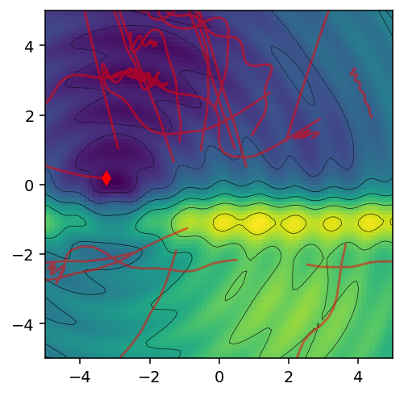

# 关键点的类型
这种对物理表面的直观理解让我们思考如何描述目标函数的不同部分。

对于平滑连续的目标函数，空间中有几种特别感兴趣的点。这些是**关键点**，在这些点上，梯度向量的分量是零向量。
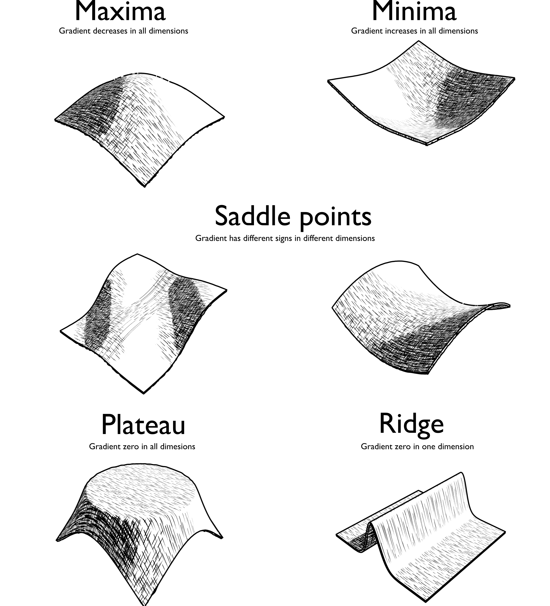  
图片：关键点的分类。每一种都对应于Hessian矩阵的特征值的不同配置。

## 二阶导数
如果一阶导数代表函数的“斜率”，那么二阶导数代表函数的“曲率”。

对于每一个参数分量 $\theta_i$，海森矩阵（Hessian）存储了其他每一个 $\theta_j$ 的“陡峭程度”如何变化。

想象我在一座山上
- 我所在的海拔高度对应于目标函数的值。
- 我可以改变的参数是我的北/南和东/西方向的位置。
- 梯度向量是我向北或向东走一步时海拔高度的变化，这些就是两个参数。这表示了我在山上所处位置的局部陡峭程度。
- 海森矩阵（Hessian）捕捉到当我向北走时，向北一步陡峭程度的变化量，同时当我向北走时东面陡峭程度的变化量；向东走同理。因此，有一个2x2矩阵描述了这些陡峭程度的变化。

对于向量值函数 $f(\vec{x})$,，我们有以下关系：

$$
\nabla L(\vec{\theta}) = \left[ \frac{\partial L(\vec{\theta})}{\partial \theta_1},  
\frac{\partial L(\vec{\theta})}{\partial \theta_2}, \dots, \frac{\partial L(\vec{\theta})}{\partial \theta_n}\right],
$$
这是梯度向量，而二阶导数存储在海森矩阵中：
$$
\begin{equation}
\nabla \nabla L(\vec{\theta}) = \nabla^2 L(\vec{\theta}) = 
\begin{bmatrix}
\frac{\partial^2 L(\vec{\theta})}{\partial \theta_1^2} & 
\frac{\partial^2 L(\vec{\theta})}{\partial \theta_1\partial \theta_2} & 
\frac{\partial^2 L(\vec{\theta})}{\partial \theta_1\partial \theta_3} & \dots &
\frac{\partial^2 L(\vec{\theta})}{\partial \theta_1\partial \theta_n}\\
\frac{\partial^2 L(\vec{\theta})}{\partial \theta_2\partial\theta_1} & 
\frac{\partial^2 L(\vec{\theta})}{\partial \theta_2^2} & 
\frac{\partial^2 L(\vec{\theta})}{\partial \theta_2\partial \theta_3} & \dots &
\frac{\partial^2 L(\vec{\theta})}{\partial \theta_2\partial \theta_n}\\
\dots\\
\frac{\partial^2 L(\vec{\theta})}{\partial \theta_n\partial\theta_1} & 
\frac{\partial^2 L(\vec{\theta})}{\partial \theta_n\partial \theta_2} & 
\frac{\partial^2 L(\vec{\theta})}{\partial \theta_n\partial \theta_3} & \dots &
\frac{\partial^2 L(\vec{\theta})}{\partial \theta_n^2}\\
\end{bmatrix},
\end{equation}
$$

这就是海森矩阵。注意，在海森矩阵中，我们为函数的每一对维度都有一个条目。你可能会注意到它与协方差矩阵的相似性，后者捕捉了数据坐标如何相互变化；海森矩阵则捕捉了函数的梯度如何相互变化。

对于一个二维表面，梯度向量指定了在给定点切于表面的平面的法线。海森矩阵指定了一个二次函数（一个有一个极小值的平滑曲线），遵循表面的曲率。

### 海森矩阵的特征值
海森矩阵的特征值捕捉了我们在前面讲座中看到的关于**关键点类型**的重要特性。特别是，海森矩阵的**特征值**告诉我们我们所拥有的关键点是什么类型的。

- 如果所有特征值都严格为正，矩阵被称为**正定的**，该点是一个极小值点。
- 如果所有特征值都严格为负（**负定的**），那么该点是一个极大值点。
- 如果特征值有混合的符号，那么该点是一个鞍点。
- 如果特征值都是正或都是负，但其中一些是零，那么矩阵是**半正定的**，该点是高地/脊线。

## 二阶优化
二阶优化使用 Hessian 矩阵，一步跳到每个局部二次逼近的底部。 这样就可以跳过平原，避开会减慢梯度下降速度的鞍点。一般来说，二阶方法要比一阶方法快得多。

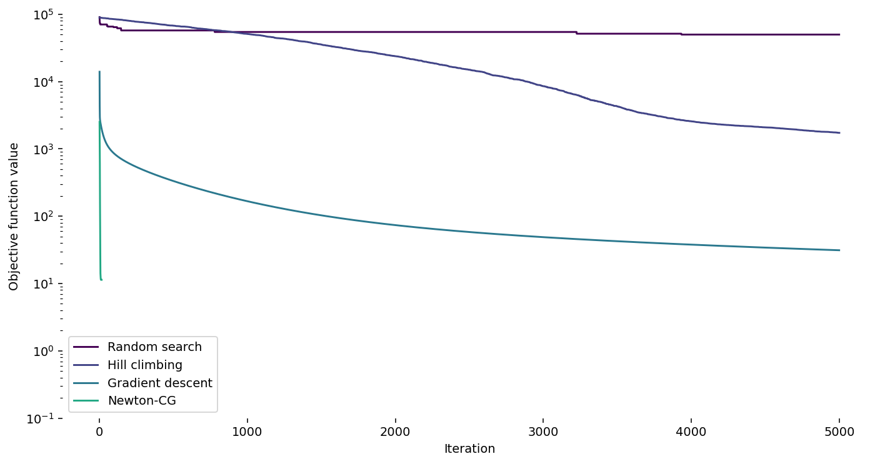

## 维度诅咒（再次提及）
然而，简单的二阶方法在高维空间中不适用。计算 Hessian 矩阵需要 $d^2$ 次计算以及 $d^2$ 的存储空间。许多机器学习应用中的模型具有 $d >$ 100 万个参数。仅仅存储一次优化迭代的 Hessian 矩阵就需要：

二阶优化在穿越鞍点和平原时比梯度下降等一阶方法更快。它在低维问题中特别有效，但是维度诅咒总是存在的。想象一下，我们有一个包含 100 万个参数的问题需要优化。梯度向量的元素数量与参数向量相同，因此有 100 万个元素，或者对于 float64，约占用 8 兆字节的内存。但 Hessian 矩阵必须存储每一对参数的变化。这将需要：8000000000000 bytes of memory 即 8 TB！这是无法承受的计算负担。有一些特殊的、内存有限的二阶方法，它们使用近似海森矩阵（如广泛使用的 L-BFGS 算法），但这不在本课程的范围之内。