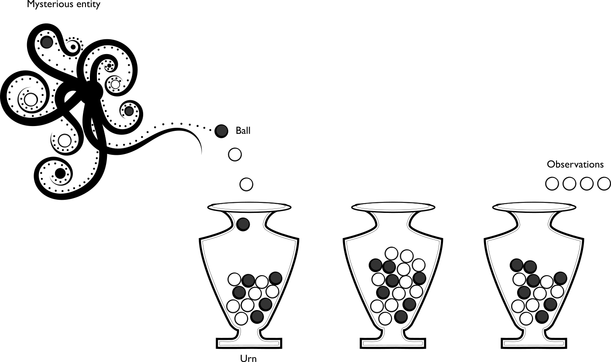
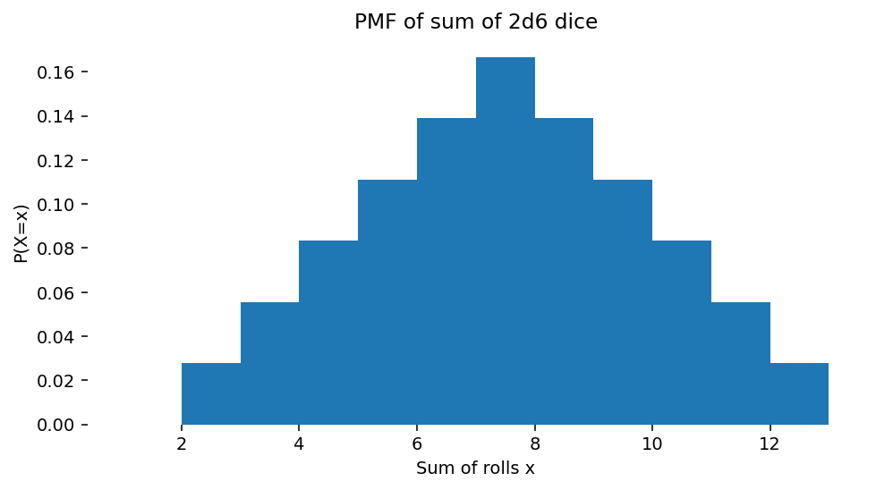

# 示例：失踪的潜艇
USS Scorpion 是一艘装备有核武器的潜艇，于1968年6月30日在大西洋某处失踪。[这是一个四艘潜艇在海上莫名其妙失踪的一年 —— 1968年的潜艇之谜。]

对这艘潜艇的搜索是概率方法首次被用于搜索的初期案例之一。美国海军需要尽快找到这艘潜艇并将其回收。概率方法允许我们精确地推理关于我们不确定的事物 —— 比如潜艇的位置。概率提供了一个具体的、可计算的表示形式来表征一个不确定的世界。

想象一下将可能的搜索区域划分为网格方块。那么，例如，询问*潜艇位于特定方块内的概率是多少？*是有意义的。可能会制作出这样一张地图，其中的方块根据它们的概率进行上色：

但是Scorpion号发生了什么事？

# 概率
本课程部分涉及随机元素；不确定性、随机性和统计在计算中的作用。基本的数学原理来源于概率论，它为我们提供了操作不确定值的简单而强大的方法，并且允许我们执行像根据一些观测推断最可能的假设这样的有用操作。概率论是一种简单、一致且有效的操纵不确定性的方法。

## 什么是概率？
[以下定义直接改编自Peter Norvig的概率笔记本：http://nbviewer.jupyter.org/url/norvig.com/ipython/Probability.ipynb]

* **实验**（或**试验**）一个有不确定结果的发生。
    * 例如，失去一个潜艇——潜艇的位置现在未知。
* **结果** 实验的结果；世界的一种特定状态。
    * 例如：潜艇在海洋网格[2,3]。
* **样本空间** 实验所有可能结果的集合。
    * 例如，海洋网格{{[0,0], [0,1], [0,2], [0,3], ..., [8,7], [8,8], [8,9], [9,9]}}。
* **事件** 一些具有共同属性的可能结果的子集。
    * 例如，位于赤道以南的网格。
* **概率** 事件关于样本空间的概率是样本空间中属于事件的结果数量除以样本空间中所有可能结果的总数。因为它是一个比例，概率总是一个介于0（代表不可能发生的事件）到1（代表必然发生的事件）之间的实数。
    * 例如，潜艇位于赤道以下的概率，或潜艇在网格[0,0]中的概率（在这个例子中事件就是单一的结果）。
* **概率分布** 将结果映射到总和为1的概率的映射。这是因为从一次试验中必定会发生一个结果（概率为1），因此所有可能结果的总和将是1。一个随机变量有一个概率分布，它将每个结果映射到一个概率。
    * 例如 $P(X=x)$，潜艇位于特定网格平方 $\vec{x}$ 的概率
* **随机变量** 表示一个未知值的变量，我们确实知道它的概率分布。该变量与试验的结果相关联。
    * 例如，$X$是一个随机变量，代表潜艇的位置。
* **概率密度/质量函数** 通过将每个结果映射到概率 $f_X(x), x \rightarrow \Re$ 来定义概率分布的函数。这可以是连续的 $x$ (密度) 或离散的 $x$ (质量)。
    * 例如 $f_X(x)$ 是潜艇的概率质量函数，它将每个网格映射到代表其概率的实数。
* **观察** 我们直接观察到的结果；即数据。
    * 例如，潜艇被发现在网格[0,5]中
* **样本** 我们根据概率分布模拟的结果。我们说我们从分布中抽取了一个样本。
    * 例如，如果我们相信潜艇是根据某种模式分布的，生成可能的、遵循这种模式的具体网格位置。
* **期望/期望值** 随机变量的“平均”值。
    * 潜艇平均位于网格[3.46, 2.19]中

## 概念
一个随机变量 $X$ 具有 一个概率分布 $P(X)$，它为属于样本空间 $\mathbb{x}$ 的结果 $x$ 分配 概率 $0 \leq P(X=x) \leq1$。该概率分布由一个概率密度/质量函数 $f_X(x)$ 定义，它为结果分配概率，使得所有结果上的概率之和为 1，$\sum_{x\in \mathbb{x}} f_X(x)=1$。我们可以观察 通过试验从分布中得到的特定结果 $x_i$。我们可以根据分布 P(X) 抽样（模拟）新的结果 $x'_j$。假设结果有价值，我们可以在无数次试验中评估 平均期望值 $\mathbb{E}{X}$。

# 概率哲学
关于概率及其应用，存在两种思考学派。我们将（主要）遵循贝叶斯解释，但理解这涉及什么是有价值的。

## 贝叶斯/拉普拉斯关于概率的观点
贝叶斯主义者将概率视为信念的运算；在这种思维模型中，概率是置信程度的衡量。$P(A)=0$ 表示相信事件 $A$ 不可能是真的，而 $P(A)=1$ 则是相信事件 $A$ 绝对确定的信念。在贝叶斯观点中，说“外面下雨的概率是0.3”是有意义的（概率量化了我们根据我们所拥有的信息对天气的信念）。注意，这并不是说我们相信天气有0.3的可能性是下雨的（不管那意味着什么）

**贝叶斯主义者**允许通过概率规则结合并操纵对状态的置信度。贝叶斯逻辑中的关键过程是置信度的更新。给定一些：
    * 先验概率（这是格拉斯哥，可能不会是晴天）和一些
    * 新的证据（室内似乎有明亮的反射）
    * 更新我们的来计算后验 —— 我们认为外面是晴天的新概率。

贝叶斯推理要求我们接受对事件的先验设定，即我们必须用概率分布明确量化我们的假设。它是对不确定信息的逻辑的扩展。

### USS Scorpion
例如，在搜寻潜艇的例子中，先验可能是潜艇很可能在南大西洋（根据收到的最后一次无线电广播）。证据可能是来自搜寻船只的声纳调查结果。在每次调查后，潜艇位于调查区域的后验概率可能被更新。这代表了我们关于船只可能位置的置信度。

## 频率主义者对概率的观点
有一种替代的学派认为概率仅仅是重复事件长期行为的表现（例如，硬币正面朝上的概率是0.5，因为从长期来看，这将是发生此事件的平均比例）。

频率主义者不接受像“现在是晴天的概率是多少？”这样的说法，因为没有涉及到长期行为（“现在”只有一次）。在这种世界观中，讨论只能发生一次的事件的概率是没有意义的。在频率主义者看来，询问像“任何给定日子是晴天的概率是多少？”这样的问题是有意义的，因为我们可以测量许多不同天数的这个事件（晴天或不晴天）。例如，频率主义者不会给USS Scorpion在特定网格中的概率赋值；这不是一个可以重复的实验。

### 客观性与主观性
频率主义者与贝叶斯主义者之间的辩论很快就会进入哲学领域。这里无法充分展示观点的多样性和论点的深度。

简而言之，贝叶斯概率论有时被认为是主观的，因为它需要指定先验信念，而频率主义的概率模型不承认先验的概念，因此是客观的。

另一种观点是，贝叶斯模型明确编码了不确定知识，并为操作该知识制定了普遍的正式规则，正如形式逻辑对于确定知识所做的那样。频率主义方法在它们对普遍真理（例如，渐近行为）的陈述中是客观的，但它们不构成信念的演算，因此不能直接回答许多重要的问题。

#### 贝叶斯
- 包含先验（priors）
- 概率是置信度（degree of belief）
- （将群体参数视为随机变量，数据为已知）
#### 频率主义
- 没有先验（priors）
- 概率是事件的长期频率（long-term frequency of events）
- （假定群体参数为固定的，数据为随机的）

## 概率模型的优越性
不管你认同哪一种哲学模型，有一点你可以确信的是：概率是最好的。

虽然有时会使用概率论以外的其他不确定性模型，但所有其他表示不确定性的方法与概率方法相比都是严格劣于的，在这个意义上，一个人、代理或计算机在不确定的情况下使用概率模型对未来事件进行“下注”，在所有决策系统中可以获得最好的可能回报。

> *任何与使用概率论所能达到的同样好的赌博结果的理论都等同于概率论。*

## 生成模型：正向和逆向概率
概率模型的一个关键思想是生成过程；即存在某个未知过程，我们可以观察到其结果。该过程本身受我们不知道的未观察变量的控制，但我们可以推断。

一个典型的例子是罐子问题。设想一个罐子，一些球被倒入罐中（比如由某个神秘实体）。每个球可能是黑色或白色。

你随机从罐子中取出四个球，并观察它们的颜色。你得到了四个白球。

现在你可以问很多问题：

* 下一个被抽出的球是白色的概率是多少？
    * 这是一个**正向概率**问题。它问的是与观察结果分布相关的问题。
* 罐中白球和黑球的分布是怎样的？
    * 这是一个逆向概率问题。它问的是与生成观察结果的过程所受控制的未观察变量相关的问题。
* 神秘实体是谁？
    * 这是一个无法知晓的问题。我们的观察结果无法解决这个问题。

有大量的过程可以被构建为罐子问题（比如球被替换的罐子问题，有多个罐子但你不知道球来自哪个罐子的问题，球可以在罐子之间移动的问题，等等）。

# 概率论的形式基础
## 概率公理

概率的基本公理很少，其他一切都可以从这些公理推导出来。用 $P(A)$ 表示事件 $A$ 的概率（注意：这些适用于**事件**（结果的集合），而不仅仅是结果！）

* **有界**
$$0 \leq P(A) \leq 1$$
对于所有可能的事件 $A$ —— 概率为0，或者是正数且小于1。

* **统一**
$$\sum_x P(x)=1$$
对于样本空间 $\sigma$ 中的完整的可能结果集合（不是事件！）$x \in \sigma$ —— 总会发生某些事情。

* **求和规则**
$$ P(A \lor B) = P(A) + P(B) - P(A \land B) $$
即事件 $A$ 或事件 $B$ 发生的概率是两者独立概率之和减去两者同时发生的概率。 （符号注释：$\lor$ 表示“或”，$\land$ 表示“且”）

* **条件概率**
$$P(A|B) = \frac{P(A \land B)}{ P(B)}$$
条件概率 $P(A|B)$ 被定义为在已知事件 $B$ 发生的条件下，事件 $A$ 发生的概率。

# 随机变量和分布
一个**随机变量**是可以取不同值的变量，但我们不知道它的具体值；即一个“未指定”的变量。然而，我们有一些知识，能够捕捉这个变量可能取的不同状态及其对应的概率。概率论允许我们在不需要给随机变量指定一个具体值的情况下，对其进行操作。

随机变量用一个大写字母表示，比如 $X$。

随机变量可能代表：
- 投掷骰子的结果（离散的）；
- 室外是否下雨（离散的：二元的）；
- USS Scorpion 潜艇的纬度（连续的）；
- 我们还没遇到的某个人的身高（连续的）。

## 分布
一个概率分布定义了随机变量不同状态的可能性。

我们可以将 $X$ 看作是实验，将 $x$ 看作是结果，有一个函数将每一个可能的结果映射到一个概率上。我们写作 $P(X=x)$（注意大小写！），并使用以下简写表示：

$$
\begin{array}{l}
P(X=x),\  \text{随机变量 X 取值 x 的概率}\\
P(X),\  \text{表示 X=x 的概率的简写}\\
P(x),\  \text{表示特定值X=x的概率的简写 }\\
\end{array}
$$​
 
我们可以将结果视为随机变量取一个特定值，即 $P(X=x)$。请注意，按照惯例我们使用 $P(A)$ 表示**事件** $A$ 的概率，而不是随机变量 $A$ 的概率（一个**事件**是**结果**的集合；**随机变量**仅为**结果**分配概率）。

### 离散和连续
随机变量可以是连续的（例如一个人的身高）或者是离散的（骰子面上显示的值）。

离散变量 离散随机变量的分布用一个概率质量函数（PMF）描述，它为每个结果赋予一个特定的值；想象一个Python字典，它将结果映射到概率上。PMF通常写作 $f_X(x)$，其中 $P(X=x) = f_X(x)$。

连续变量 连续变量有一个概率密度函数（PDF），它指定了作为连续函数 $f_X(x)$ 的结果上的概率分布。对于PDF来说，不是 $P(X=x) = f_X(x)$ 这种情况。

#### 积分为一
概率质量函数或概率密度函数的**和/积分必须正好为 1，因为所考虑的随机变量必须取**值；这是单一性的结果。实验的每一次重复都只有一个结果。

$$\sum_i f_X(x_i) = 1\quad \text{for PMFs of discrete RVs}$$
$$\int_x f_X(x)\ dx = 1\quad \text{for PDFs of continuous RVs}$$

## PMF 示例：掷骰子的总和
一个非常简单的离散 PMF 是两个六面骰子之和的期望值。$P(X=x) = f_X(x)$ 对每种可能的结果 $x 取值（in \{2,3,4,5,6,7,8,9,10,11,12\}$

