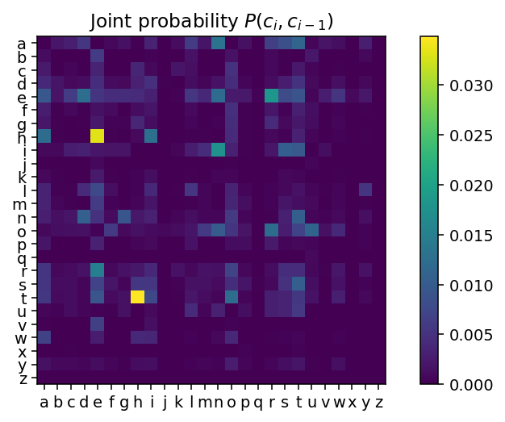
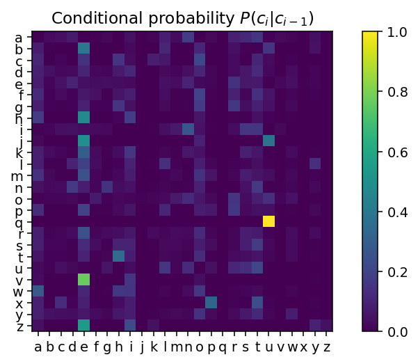
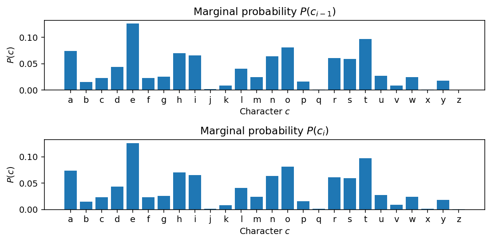

# 概率
本课程部分涉及随机元素；不确定性、随机性和统计在计算中的作用。基本的数学原理来源于概率论，它为我们提供了操作不确定值的简单而强大的方法，并且允许我们执行像根据一些观测推断最可能的假设这样的有用操作。概率论是一种简单、一致且有效的操纵不确定性的方法。

## 什么是概率？
[以下定义直接改编自Peter Norvig的概率笔记本：http://nbviewer.jupyter.org/url/norvig.com/ipython/Probability.ipynb]

* **实验**（或**试验**）一个有不确定结果的发生。
    * 例如，失去一个潜艇——潜艇的位置现在未知。
* **结果** 实验的结果；世界的一种特定状态。
    * 例如：潜艇在海洋网格[2,3]。
* **样本空间** 实验所有可能结果的集合。
    * 例如，海洋网格{{[0,0], [0,1], [0,2], [0,3], ..., [8,7], [8,8], [8,9], [9,9]}}。
* **事件** 一些具有共同属性的可能结果的子集。
    * 例如，位于赤道以南的网格。
* **概率** 事件关于样本空间的概率是样本空间中属于事件的结果数量除以样本空间中所有可能结果的总数。因为它是一个比例，概率总是一个介于0（代表不可能发生的事件）到1（代表必然发生的事件）之间的实数。
    * 例如，潜艇位于赤道以下的概率，或潜艇在网格[0,0]中的概率（在这个例子中事件就是单一的结果）。
* **概率分布** 将结果映射到总和为1的概率的映射。这是因为从一次试验中必定会发生一个结果（概率为1），因此所有可能结果的总和将是1。一个随机变量有一个概率分布，它将每个结果映射到一个概率。
    * 例如 $P(X=x)$，潜艇位于特定网格平方 $\vec{x}$ 的概率
* **随机变量** 表示一个未知值的变量，我们确实知道它的概率分布。该变量与试验的结果相关联。
    * 例如，$X$是一个随机变量，代表潜艇的位置。
* **概率密度/质量函数** 通过将每个结果映射到概率 $f_X(x), x \rightarrow \Re$ 来定义概率分布的函数。这可以是连续的 $x$ (密度) 或离散的 $x$ (质量)。
    * 例如 $f_X(x)$ 是潜艇的概率质量函数，它将每个网格映射到代表其概率的实数。
* **观察** 我们直接观察到的结果；即数据。
    * 例如，潜艇被发现在网格[0,5]中
* **样本** 我们根据概率分布模拟的结果。我们说我们从分布中抽取了一个样本。
    * 例如，如果我们相信潜艇是根据某种模式分布的，生成可能的、遵循这种模式的具体网格位置。
* **期望/期望值** 随机变量的“平均”值。
    * 潜艇平均位于网格[3.46, 2.19]中

## 概念
一个随机变量 $X$ 具有 一个概率分布 $P(X)$，它为属于样本空间 $\mathbb{x}$ 的结果 $x$ 分配 概率 $0 \leq P(X=x) \leq1$。该概率分布由一个概率密度/质量函数 $f_X(x)$ 定义，它为结果分配概率，使得所有结果上的概率之和为 1，$\sum_{x\in \mathbb{x}} f_X(x)=1$。我们可以观察 通过试验从分布中得到的特定结果 $x_i$。我们可以根据分布 P(X) 抽样（模拟）新的结果 $x'_j$。假设结果有价值，我们可以在无数次试验中评估 平均期望值 $\mathbb{E}{X}$。

# 概率哲学
关于概率及其应用，存在两种思考学派。我们将（主要）遵循贝叶斯解释，但理解这涉及什么是有价值的。

## 贝叶斯/拉普拉斯关于概率的观点
贝叶斯主义者将概率视为信念的运算；在这种思维模型中，概率是置信程度的衡量。$P(A)=0$ 表示相信事件 $A$ 不可能是真的，而 $P(A)=1$ 则是相信事件 $A$ 绝对确定的信念。在贝叶斯观点中，说“外面下雨的概率是0.3”是有意义的（概率量化了我们根据我们所拥有的信息对天气的信念）。注意，这并不是说我们相信天气有0.3的可能性是下雨的（不管那意味着什么）

**贝叶斯主义者**允许通过概率规则结合并操纵对状态的置信度。贝叶斯逻辑中的关键过程是置信度的更新。给定一些：
    * 先验概率（这是格拉斯哥，可能不会是晴天）和一些
    * 新的证据（室内似乎有明亮的反射）
    * 更新我们的来计算后验 —— 我们认为外面是晴天的新概率。

贝叶斯推理要求我们接受对事件的先验设定，即我们必须用概率分布明确量化我们的假设。它是对不确定信息的逻辑的扩展。

### USS Scorpion
例如，在搜寻潜艇的例子中，先验可能是潜艇很可能在南大西洋（根据收到的最后一次无线电广播）。证据可能是来自搜寻船只的声纳调查结果。在每次调查后，潜艇位于调查区域的后验概率可能被更新。这代表了我们关于船只可能位置的置信度。

## 频率主义者对概率的观点
有一种替代的学派认为概率仅仅是重复事件长期行为的表现（例如，硬币正面朝上的概率是0.5，因为从长期来看，这将是发生此事件的平均比例）。

频率主义者不接受像“现在是晴天的概率是多少？”这样的说法，因为没有涉及到长期行为（“现在”只有一次）。在这种世界观中，讨论只能发生一次的事件的概率是没有意义的。在频率主义者看来，询问像“任何给定日子是晴天的概率是多少？”这样的问题是有意义的，因为我们可以测量许多不同天数的这个事件（晴天或不晴天）。例如，频率主义者不会给USS Scorpion在特定网格中的概率赋值；这不是一个可以重复的实验。

### 客观性与主观性
频率主义者与贝叶斯主义者之间的辩论很快就会进入哲学领域。这里无法充分展示观点的多样性和论点的深度。

简而言之，贝叶斯概率论有时被认为是主观的，因为它需要指定先验信念，而频率主义的概率模型不承认先验的概念，因此是客观的。

另一种观点是，贝叶斯模型明确编码了不确定知识，并为操作该知识制定了普遍的正式规则，正如形式逻辑对于确定知识所做的那样。频率主义方法在它们对普遍真理（例如，渐近行为）的陈述中是客观的，但它们不构成信念的演算，因此不能直接回答许多重要的问题。

#### 贝叶斯
- 包含先验（priors）
- 概率是置信度（degree of belief）
- （将群体参数视为随机变量，数据为已知）
#### 频率主义
- 没有先验（priors）
- 概率是事件的长期频率（long-term frequency of events）
- （假定群体参数为固定的，数据为随机的）

## 概率模型的优越性
不管你认同哪一种哲学模型，有一点你可以确信的是：概率是最好的。

虽然有时会使用概率论以外的其他不确定性模型，但所有其他表示不确定性的方法与概率方法相比都是严格劣于的，在这个意义上，一个人、代理或计算机在不确定的情况下使用概率模型对未来事件进行“下注”，在所有决策系统中可以获得最好的可能回报。

> *任何与使用概率论所能达到的同样好的赌博结果的理论都等同于概率论。*

## 生成模型：正向和逆向概率
概率模型的一个关键思想是生成过程；即存在某个未知过程，我们可以观察到其结果。该过程本身受我们不知道的未观察变量的控制，但我们可以推断。

一个典型的例子是罐子问题。设想一个罐子，一些球被倒入罐中（比如由某个神秘实体）。每个球可能是黑色或白色。

你随机从罐子中取出四个球，并观察它们的颜色。你得到了四个白球。

现在你可以问很多问题：

* 下一个被抽出的球是白色的概率是多少？
    * 这是一个**正向概率**问题。它问的是与观察结果分布相关的问题。
* 罐中白球和黑球的分布是怎样的？
    * 这是一个逆向概率问题。它问的是与生成观察结果的过程所受控制的未观察变量相关的问题。
* 神秘实体是谁？
    * 这是一个无法知晓的问题。我们的观察结果无法解决这个问题。

有大量的过程可以被构建为罐子问题（比如球被替换的罐子问题，有多个罐子但你不知道球来自哪个罐子的问题，球可以在罐子之间移动的问题，等等）。

# 概率论的形式基础
## 概率公理

概率的基本公理很少，其他一切都可以从这些公理推导出来。用 $P(A)$ 表示事件 $A$ 的概率（注意：这些适用于**事件**（结果的集合），而不仅仅是结果！）

* **有界**
$$0 \leq P(A) \leq 1$$
对于所有可能的事件 $A$ —— 概率为0，或者是正数且小于1。

* **统一**
$$\sum_x P(x)=1$$
对于样本空间 $\sigma$ 中的完整的可能结果集合（不是事件！）$x \in \sigma$ —— 总会发生某些事情。

* **求和规则**
$$ P(A \lor B) = P(A) + P(B) - P(A \land B) $$
即事件 $A$ 或事件 $B$ 发生的概率是两者独立概率之和减去两者同时发生的概率。 （符号注释：$\lor$ 表示“或”，$\land$ 表示“且”）

* **条件概率**
$$P(A|B) = \frac{P(A \land B)}{ P(B)}$$
条件概率 $P(A|B)$ 被定义为在已知事件 $B$ 发生的条件下，事件 $A$ 发生的概率。

# 随机变量和分布
一个**随机变量**是可以取不同值的变量，但我们不知道它的具体值；即一个“未指定”的变量。然而，我们有一些知识，能够捕捉这个变量可能取的不同状态及其对应的概率。概率论允许我们在不需要给随机变量指定一个具体值的情况下，对其进行操作。

随机变量用一个大写字母表示，比如 $X$。

随机变量可能代表：
- 投掷骰子的结果（离散的）；
- 室外是否下雨（离散的：二元的）；
- USS Scorpion 潜艇的纬度（连续的）；
- 我们还没遇到的某个人的身高（连续的）。

## 分布
一个概率分布定义了随机变量不同状态的可能性。

我们可以将 $X$ 看作是实验，将 $x$ 看作是结果，有一个函数将每一个可能的结果映射到一个概率上。我们写作 $P(X=x)$（注意大小写！），并使用以下简写表示：
$$\begin{array}{l}
P(X=x),\  \text{随机变量 X 取值 x 的概率}\\
P(X),\  \text{表示 X=x 的概率的简写}\\
P(x),\  \text{表示特定值X=x的概率的简写 }\\
\end{array}$$
​
我们可以将结果视为随机变量取一个特定值，即 $P(X=x)$。请注意，按照惯例我们使用 $P(A)$ 表示**事件** $A$ 的概率，而不是随机变量 $A$ 的概率（一个**事件**是**结果**的集合；**随机变量**仅为**结果**分配概率）。

### 离散和连续
随机变量可以是连续的（例如一个人的身高）或者是离散的（骰子面上显示的值）。

离散变量 离散随机变量的分布用一个概率质量函数（PMF）描述，它为每个结果赋予一个特定的值；想象一个Python字典，它将结果映射到概率上。PMF通常写作 $f_X(x)$，其中 $P(X=x) = f_X(x)$。

连续变量 连续变量有一个概率密度函数（PDF），它指定了作为连续函数 $f_X(x)$ 的结果上的概率分布。对于PDF来说，不是 $P(X=x) = f_X(x)$ 这种情况。

#### 积分为一
概率质量函数或概率密度函数的**和/积分必须正好为 1，因为所考虑的随机变量必须取**值；这是单一性的结果。实验的每一次重复都只有一个结果。

$$\sum_i f_X(x_i) = 1\quad \text{for PMFs of discrete RVs}$$
$$\int_x f_X(x)\ dx = 1\quad \text{for PDFs of continuous RVs}$$

## PMF 示例：掷骰子的总和
一个非常简单的离散 PMF 是两个六面骰子之和的期望值。$P(X=x) = f_X(x)$ 对每种可能的结果 $x 取值（in \{2,3,4,5,6,7,8,9,10,11,12\}$

# 期望值

    
如果一个随机变量取数值，那么我们可以定义这个随机变量的**期望值**或**期望**
$\mathbb{E}[X]$ 为：

$$ \mathbb{E}[X] = \int_x x\ f_X(x) dx $$

对于具有概率质量函数 $P(X=x) = f_X(x)$ 的离散随机变量，我们可以将其写成求和形式：

$$\mathbb{E}[X] = \sum_x  f_X(x) x $$

如果只有有限个可能的结果，那么这可以表示为：
$$\mathbb{E}[X] = P(X=x_1) x_1 + P(X=x_2) x_2 + \dots + P(X=x_n) x_n$$ 

期望值是随机变量的“平均值”。非正式地说，它代表我们“期望发生的情况”；最有可能的总体“得分”。它可以被认为是一个实验所有可能结果的*加权和*，其中每个结果按该结果发生的概率进行加权。

例如，在“一对骰子”的场景中，我们可以计算掷骰子后显示的“点数”总数的期望值。我们计算显示每个点数的概率，并乘以该点数，然后将结果相加。这就是平均显示的点数，或者说是期望值。

## 期望值与均值
期望值对应于**平均**或**平均结果**的概念。随机变量的期望值是所有结果值的**真实平均值**，如果我们无限次进行实验，就会观察到这些结果。这是**总体均值**——随机变量的整个可能无限的总体的平均值。

许多关于随机变量的重要性质可以用期望值来定义。

* 随机变量 $X$ 的均值就是 $\mathbb{E}[X]$。它是**中心趋势**的度量。
* 随机变量 $X$ 的方差是 $\text{var}(X) = \mathbb{E}[X - \mathbb{E}[X]^2]$。它是**分散程度**的度量。

### 对 X 的函数的期望值
我们可以对随机变量应用函数，例如，随机变量的平方。

连续随机变量 $X$ 的任何函数 $g(X)$ 的期望值定义为：
$$\mathbb{E}[g(X)] = \int_x f_X(x) g(x) dx$$
或者

$$\mathbb{E}[g(X)] = \sum_x f_X(x) g(x)$$
对于离散随机变量。

例如，我们可以计算像这样的简单期望值：

$$\mathbb{E}[2X^2] = \sum_x f_X(x) 2x^2 dx$$

或者

$$\mathbb{E}[sin(X)] = \sum_x f_X(x) \sin(x) dx$$

也就是说，我们只是取每个结果通过函数 $g(x)$ 后的和/积分，按结果 $x$ 发生的概率加权。$g(x)$ 可以被认为是一个“评分”函数，它为 $X$ 的每个结果分配一个实数。注意 $g(x)$ 不会影响概率密度/质量函数 $f_X(x)$。它不影响结果的概率，只影响*分配给这些结果的值*。例如，如果我们玩一个骰子游戏，其中掷出的分数是显示点数的*平方*（所以显示2点值4分，显示8点值64分等），那么我们会计算 $\mathbb{E}[X^2]$ 如下：  
`sqr_expected_value = np.sum(pmf * (np.arange(2,13))**2)`

### 计算经验分布
对于离散随机变量，我们总是可以从一系列观察中计算出经验分布；例如，从文本*语料库*中特定单词的计数中计算（例如，1994年每篇报纸文章中的计数）。我们只需计算每个单词出现的次数并除以单词总数。
    
$$P(X=x) = \frac{n_x}{N}, $$

其中 $n_x$ 是观察到结果 $x$ 的次数，$N$ 是试验的总次数。

注意，经验分布是一种*近似*未知真实分布的分布。对于离散变量的非常大的样本，只要我们看到的样本是以不带偏见的方式抽取的，经验分布将越来越接近**真实的概率质量函数（PMF）**。然而，这种方法对于连续随机变量并不实用，因为我们只会看到每个观察值一次（想想为什么！）。

## 随机抽样程序

### 均匀抽样
有一些算法可以生成在一个区间内**均匀分布**的连续随机数，例如从 0.0 到 1.0。这些实际上是**伪随机数**，因为计算机是（希望如此）确定性的。它们被设计来近似真实随机序列的统计特性。本质上，所有这些生成器都生成离散符号（比特或整数）的序列，然后将这些符号映射到特定范围内的浮点数；这是相当难以做到准确的。

> 我们必须小心：计算机生成的是**伪随机浮点数**；而不是**真正的随机实数**。虽然大多数时候这种差异并不重要，但它们确实是不同的事物。

**均匀分布**的数在其区间内取任何值的概率都相等，并且在其他地方的概率为零。尽管这是从连续概率密度函数（PDF）中抽样，但它是从任意概率质量函数（PMF）中抽样的关键基础。均匀分布记为 $X \sim U(a,b)$，意味着随机变量 $X$ 可以在 $a$ 和 $b$ 之间取值，且该区间内任何数值出现的可能性都相等。符号 $\sim$ 读作“分布为”，即“X 分布为区间 [a,b] 中的均匀分布”。

> 注意在实践中，如果我们使用浮点数，这些值不会在给定区间的实数中均匀分布，因为我们只能抽样有效的浮点值。虽然浮点数是非均匀分布的，但对于大多数应用来说，这种差异并不重要。

例如，我们知道 NumPy 函数 `np.random.uniform(a,b,[shape])` 用 `a` 和 `b` 之间的“连续”随机数填充数组。

### 离散抽样
对于离散概率质量函数，我们可以通过划分单位区间来按照*任意给定的 PMF* 抽样结果。这就像在墙上贴上面积与每个结果的概率成比例的海报，然后向墙上投掷飞镖。

算法：

* 为结果 $x_1, x_2, \dots$ 选择任意排序
* 为每个结果分配一个“区间”，这是区间 [0,1] 的一部分，等于其概率，这样区间就被划分为连续的不重叠区域 $[P(x_1) \rightarrow P(x_1)+P(x_2), P(x_1)+P(x_2)\rightarrow P(x_1)+P(x_2)+P(x_3), \dots]$
* 在范围 [0,1] 内抽取一个均匀样本
* 它落在的“结果区间”即为要抽取的样本

根据 PMF 的定义，所有概率的总和将为 1.0，因此它将完美地填满区间 [0,1]，没有间隙。

### 联合概率、条件概率、边际概率 Joint conditional marginal probability

两个随机变量的**联合概率**记为 $P(X,Y)$，表示 $X$ 和 $Y$ 同时取特定值的概率（即 $P(X=x) \land P(Y=y)$）。

**边际概率**是从 $P(X,Y)$ 通过对所有可能的 $Y$ 结果进行积分（求和）得到的 $P(X)$：

$$P(X) = \int_y P(X,Y) dy\  \text{对于 PDF 而言。}$$
$$P(X) = \sum_y P(X,Y)\  \text{对于 PMF 而言。}$$

这使我们能够通过对涉及的另一个变量的所有可能结果求和，从联合分布中计算出一个随机变量的分布。

**边际化**只是指从联合分布中对一个或多个变量进行积分：它*移除*了这些变量的分布。

如果两个随机变量相互独立，则表示它们之间没有任何依赖关系。如果是这种情况，那么联合分布就是各自分布的乘积：$P(X,Y) = P(X)P(Y)。$ **在变量相互依赖的一般情况下，这不成立。**

给定随机变量 $Y$ 的情况下随机变量 $X$ 的**条件概率**记为 $P(X|Y)$，可以计算为

$$P(X|Y) = \frac{P(X,Y)}{P(Y)}。$$

这告诉我们如果我们已经知道（或确定）了 $Y$ 的结果，$X$ 的结果有多大可能性。读作“在 Y 取 y 值的情况下，X 取 x 值的概率”。如果 $X$ 和 $Y$ 是独立的，则条件概率 $P(X|Y)=P(X)$ 和 $P(Y|X)=P(Y)$。

当两个随机变量 $X$ 和 $Y$ 不是相互独立的，他们的联合概率 $P(X, Y)$ 就不能简单地通过乘以各自的边缘概率来计算。相反，需要使用其他方法来确定这种依赖关系下的联合概率分布。有几种方法可以做到这一点：

1. **直接观察或数据统计**：
   - 如果可以直接观测 $X$ 和 $Y$ 的联合行为，或者有关于它们的历史数据，可以通过统计方法来估计它们的联合概率分布。

2. **条件概率公式**：
   - 一个重要的工具是条件概率公式，$P(X, Y) = P(Y | X) \times P(X)$ 或 $P(X, Y) = P(X | Y) \times P(Y)$。
   - 这里，$P(Y | X)$ 是在 $X$ 发生的情况下 $Y$ 发生的概率，而 $P(X)$ 是 $X$ 发生的边缘概率。
   - 类似地，$P(X | Y)$ 是在 $Y$ 发生的情况下 $X$ 发生的概率，而 $P(Y)$ 是 $Y$ 的边缘概率。

3. **利用已知的概率模型**：
   - 如果 $X$ 和 $Y$ 的依赖关系遵循某种已知的概率模型（如线性回归、贝叶斯网络等），可以使用这些模型来计算联合概率。

4. **模拟和计算实验**：
   - 在一些情况下，可以通过模拟实验来估计 $X$ 和 $Y$ 的联合概率。这通常涉及到生成大量 $X$ 和 $Y$ 的样本，然后计算它们一起出现的频率。

## 二元模型
我们可以在之前看到的文本字符模型的情况下考虑这些。从组成“变形记”（Metamorphosis）的字符代码向量中，我们可以取出每一对按顺序出现的*字符对*。也就是说，我们考虑某个索引 $i$ 处的两个字符 $c_{i-1}$ 和 $c_i$。这被称为**二元模型**，还有一元、三元、n元模型的概念推广。一个“gram”指的是一个单位，如一个字符或单词，我们正在讨论的是字符**二元模型**。

* 二元模型的联合分布 $P(C_i=c_i, C_{i-1}=c_{i-1})$ 由每个字符对的归一化计数给出。

* 边际分布 $P(C_i=c_i)$ 可以通过对每个可能的字符 $c_{i-1}$ 求和，从 $P(C_i=c_i, C_{i-1}=c_{i-1})$ 中计算得出，同样地可以边际化以找到 $P(C_{i-1}=c_{i-1})$

* 条件分布 $P(C_i=c_i|C_{i-1}=c_{i-1})$ 由联合分布除以 $P(C_{i-1}=c_{i-1})$ 的计数得出。它告诉我们在观察到一个字符 $c_{i-1}$ 之后，观察到特定字符 $c_i$ 的可能性有多大。

### 赔率、对数赔率 odds log odds
具有概率 $p$ 的事件的**赔率**定义为：

    
$$\text{odds} =  \frac{p}{1-p}$$

赔率是讨论不太可能的情景时更有用的单位（1:999的赔率，或*999:1反对*，比 $p=0.001$ 更容易理解）。

**对数赔率**或**logit**对于非常不太可能的情景特别有用：

$$
\text{logit}(p) = \log \left(\frac{p}{1-p}\right)
$$   

对数赔率的刻度与赔率分子中零的数量成比例。

### 对数概率

多个*独立*随机变量取一组值的概率可以通过乘积计算：
$$P(X,Y,Z) = P(X)P(Y)P(Z)$$
通常情况下

$$P(X_1=x_i, \dots, X_n=x_n) = \prod_{i=1}^{n} P(X_i=x_i)$$

我们经常需要计算这样的乘积，但是乘以许多小于1的值会导致数值问题：我们会得到浮点数下溢。相反，操纵**对数概率**在数值上更可靠，可以相加而不是相乘：
$$\log P(x_1, \dots, x_n) = \sum_{i=1}^{n} \log P(x_i)$$

The log-likelihood does not have this problem with underflow:
    
$$\log \mathcal{L}(c_1, c_2, \dots\ c_n) = \sum_i \log P(c_i)$$

## 先验概率、似然概率、后验概率 Prior, likelihood, posterior

### 反转条件分布
我们经常想要知道在某个事件 $B$ 发生的情况下，另一个事件 $A$ 发生的概率；即 $P(A|B)$。但我们通常只能计算 $P(B|A)$。

这种情况通常是：
* 我们知道神秘实体的行为 $P(B|A)$；
* 我们知道我们看到的数据 $P(B)$；
* 我们知道神秘实体通常可能做什么 $P(A)$；
* 我们想要弄清楚神秘实体正在做什么 $P(A|B)$。

一般来说 $P(A|B) \neq P(B|A)$；这两个表达式可以完全不同。

通常，这类问题出现在：
* 我们想要知道在有一些*证据*的情况下某个事件发生的概率（*我的血液检测呈阳性，我患这种病的可能性有多大？*）
* 但我们只知道在事件发生时观察到证据的概率（*如果你患有这种病，血液检测会有 95% 的时间呈阳性*）。

**贝叶斯定理**提供了正确反转概率分布的方法：
$$ P(A|B) = \frac{P(B|A) P(A)}{P(B)} $$

这直接遵循概率的公理。贝叶斯定理是一个非常重要的定理，并且有一些令人惊讶的后果。

### 术语
* $P(A|B)$ 被称为**后验概率**——我们想要知道的，或在计算后会知道的
* $P(B|A)$ 被称为**似然概率**——事件 $A$ 产生我们看到的证据的可能性
* $P(A)$ 是**先验概率**——不考虑证据时事件 $A$ 的可能性
* $P(B)$ 是**证据**——不考虑事件时证据 $B$ 的可能性。

贝叶斯定理提供了一个一致的规则，可以将某些先验信念与观察到的数据结合起来，估计一个结合了它们的新分布。

我们经常将这表述为一些我们想要知道的**假设** $H$，给定我们观察到的**数据** $D$，我们将贝叶斯定理写为：

$$ P(H|D) = \frac{P(D|H) P(H)}{P(D)} $$

$H$ 和 $D$ 在这个表达式中是随机变量。

## 对证据的积分
我们可以说后验概率与先验概率和似然概率的乘积成*比例*。但要评估其值，我们需要计算 $P(D)$，即**证据**。

一开始很难理解这代表什么。但一种思考方式是将其视为从联合分布 $P(H,D)$ 中边际化 $P(D)$ 的结果；即对每个可能的 $D$，对 $H$ 的每个可能结果进行积分。

因为概率必须加起来等于 1，我们可以将 $P(D)$ 写为：
$$P(D)  = \sum_{i} P(D|H_i) P(H_i)$$ 
对于一组离散结果 $H_i$，或者
$P(D) = \int_{H} P(D|H) P(H) dH$ 对于连续结果的分布。

一般情况下这可能难以计算。对于只有两个可能结果的简单二元案例（$H$ 只能是 0 或 1），贝叶斯定理可以写成：

$$P(H=1|D) = \frac{P(D|H=1)P(H=1)}{P(D|H=1)P(H=1) + P(D|H=0) P(H=0)}$$
## 自然频率
有一种解释此类问题的方法，可以大大降低做出错误判断的可能性。**自然频率**的解释涉及想象具有固定大小的具体人群（例如，房间里有10000人），并将人群的比例视为*计数*（房间里有多少人患有瘟疫？）。

我们可以使用它来可视化上述问题并解释明显的悖论。下面的图表展示了 $P(\text{瘟疫})=0.005$（1在200）的情况，再次使用5%准确的测试。

## 贝叶斯定理用于合并证据
贝叶斯定理是将先验信念和观察结合起来更新信念的正确方法。我们总是从一个概率分布（先验）转换为新的信念（后验），使用一些观察到的证据。这可以用于“学习”，其中“学习”意味着根据观察更新概率分布。它在必须将不确定信息融合在一起的任何地方都有巨大的应用，无论是来自多个来源（例如传感器融合）还是随时间变化（例如概率过滤）。

# 熵 Entropy
概率分布的一个关键特性是**熵**。直观上，这是一个衡量观察者在观察分布中的抽样时的“惊讶”程度的指标，或者换句话说，是分布可能代表的不同“状态”数量的（对数）测量。一个平坦、均匀的分布是非常“令人惊讶”的，因为其值很难预测；一个狭窄、尖峰的分布则不令人惊讶，因为其值总是非常相似。

这是一个精确的量化——它给出了分布中的*信息*。信息的单位通常是比特；1比特的信息告诉你一个是或否问题的答案。熵告诉你确切需要多少比特（最少）来将一个分布中的值传达给一个*已经知道该分布的*观察者。或者，你可以将分布描述的不同状态数视为 $p = 2^{H(X)}$ —— 这个值被称为**困惑度**，它可以是分数。

## 熵只是对数概率的期望值
随机变量 $X$ 的（离散）分布的熵可以计算为：

    
$$\begin{equation}H(X) = \sum_{x} -P(X=x) \log_2(P(X=x))\end{equation}$$

这只是随机变量对数概率的期望值（对数概率的“平均”值）。

### 抛硬币
考虑抛硬币：这是从可以取两种状态，正面和反面的离散随机变量进行采样。

如果我们将两种可能的状态称为 0（正面）和 1（反面），我们可以用一个参数 $q$ 来描述这个，其中 $P(X=0)=q$ 和 $P(X=1)=(1-q)$（这是因为 $P(X=0)+P(X=1)$ *必须* 等于 1 —— 硬币必须落在一边或另一边。我们忽略边缘着陆！）。

如果这个过程非常有偏见，并且正面比反面更有可能（$q<<0.5$），观察者大多数时间都不会感到惊讶，因为预测正面将是一个好的赌注。如果这个过程是公正的（$q=0.5$），观察者将无法预测正面或反面更有可能。我们可以写出这个分布的熵：
$$H(X) = P(X=0) \log_2 P(X=0) + P(X=1) \log_2 P(X=1)$$
$$ = -q \log_2 q - (1-q) \log_2 P(1-q)$$
