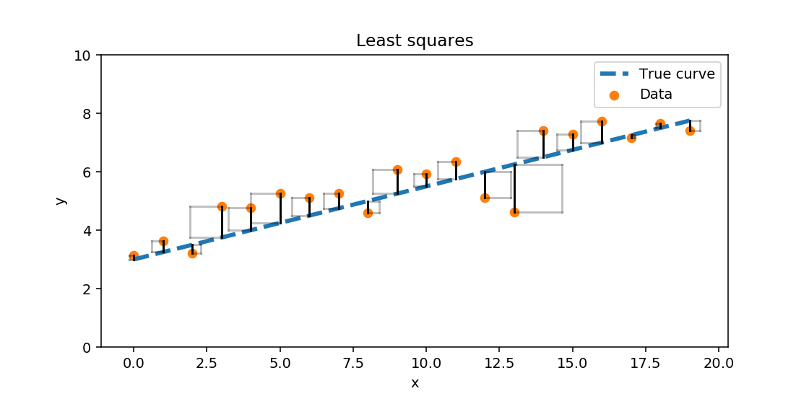
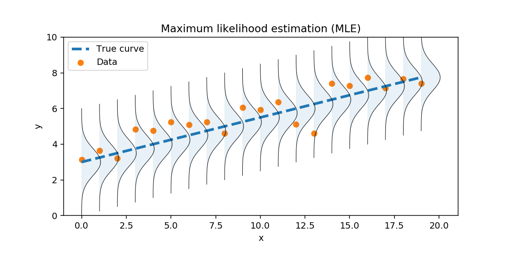
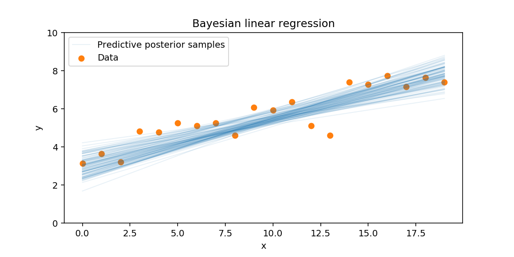

## Linear regression
## 线性回归

**Linear regression** is the fitting of a line to observed data. It assumes the mysterious entity generates data where one of the observed variables is scaled and shifted version of another observed variable, corrupted by some noise; a linear relationship. It is a very helpful lens through which different approaches to data modelling can be seen; it is pretty much the simplest useful model of data with relationships, and the techniques we use easily generalise from linear models to more powerful representations.
**线性回归**是对观察数据进行直线拟合的过程。它假设有一个神秘的实体生成数据，其中一个观察变量是另一个观察变量的缩放和移位版本，受到一些噪声的干扰；即线性关系。线性回归是通过这种方式来看待数据建模的不同方法的一个非常有用的视角；它几乎是最简单有用的数据关系模型，并且我们使用的技术可以从线性模型轻松泛化到更强大的表示形式。

The problems is to estimate what that scaling and shifting is. In a simple 2D case, this is the gradient $m$ and offset $c$ in the equation $y=mx+c$. It can be directly generalised to higher dimensions to find $A$ and $\mathbf{b}$ in $$\mathbf{y}= A\mathbf{x} + \mathbf{b},$$ but we'll use the simple "high school" $y=mx+c$ case for simplicity.
问题是估计缩放和移位是什么。在一个简单的二维案例中，这是方程式 $y=mx+c$ 中的梯度 $m$ 和偏移量 $c$。它可以直接泛化到更高维度以在 $$\mathbf{y}= A\mathbf{x} + \mathbf{b}$$ 中找到 $A$ 和 $\mathbf{b}$，但为了简单起见，我们将使用简单的“高中”案例 $y=mx+c$。

We assume that we will fit a line to *noisy* data. That is the process that we assume that is generating the data is $$y=mx+c+\epsilon,$$ where $\epsilon$ is some noise term. We have to make assumptions about the distribution of $\epsilon$ in order to make inferences about the parameters.
我们假设我们将对*带噪声的*数据拟合一条线。也就是说，我们假设生成数据的过程是 $$y=mx+c+\epsilon,$$ 其中 $\epsilon$ 是一些噪声项。我们必须对 $\epsilon$ 的分布做出假设，以便对参数进行推断。

One simple assumption is that $$\epsilon \sim \mathcal{N}(0, \sigma^2),$$ i.e. that we have normally distributed variations in our measurements. So our full equation is:
一个简单的假设是 $$\epsilon \sim \mathcal{N}(0, \sigma^2),$$ 即我们的测量中有正态分布的变化。所以我们的完整方程是：

$$y=mx+c+\mathcal{N}(0, \sigma^2),$$

or equivalently, putting the $mx+c$ as the mean of the normal distribution:
或者等价地，将 $mx+c$ 作为正态分布的均值：

$$y \sim \mathcal{N}(mx+c, \sigma^2)$$

Note that we assume that $y$ is a random variable, $x$ is known, and that $m, c, \sigma$ are parameters that we wish to infer from a collection of observations:
注意，我们假设 $y$ 是一个随机变量，$x$ 是已知的，而 $m, c, \sigma$ 是我们希望从一系列观察中推断出来的参数：

$$[(x_1, y_1),\\ (x_2, y_2),\\ \dots,\\ (x_n, y_n)]$$

In code, we could write down what we *assume* is generating data, our tame mysterious entity:
在代码中，我们可以写下我们*假设*正在生成数据的，我们的温顺的神秘实体：
```
def model(x, theta):
    m, c, sigma = theta
    y =  np.random.normal(x * m + c, sigma)
    return y
```
## Our problem is: given just the inputs \(x\) and return values \(y\), what are the values of the *other* argument \(\theta\).
## 我们的问题是：仅给定输入 \(x\) 和返回值 \(y\)，*其他*参数 \(\theta\) 的值是什么。

### Linear regression via direct optimisation
### 通过直接优化进行线性回归
We saw how this problem could be solved as a **function approximation** problem using optimisation. We can write an objective function:
我们看到了如何通过优化将这个问题解决为一个**函数逼近**问题。我们可以写一个目标函数：

$$L(\theta) = \|f(x;\theta)-y\|, $$ 

where \(\theta=[m,c]\) and \(f(x;\theta) = \theta_0 x + \theta_1\). 
其中 \(\theta=[m,c]\) 且 \(f(x;\theta) = \theta_0 x + \theta_1\)。

If we choose the squared Euclidean norm, then we have, for the simple \(y=mx+c\) case :
如果我们选择平方欧几里得范数，那么对于简单的 \(y=mx+c\) 情况：

$$L(\theta) = \|f(x;\theta)-y\|$$
$$L(\theta) = \|\theta_0 x + \theta_1 - y\|^2_2 = (\theta_0 x + \theta_1 - y)^2, $$

which we can easily minimise, e.g. by gradient descent, since computing \(\nabla L(\theta)\) turns out to be easy.  This is **ordinary linear least-squares**.
我们可以轻松地将其最小化，例如通过梯度下降，因为计算 \(\nabla L(\theta)\) 结果很简单。这是**普通线性最小二乘法**。



*Linear least squares tried to make the size of the squares nestled between the line and data points as small as possible*
*线性最小二乘法试图使线与数据点之间的正方形的大小尽可能小*

In fact, we can find a closed form solution to this problem, without doing any iterative optimisation. This is because we have an **estimator** that gives us an estimate of the parameters of the line fit directly from observations. We can derive this, for example, by setting $\nabla L(\theta)=0$ and solving directly (high-school optimisation).
实际上，我们可以找到这个问题的闭式解，而不需要进行任何迭代优化。这是因为我们有一个**估计器**，它可以直接从观测数据中给出线性拟合参数的估计值。例如，我们可以通过设置 $\nabla L(\theta)=0$ 并直接求解 来推导出这一点。

### 通过最大似然估计进行线性回归
### Linear regression via maximum likelihood estimation

我们也可以将这视为一个推断问题。我们可以明确假设我们正在观察来自其参数我们希望估计的分布的样本。这是一种**最大似然方法**。这要求我们能够以随机变量的分布来描述问题。
We could also consider this to be a problem of inference. We could explicitly assume that we are observing samples from a distribution whose parameters we wish to estimate. This is a **maximum likelihood approach**. This requires that we can write down the problem in terms of the distribution of random variables.

如果我们假设“误差”是破坏完美的 $y=mx+c$ 关系的正态分布值，我们可能有一个模型 $Y \sim \mathcal{N}(mx+c, \sigma^2)$；$Y$ 有均值 $mx+c$ 和某个标准偏差 $\sigma$。
If we assume that "errors" are normally distributed values which are corrupting a perfect $y=mx+c$ relationship, we might have a model $Y \sim \mathcal{N}(mx+c, \sigma^2)$; $Y$ has mean $mx+c$ and some standard deviation $\sigma$. 

我们可以将其写为一个最大似然问题（MLE），在该问题中我们最大化 $\mathcal{L}(\theta|x_1, y_1, x_2, y_2, \dots, x_n, y_n)$。为了避免下溢，我们使用似然的对数并最小化负对数似然。独立样本 $x_i$ 的对数似然由以下给出：
We can write this as a maximum likelihood problem (MLE), where we maximise $\mathcal{L}(\theta|x_1, y_1, x_2, y_2, \dots, x_n, y_n)$. To avoid underflow, we work with the log of the likelihood and minimise the negative log-likelihood. The log-likelihood of independent samples $x_i$ is given by:

$$\log \mathcal{L}(\theta|x_1, y_1,  \dots, x_n, y_n) = \log \prod_i f_Y(x_i, y_i) = \sum_i \log f_Y(x_i, y_i), $$


$$f_Y(x_i, y_i) = \frac{1}{Z}\, e^{-\frac{(y_i - \mu)^2}{2 \sigma^2}}, \quad \mu = mx_i+c$$


我们可以最小化负对数似然来找到 $\theta=[m,c,\sigma]$ 的“最有可能”的设置，如果我们愿意在 LaTeX 中写出长方程式，我们可以将其写为一个目标函数：
We can then minimise the negative log-likelihood to find the "most likely" setting for $\theta=[m,c,\sigma]$, which (if we feel like writing out long equations in LaTeX), we could write as an objective function:

$$L(\theta) = -\sum_i \log \left[ \frac{1}{Z}\, e^{-\frac{(y_i - \theta_0 x_i + \theta_1)^2}{2 \theta_2^2}} \right],$$


在我们有线性回归的正态分布噪声的情况下，这实际上与直接优化线性最小二乘法完全相同，尽管我们除了找到 $m$ 和 $c$ 之外，还会找到误差的标准偏差 $\sigma$。这是**最大似然线性回归**。
In the case where we have normally distributed noise for linear regression, this turns out to be *exactly* equivalent to the direct optimisation with linear least-squares, although we will also find the standard deviation of the error $\sigma$ in addition to $m$ and $c$. This is **maximum likelihood linear regression**.

*[注意：你绝对不需要记住这些方程或能够推导出它们。然而，你应该理解它们背后的逻辑。]*
*[Note: you definitely do not need to remember these equations or be able to derive them. You should understand the logic behind them, however].*



*最大似然估计试图找到一条直线的参数，使得观察结果看起来可能*
*Maximum likelihood estimation tried to find parameters of a line that made the observations likely*

### 贝叶斯线性回归
### Bayesian linear regression 

如果我们想知道我们对 $m$ 和 $c$（以及 $\sigma$）的估计有多确定怎么办？MLE 会告诉我们*最可能的设置*，但它不会告诉我们与数据兼容的可能设置。
What if we wanted to know how sure our estimates of $m$ and $c$ (and $\sigma$) were? MLE will tell us the *most likely setting*, but it won't tell us the possible settings that are compatible with the data.

贝叶斯方法是让参数本身成为随机变量。我们不想优化。我们不想找到最有可能的参数。我们反而想推导出关于参数的信念作为概率分布。这就是贝叶斯人做的；他们用概率来表示信念。
The Bayesian approach is to let the parameters themselves by random variables. We don't want to optimise. We don't want to find the most likely parameters. We instead want to derive a belief about the parameters as a probability distribution. This is what Bayesians do; they represent belief with probability.

因此我们可以将 $\theta = [m,c,\sigma]$ 写成一个随机变量，并尝试推断出它的分布。我们可以使用贝叶斯规则来做到这一点。以这种形式写（$D$=数据，$H$=假设；假设的参数设置）：
So we can write $\theta = [m,c,\sigma]$ as a random variable, and try and infer the distribution over it. We can do this using Bayes' rule.  Writing in the form ($D$=data, $H$=hypothesis; hypothesised parameter settings):

$$P(H|D) = \frac{P(D|H) P(H)}{P(D)}$$

假设我们的假设 $H$ 是由 $\theta$ 参数化的，那么我们想要知道 $P(\theta|D) = \frac{P(D|\theta)P(\theta)}{P(D)}$，其中 $D$ 代表数据 $[(x_1, y_1), (x_2, y_2), \dots, (x_n, y_n)]$。在线性回归中，$\theta$ 可以被看作是数据是由 $\theta$ 指定的参数的一条线生成的假设。
Assuming our hypotheses $H$ are parameterised by $\theta$, then we want to know $P(\theta|D) = \frac{P(D|\theta)P(\theta)}{P(D)}$, where $D$ stands for the data $[(x_1, y_1), (x_2, y_2), \dots, (x_n, y_n)]$. In linear regression $\theta$ can be seen as the hypothesis that the data was generated by a line with parameters specified by $\theta$.

我们需要：
* 关于参数的**先验** $P(\theta)$。在线性回归的情况下，关于可能的梯度 $m$、偏移 $c$ 和噪声水平 $\sigma$ 的初始信念。
* 计算**似然** $P(D|\theta)$ 的方法。
* 使用贝叶斯规则结合这些的方法。通常这是不可能精确计算的（特别是 $P(D)$ 项通常是难以处理的），但我们可以使用**马尔可夫链蒙特卡洛**等方法从中抽样。
We need:
* a **prior** over the parameters $P(\theta$). An initial belief about the possible gradient $m$, offset $c$ and noise level $\sigma$, in the linear regression case.
* a way of calculating the **likelihood** $P(D|\theta)$. 
* a way of combining these using Bayes Rule. In general this is impossible to compute exactly (in particular the $P(D)$ term is often intractable), but we could sample from it using **Markov Chain Monte Carlo**, for example.

这将给我们从后验分布 $P(\theta|D)$ 中的样本，因此我们可以看到我们对神秘实体的参数的信念有多确定。
This will give us samples from the posterior distribution of $P(\theta|D)$, so we can see how sure we should be about our beliefs about the parameters of the mysterious entity.



*贝叶斯回归尝试在给定证据的情况下更新线参数的分布*
*Bayesian regression tries to update a distribution over line parameters given evidence*
