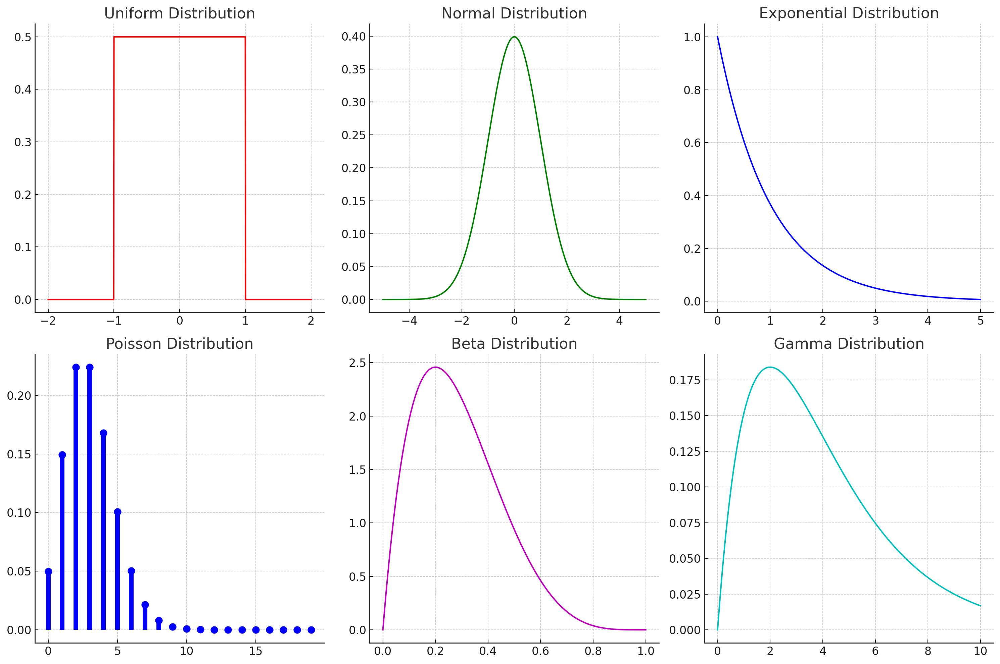
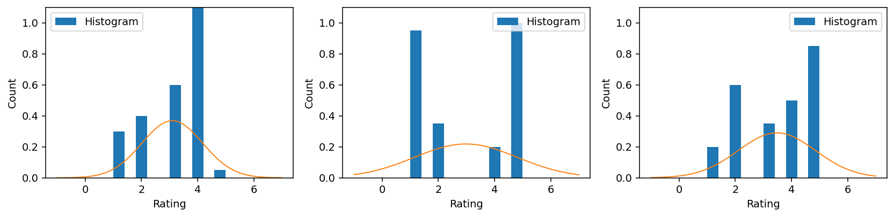

# 连续随机变量
## 连续变量的问题
连续随机变量由概率*密度*函数（PDF）定义，而不是概率*质量*函数（PMF）。PMF 本质上只是一系列值的集合，但 PDF 是将其定义域中的*任何*输入映射到概率的函数。
这看起来是一个微妙的区别（随着 PMF 的“区间”越来越多，它越来越接近 PDF，对吗？），但它带来了许多复杂性。

* 任何特定值的概率都是 $P(X=x)=0$：对于每个可能的 $x$ 都是*零*，但分布函数的*支持集*（PDF 不为零的任何地方）中的任何值都是可能的。

* 无法像对 PMF 那样直接从 PDF 中抽样。但有几种技巧可以从连续分布中抽样。
* 我们无法像对经验分布那样仅通过观察次数来估计真实 PDF。这永远无法“填满”PDF，因为它只适用于具有零“宽度”的单个值。

* 贝叶斯定理易于应用于离散问题。但我们如何使用贝叶斯定理对连续 PDF 进行计算？

* 简单的离散分布没有维度的概念。但我们可以在 $\real$ 中或在向量空间 $\real^n$ 中有连续值，代表随机变量取向量值的概率，甚至是其他泛化（矩阵、复数或四元数等其他领域，甚至更复杂的结构如黎曼流形）上的分布。


# 概率分布函数
随机变量 $X$ 的 PDF $f_X(x)$ 将一个值 $x$（可能是一个实数、向量或任何其他连续值）映射到一个数字，即该点的密度。它是一个函数（假设是实向量上的分布）$\real^n \rightarrow \real^+$，其中 $\real^+$ 是正实数，且 $\int_x f_X(x)=1$

* 虽然 PMF 的结果的概率最多为 1，但 PDF 的最大值不是 $f_X(x) \leq 1$ ——*只是 PDF 的积分为 1。*

PDF 在任何点的值**不是**概率，因为连续随机变量取任何特定数字的概率必须为零。相反，我们可以说连续随机变量 $X$ 落在区间 $(a,b)$ 内的概率是：

$$P(X \in (a,b)) = (a < X < b)  = \int_a^b f_X(x)$$

#### 支持集
PDF 的**支持集**是其映射的非零密度的域。

$$\text{supp}(x) = x\  \text{使得}\  f_X(x) > 0$$

一些 PDF 在固定区间内有密度，并在其他地方密度为零。均匀分布就是这样，它在固定范围内密度恒定，并且在其他地方为零。这被称为**紧凑支持**。我们知道从这种 PDF 的随机变量中抽样将总是在这个支持范围内给出值。一些 PDF 在无限域上有非零密度。正态分布就是这样。从正态分布中抽样可能会得到*任何*实际值；只是更有可能靠近分布的均值而不是远离。这是**无限支持**。
##### 示例
**无限支持** **紧凑支持** **半无限支持**  
 

### 累积分布函数
实值随机变量的**累积分布函数**（CDF）为

$$F_X(x) = \int_{-\infty}^x f_X(x) = P(X \leq x)$$

与 PDF 不同，CDF 总是将 $x$ 映射到 [0,1] 的值域中。对于任何给定的值 $F_X(x)$ 告诉我们小于或等于 $x$ 的概率质量有多少。给定一个 CDF，我们现在可以回答问题，比如：随机变量 X 取 3.0 到 4.0 之间的值的概率是多少？

$$P(3 \leq X \leq 4) = F_X(4) - F_X(3)$$

这*是*一个概率。有时使用 CDF 而不是 PDF 进行计算更方便或有效。

## 概率密度分布

上图展示了六种常见的概率密度分布的图形及其公式和参数解释：
1. **均匀分布 (Uniform Distribution)**：
   - 公式：$f(x) = \frac{1}{b - a} \quad \text{for } a \leq x \leq b$
   - 参数：$a$（最小值），$b$（最大值）
   - The graph shows a uniform distribution with the formula $f(x) = \frac{1}{b - a}$ for $a \leq x \leq b$. Parameters: $a$ (minimum value), $b$ (maximum value).

2. **正态分布 (Normal Distribution)**：
   - 公式：$f(x) = \frac{1}{\sigma\sqrt{2\pi}} \exp\left(-\frac{(x - \mu)^2}{2\sigma^2}\right)$
   - 参数：$\mu$（平均值），$\sigma$（标准差）
   - The graph depicts a normal distribution with the formula $f(x) = \frac{1}{\sigma\sqrt{2\pi}} \exp\left(-\frac{(x - \mu)^2}{2\sigma^2}\right)$. Parameters: $\mu$ (mean), $\sigma$ (standard deviation).

3. **指数分布 (Exponential Distribution)**：
   - 公式：$f(x) = \lambda e^{-\lambda x} \quad \text{for } x \geq 0$
   - 参数：$\lambda$（率参数）
   - The exponential distribution graph illustrates the formula $f(x) = \lambda e^{-\lambda x}$ for $x \geq 0$. Parameter: $\lambda$ (rate parameter).

4. **泊松分布 (Poisson Distribution)**：
   - 公式：$f(x) = \frac{\lambda^x e^{-\lambda}}{x!} \quad \text{for } x = 0, 1, 2, \ldots$
   - 参数：$\lambda$（事件发生的平均次数）
   - The Poisson distribution graph is described by the formula $f(x) = \frac{\lambda^x e^{-\lambda}}{x!}$ for $x = 0, 1, 2, \ldots$. Parameter: $\lambda$ (average number of events).

5. **贝塔分布 (Beta Distribution)**：
   - 公式：$f(x) = \frac{x^{\alpha - 1}(1 - x)^{\beta - 1}}{B(\alpha, \beta)} \quad \text{for } 0 \leq x \leq 1$
   - 参数：$\alpha$ 和 $\beta$（形状参数）
   - The beta distribution is defined with the formula $f(x) = \frac{x^{\alpha - 1}(1 - x)^{\beta - 1}}{B(\alpha, \beta)}$ for $0 \leq x \leq 1$. Parameters: $\alpha$ and $\beta$ (shape parameters).

6. **伽马分布 (Gamma Distribution)**：
   - 公式：$f(x) = \frac{1}{\Gamma(k)\theta^k} x^{k - 1} e^{-x/\theta} \quad \text{for } x > 0$
   - 参数：$k$（形状参数），$\theta$（尺度参数）
   - The gamma distribution graph uses the formula $f(x) = \frac{1}{\Gamma(k)\theta^k} x^{k - 1} e^{-x/\theta}$ for $x > 0$. Parameters: $k$ (shape parameter), $\theta$ (scale parameter).

## PDF 示例：正态分布
所有连续 PDF 中最普遍的是**正态**或**高斯**分布。它将概率分配给实数值 $x \in {\mathbb{R}}$（换句话说，由所有实数组成的样本空间）。它的密度由 PDF 给出：

$$f_X(x) = \frac{1}{Z}\, e^{-\frac{(x - \mu)^2}{2 \sigma^2}}$$

您不需要记住这个公式，但了解其本质上只是 $e^{-x^2}$ 加上一些缩放因子以标准化它是很有用的 —— 这被称为**平方指数函数**。

**旁注：** $Z = \sqrt{2\pi\sigma^2}$，但您不需要记住这一点。


我们使用简写符号来表示连续随机变量的分布，$\text{variable}  \sim \text{distribution}(\text{parameters})$，其中 $\sim$ 读作“按照分布”。对于正态分布，这是：

$$X \sim \mathcal{N}(\mu, \sigma^2),$$ 

读作 

>“随机变量 X 按照 [N]ormal 分布，均值为 $\mu$，方差为 $\sigma^2$”

这意味着 $X$ 的密度函数由具有特定参数 $\mu$ 和 $\sigma^2$ 的正态密度函数类定义；$f_X(x) = \frac{1}{Z}\, e^{-\frac{(x - \mu)^2}{2 \sigma^2}}.$

还有其他符号用于其他连续分布，包括 $\Gamma(\alpha, \beta), \beta(\alpha, \beta), \mathcal{t}(\nu), \chi^2(k), \dots$，在这个课程中我们不会涉及。如果您想了解更多，请查阅参考资料。

### 位置和规模
正态分布将最高密度点放在其中心 $\mu$（“均值”）处，以 $\sigma^2$（“方差”）定义的扩散。这可以被认为是密度函数的**位置**和**规模**。大多数标准的连续随机变量 PDF 都有位置（密度集中的地方）和规模（密度的分布范围）。

#### 正态模型 Normal model
这似乎是一个非常有局限性的选择，但有两个很好的理由使它在许多情况下都能很好地用作模型：
1. 正态变量具有很好的数学特性，易于分析处理（即无需依赖数值计算）。
2. 中心极限定理*告诉我们，随着求和变量数量的增加，任何随机变量之和（无论它们如何分布）都将趋向于*列维稳定分布*。对于大多数随机变量来说，这意味着正态分布（一种特定的列维稳定分布）。

### 中心极限定理 Central limit theorem
如果我们将 $Y = X_1 + X_2 + X_3 + \dots,$$组成许多随机变量的和，那么对于 $X_1,X_2,\dots$中的每个变量可能具有的几乎任何PDF，$Y$的PDF都将是近似正态的，即 $Y \sim \mathcal{N}(\mu, \sigma^2)$。这意味着，任何涉及许多随机成分混合物的过程，在各种条件下都将趋于高斯。

## 多元分布：在 $\real^n$ 上的分布
连续分布将离散变量（概率质量函数）（例如在 $\mathbb{Z}$ 上）概括为通过概率密度函数在 $\real$ 上的连续空间。

概率密度可以进一步推广到向量空间，特别是到 $\real^n$。这扩展了 PDF 以在整个向量空间内分配概率，同时受到（多维积分）的约束 $$\int_{\mathbf{x}\in\real^n} f_X (\mathbf{x}) =1。$$
这与下面的表达式相同：

$$\int_{x_0=-\infty}^{x_0=\infty} \int_{x_1=-\infty}^{x_1=\infty} \dots 
\int_{x_n=-\infty}^{x_n=\infty} f_X ([x_0, x_1, \dots, x_n])\, dx_0 dx_1 \dots dx_n = 1。$$ 

在向量空间上具有 PDF 的分布称为**多元分布**（这个名字并不是很好；向量分布可能更清晰）。在许多方面，它们的工作方式与**单变量**连续分布相同。然而，它们通常需要更多参数来指定其形式，因为它们可以在更多维度上变化。

### 多元均匀分布
多元均匀分布特别容易理解。它在向量空间 $\real^n$ 的某个（轴对齐的）盒子内分配相等的密度 $f_X(x_i) = f_X(x_j)$，使得 
$$\int_\mathbf{x} f_X(\mathbf{x})=1, \mathbf{x} \in \text{a box}。$$ 

从中抽样非常简单；我们只需从范围 [0,1] 的一维均匀分布中*独立*抽样，以获得我们向量样本的每个元素。这是从单位盒子内的 n 维均匀分布中抽取的。

## 正态分布
正态分布（如上所述）被广泛用作连续随机变量的分布。它可以为*任何维度*的随机变量定义；在统计术语中称为**多元正态**。在第5单元中，我们看到了**均值向量** $\mathbf{\mu}$ 和**协方差矩阵** $\Sigma$ 的概念，这些概念以椭圆的形式捕捉了数据集的“形状”。*这些实际上是多元正态分布的参数化。*

多元正态分布完全由均值向量 $\mathbf{\mu}$ 和协方差矩阵 $\Sigma$ 指定。如果你将正态分布想象成空间中的球形质量，均值*平移*质量，协方差应用变换矩阵（缩放、旋转和剪切）于球体。

就像均匀分布一样，我们可以想象从具有每个维度独立正态分布的“单位球”中抽取样本。这些样本由协方差矩阵 $\Sigma$ 和均值向量 $\mu$ 线性变换，就像上面的 $A$ 和 $b$ 一样（尽管 $\Sigma$ 实际上是 $A^-\frac{1}{2}$ 出于技术原因）

### 联合和边际分布
现在我们可以讨论**联合概率密度函数**（在所有维度上的密度）和**边际概率密度函数**（在某些维度的子集上的密度）。

例如，考虑 $X \sim N(\mathbf{\mu}, \Sigma), X \in \real^2$，一个二维（“双变量”）正态分布。我们可以看一些 PDF 的例子，展示：

* 联合 $P(\mathbf{X})$
* 边际 $P(X_1$) 和 $P(X_2)$
* 条件概率 $P(X_1|X_2)$ 和 $P(X_2|X_1)$  


<br>

###  期望计算
例如，计算随机变量函数的期望对于连续随机变量来说通常很难。积分：

$$\mathbb{E}[g(X)] = \int_x f_X(x) g(x)\ dx$$

可能是不可解的。然而，计算任何可能的 $x$ 的 $g(x)$ 通常非常容易。如果我们能够以某种方式从分布 $P(X=x)$ 中抽样，那么我们可以非常容易地近似这个值：
<div class="alert alert-box alert-success">
    
$$\mathbb{E}[g(X)] = \int_x f_X(x) g(x)\ dx \approx \frac{1}{N} \sum_{i=1}^N g(x_i)\ ,$$ 
</div>

其中 $x_i$ 是从 $P(X=x)$ 中随机抽样得到的，由 PDF $f_X(x)$ 定义。随着 $N$ 的增大，这个近似值会变得更好。

## 三种方法

我们将看到三种不同的推断方法：

* **直接估计**参数，其中我们定义*观察的函数*，直接估计分布参数的值。这需要我们假设控制神秘实体的分布的形式。这种方法非常高效，但只适用于非常特定类型的模型。我们需要为我们想要估计的每个特定分布有*估计函数*，这些函数将观察映射到参数估计。

* **最大似然估计**参数，其中我们使用**优化**来找到使观察结果看起来尽可能可能的参数设置。我们可以将其视为调整某个预定义模型的参数，直到它们与我们拥有的观察结果“最佳对齐”。这需要一个迭代优化过程，但它适用于任何已知似然函数（即我们可以计算观察结果被该模型生成的可能性）的模型。

* **贝叶斯、概率**方法明确地使用概率分布对神秘实体的行为进行编码。在贝叶斯模型中，我们假设参数本身的分布，并将*参数视为随机变量*。我们对这些参数有一个初始假设（“先验”），我们使用观察结果更新这一信念，以将我们对参数的估计调整到更紧密（希望如此）的分布（“后验”）。与其他方法不同，我们不估计单个“参数设置”，而是总是有一个随观察数据变化的可能参数的分布。这种方法更加健壮，可以说是更加连贯的推断方式，但它更难表示和计算。我们需要参数的**先验**，以及一个**似然函数**，告诉我们数据在特定参数设置下被生成的可能性。

### 估计器
与离散分布不同，离散分布的 PMF 可以通过使用经验分布直接从观察中估计（就像我们对《罗密欧与朱丽叶》所做的那样），但对于连续分布并没有类似的直接程序。

对于许多连续分布，统计学家已经开发出**估计器**；这些函数可以应用于观察集合，以估计定义可能生成这些观察的分布的概率密度函数的最可能参数。

必须提前决定分布的**形式**（例如，假设数据由近似正态分布生成）；这通常称为**模型**。然后可以在这个模型的假设下计算特定参数。
# 直接估计

进行推断的一种方法是，如果我们假设分布的特定*形式*（例如假设它是正态的），使用**估计器**来估计这种人群分布的**参数**（例如均值和方差）。这些**估计器**是通过我们可以应用于数据的汇总函数——**统计量**来计算的。*这些估计器需要为每个特定类型的问题特别推导。*

例如，一组观察样本的算术平均值和标准偏差是**统计量**，它们是 $\mu$ 和 $\sigma$ 正态分布的**估计器**。如果我们有（被认为已经）从正态分布中抽取的观察结果，我们可以仅通过计算均值和标准偏差来估计该分布的参数 $\mu$ 和 $\sigma$。

换句话说，我们可能想要知道“真实”的平均应用评分——产生应用评分的分布的**人群均值**。我们假设一个随机过程正在创建这些评分，其操作特性（参数）我们可以从样本中学习。但我们只能通过测量用户实际评价应用的特定子集的一些评分，并计算结果的统计量——**样本均值**，来观察有限的样本评分。


*图片：直接估计使用数据的函数，即统计量，直接估计参数；例如，点云的算术平均值估计人群的均值向量。*

## 标准估计器
### 均值
**算术平均值**是样本值 $x_1, x_2, \dots, x_n$ 的总和除以值的数量：
$$\hat{\mu} = \frac{1}{N} \sum_{i=1}^N x_i$$

### 样本均值
随机变量 $X$ 的总体均值是 $\mu = \mathbb{E}[X]$。事实证明，观察样本的*算术平均值*或**样本均值**（我们用一个*小帽子* $\hat{\mu}$ 表示）是真实总体均值 $\mu$ 的一个好的（脚注：统计学家称之为“无偏”的）估计器。随着样本数量的增加，我们对总体均值 $\mu$ 的估计 $\hat{\mu}$ 会越来越好。

重要的是区分以下观念：
* 总体均值 $\mu$，通常是存在的但不能直接知道。它是随机变量的期望值 $\mathbb{E}[X]$。
* 样本均值 $\hat{\mu}$，只是我们看到的样本的算术平均值（例如，通过 `np.mean(x, axis=0)` 计算得到）。

样本均值是一个**统计量**（观察值的函数），它是总体均值的**估计器**（可能是分布的一个**参数**）。可以对这个估计设定特定的界限；标准误差给出了我们预期样本的算术平均值与总体均值接近程度的度量，尽管其解释并不直接。


均值测量的是数值集合的**中心倾向**。均值向量**将这一概念推广到更高维度。

### 方差和标准偏差
样本方差是序列中每个值与该序列均值的差的平方：

$$\hat{\sigma^2} = \frac{1}{N} \sum_{i=1}^N \left(x_i-\hat{\mu} \right)^2.$$

它是总体方差的估计器，$\mathbb{E}\left[(X-\mathbb{E}[X])^2\right]$

样本标准偏差只是这个值的平方根。

$$\hat{\sigma} = \sqrt{\frac{1}{N} \sum_{i=1}^N \left(x_i-\hat{\mu} \right)^2}$$

方差和标准偏差衡量一组值的**扩散程度**。**协方差矩阵** $\Sigma$ 将这个概念推广到更高维度。

##### 与正态分布的关系
如果我们*假设*我们的数据是由正态分布生成的，那么统计量**均值** $\hat{\mu}$ 和**方差** $\hat{\sigma^2}$ 估计该正态分布的参数 $\mu, \sigma$，$\mathcal{N}(\mu, \sigma)$。即使底层过程不完全是正态的，由于中心极限定理，它可能非常接近正态。即使这不适用，均值和方差仍然是有用的*描述性统计量*。


### 拟合
估计可能产生应用评分的正态分布的参数意味着什么？我们正在**拟合**一个受 PDF 控制的分布到一组观察结果。在我们的离散示例中，我们可以通过计算经验分布（假设我们有足够的样本）来简单地拟合分布。但估计 PDF 需要一些结构，即具有一些参数化的函数空间。

我们可以可视化这一点：


### 从模型中取样
我们可以从拟合分布中抽取样本，并与结果进行比较。它们不会是一个很好的代表，因为我们的数据显然不是正态的。但它们显示了我们驯服的神秘实体所产生的结果，让我们可以评估我们的**建模假设**--即应用程序评分的特征仅为平均值和标准偏差。

# 最大似然估计：通过优化进行估计

如果我们没有现成的估计器来估计我们想要的参数，该怎么办？我们如何进行推断？我们如何将分布参数拟合到观察结果上？

在许多情况下，我们可以计算特定潜在随机分布生成观察结果的**似然**。这就是我们之前看到的**似然**。对于 PDF，值 $x$ 的似然只是 PDF 在 $x$ 处的值：$f_X(x)$。似然是数据的函数，基于某些特定参数的假设。

许多*独立*观察的似然是各个似然的乘积，对数似然是各个对数似然的总和。

$$\log \mathcal{L}(x_1, \dots, x_n) = \sum_i \log f_X(x_i)$$

想象一下，我们有一个我们*不知道*参数的**估计器**的分布。如果有一些数据，我们该如何估计它们可能是什么？我们可以将所有参数写成向量 $\theta$；例如，正态分布将有 $\theta = [\mu, \sigma]$。


*图片：最大似然估计使用优化来最大化数据的似然函数，并找到给定数据的参数的最优值。它不需要特殊的估计器函数；只需要一个似然。*

## 优化解决所有问题
尽管我们没有固定的、闭合形式的函数来估计参数，但有了似然函数，我们可以应用优化来计算在此参数设置下我们*实际*观察到的数据最有可能的情况。这相当于在我们的“神秘实体”机器上转动旋钮，直到我们找到一个在我们向其输入样本时输出最大似然值的设置。

如果似然取决于分布的某些参数 $\theta$，那么我们写作：

$$\mathcal{L}(\theta | x)$$
然后，我们可以定义一个**目标函数**；最大化对数似然，或等价地最小化负对数似然。

$$\theta^* = \arg\min_{\theta} L(\theta)$$
$$L(\theta) = -\log \mathcal{L}(\theta | x_1, \dots, x_n) = -\sum_i \log f_X(x_i;\theta) , $$

假设我们的 $f_X(x_i)$ 可以写作 $f(x;\theta)$ 来表示在给定 $\theta$ 的特定参数选择下 $f$ 的 PDF。

### 最大似然估计
这与我们之前看到的近似目标函数 $\|f(\mathbf{x};\theta)-y\|$ 非常相似，但我们有 $y=0$ 并且 $f$ 只有标量输出，所以不需要范数。我们已经知道如何解决这种问题；只需优化。这被称为**最大似然估计**，是确定给定一些观察结果的分布参数的一般技术。它将找到解释观察结果如何产生的参数的**最佳**设置。

如果我们幸运的话，这将是可微的，我们可以使用梯度下降（或随机梯度下降——注意目标函数是简单子目标函数的总和）。如果我们不幸，我们可以退回到效率较低的优化器。在这种情况下，我们不需要特殊的估计器，只要我们能够评估任何参数设置 $\theta$ 下的 PDF $f(x;\theta)$。*这适用于更广泛的概率分布类别。*

### 使用 MLE 拟合正态分布

例如，我们可以考虑从一组（假设是独立的）样本中估计正态分布的均值和方差的问题，而*不使用*估计器；比如我们的应用评分。为此，我们需要能够计算任何给定样本的似然，并取所有这些样本的乘积（或者更确切地说是对数似然的总和）。

这给了我们目标函数。如果我们改变符号，使之最小化负对数似然，我们将寻找使数据最有可能的参数向量。

对于单变量正态分布，参数只是 $\mu$ 和 $\sigma$，所以 $\theta=[\mu, \sigma]$。

在这种情况下，当然，我们*确实*有估计器；但即使我们只有似然函数，这个程序也同样有效。

### 混合模型

但如果我们的模型比单纯的正态分布更复杂呢？我们可以想象以某种其他方式建模，也许能够捕捉到应用 B 似乎在两侧都有“峰值”的事实。一个非常简单的模型是**高斯混合**，我们只是说我们期望我们试图拟合的分布的 PDF 是 $N$ 个不同正态分布（“成分”）$\mathcal{N_i}(\mu_i, \sigma_i)$ 的加权组合（凸和），每个都有自己的 $\mu_i, \sigma_i$，以及表示这个“成分”重要性的权重因子 $\lambda_i$，其中 $\sum_i \lambda_i=1$。这使我们能够表示“多峰”的分布。

这个模型让我们想象评分可能属于一个“簇”或另一个。每个簇的位置和大小由该成分的 $\mu_i$ 和 $\sigma_i$ 给出，$\lambda_i$ 给出数据落入该簇的可能性。

我们可以轻松地绘制这个函数的 PDF；它只是：

$$f_X(x) = \sum_i \lambda_i n_X(x; \mu_i, \sigma_i),$$ 

其中 

$$n_X(x; \mu,\sigma) = \frac{1}{Z} e^{\frac{(x-\mu_i)^2}{2\sigma^2}}$$

是标准正态 PDF 函数。


### 拟合混合模型
这是对我们应用评分更为合理的模型，并可能是一个更好的模型。但我们如何拟合它？即使我们提前固定 $N$，我们肯定没有任何直接的估计器可以估计正态 PDF 和的均值、标准偏差（和权重）。这不是我们知道如何做的事情。

**但是**，（对数）似然在代码中写起来很简单。对于每个观察值 $x$，我们只需计算每个成分的加权 PDF 之和，结果就是该观察值的似然。这是数据的函数 $\mathcal{L}(\theta|x)$，我们的参数向量是 $\theta = [\mu_1, \sigma_1, \lambda_1, \mu_2, \sigma_2, \lambda_2, \dots]$。


# 贝叶斯推断

贝叶斯推断涉及到以一种截然不同的方式思考问题。贝叶斯人将他们正在估计的分布的*参数*视为*本身*是随机变量，具有自己的分布。

先验分布定义在这些参数上（例如，我们可能相信平均应用评分可以以相同的概率取任何值 1.0-5.0），随着更新到来的证据被贝叶斯规则结合起来，以精炼我们对参数分布的信念。我们再次认为我们的分布由某个参数向量 $\theta$ 描述，我们想要精炼一个关于可能的 $\theta$ 的分布。

我们不考虑估计器或它们的抽样分布，谈论找到最佳参数设置是没有意义的；我们只能对参数设置有*信念*，这必须以概率方式表示。我们不寻求找到最有可能的参数设置（如在直接估计或 MLE 中），而是推断一个与数据*兼容*的可能参数设置的分布。

我们谈论的是在给定一些**先验**信念和一些**证据**的情况下，推断参数的**后验**分布。我们假设我们有一个**似然函数** $P(D|\theta)$ 和一个关于参数的先验 $P(\theta)$，然后我们可以使用贝叶斯规则：

$$
P(\theta|D) = \frac{P(D|\theta) P(\theta)}{P(D)}
$$

这给了我们一个关于 $\theta$ 的新分布，给定一些观察结果。贝叶斯规则同样适用于连续分布和离散分布，但在“闭合形式”（即代数上）中的计算要困难得多。


在某些情况下，可以用闭合形式找到 $P(\theta|D)$，但代数通常很复杂，模型选择有限；我们不会讨论如何做到这一点。然而，当这是可能的，它更具计算效率。相反，我们将从计算角度出发，找到一种从后验分布 $P(\theta|D)$ 中抽取*样本*的方法。

## 示例
记住，我们假设应用评分是由这个函数生成的：  
`return np.random.normal(mu, sigma)`  

我们想要*推断*关于 $\mu$ 和 $\sigma$ 的分布（**不是**关于观察结果的分布！）。也就是说，我们将把参数本身视为具有自己分布的随机变量，并使用贝叶斯推理（即应用贝叶斯规则）在给定一些先验和一些观察到的证据的情况下推断参数的后验分布。

### 参数和样本
我们有一组观察结果 $D=x_1, x_2, \dots$，代表实际的应用评分。我们不确定这些评分真正告诉我们关于未见潜在用户人群的信息有多少。我们将分布参数表示为 $\theta = [\mu, \sigma]$，并可以讨论 $P(\theta)$，即参数向量上的分布。

### 先验
假设我们对 $\theta$ 有一些先验信念 $P(\theta)$：例如，这可能是一个非常简单的假设，即我们的先验是 $\mu$ 和 $\sigma$ 均匀分布

* $\mu \sim U(1,5)$
* $\sigma \sim U(0, 10)$

这给了我们 $P(\theta)$ 的形式。我们可以编写代码中从这个分布中抽样的方法，以及评估任何给定参数设置的先验概率的方法。正如我们稍后将看到的，我们需要这两个函数来进行贝叶斯推断。
```
def sample_prior():
    return [np.random.uniform(1,5), 
            np.random.uniform(0,3)]

def log_prior(theta):
    mu, sigma = theta    
    # p(x) = 1/x if x ~ U(0,x), and 0 otherwise
    return (scipy.stats.uniform(1.0, 4.0).logpdf(mu) + 
            scipy.stats.uniform(0.0, 3.0).logpdf(sigma))
    
```
### 似然
我们需要能够定义一个**似然函数**。这是一个给定某些参数设置的数据函数，在这种情况下，它与用于最大似然估计的似然函数相同：一个样本的似然只是在该点评估的正态 PDF，所有样本的似然是这些似然的乘积。

```
def log_likelihood(samples, theta):
    # for a *known* mu, theta
    # compute the log PDF at each sample, and sum them
    return np.sum(scipy.stats.norm(theta[0], 
                                   theta[1]).logpdf(samples))    
```
## 推断

我们如何计算后验分布 $P(\theta|D)$？我们不会讨论如何以闭合形式（作为一个函数）找到这个——有时这是可能的，但在数学上涉及到复杂性，因为我们需要处理关于 $\theta$ 的分布——而是讨论如何在给定先验、似然和一些观察结果的情况下从这个后验中抽取样本。

关于如何解决这个问题有大量文献，其中有一些棘手的部分：
* $P(D|\theta)$ 需要为关于 $\theta$ 的**分布**计算，而不仅仅是一些数字。仅仅计算一个特定 $\theta$ 的概率是不够的；我们必须处理分布函数。
* $P(D) = \int_\theta P(D|\theta)P(\theta)$ 可能是难以解决的。

### 使其可解决

有许多方法可以简化这个问题，使其可解决。我们将使用两种：

#### 样本就够了
我们通常无法计算 $P(\theta|D)$，因为我们不知道如何对函数的乘积进行操作。但对于*具体的、具体的* $\theta$ 值来说，这通常是微不足道的。例如，对于一个给定的固定 $\theta$，我们可以计算那个特定示例的似然和先验。

这让我们想到了从后验分布 $P(\theta|D)$ **抽取样本**的想法，而不是试图精确计算分布。

#### 仅关注相对概率
我们可以做一个简化的假设：我们只关心具有我们实际拥有的数据 $D$ 的不同参数设置的*相对*概率。即我们有

$$P(\theta|D) \propto P(D|\theta)P(\theta)$$

并忽略这是由某个未知常数 $Z=\frac{1}{P(D)}$ 缩放的后验事实。这只有在我们在这个例子中只考虑一个模型和一组数据的情况下才有意义。

# 马尔可夫链蒙特卡洛
我们可以通过对*模拟退火*算法进行非常简单的修改，实现从（相对）后验分布中抽样的程序。

这定义了一种通过参数设置空间的随机游走，提出对参数设置的小的随机调整，并在使估计更有可能的情况下接受“跳跃”，或者如果不是，则按照 $P(D|\theta)P(\theta)$ 变化的比例接受。这种方法的优点是我们可以使用来自 $\theta$ 的*确定样本*，我们不必进行任何复杂的积分。这种方法称为**马尔可夫链蒙特卡洛**

我们所需的只是评估 $P(\theta)$（先验）和 $P(D|\theta)$（似然）的方法，对于任何特定的 $\theta$。

## 实践中的 MCMC：抽样问题

我们将使用马尔可夫链蒙特卡洛来解决贝叶斯推断问题。MCMC 方法的**伟大之处**在于，你基本上可以直接写下模型然后直接进行推断。无需推导复杂的近似，也不必限制我们自己只使用可以解析计算答案的有限模型。本质上，无需手工计算；一切都是算法完成的。

MCMC 允许我们从任何我们无法直接抽样的分布 $P(X=x)$ 中抽取样本。特别是，我们将能够从参数的后验分布中抽样。

MCMC 方法的**坏处**在于，即使它*渐近地*会做出“正确的事情”，但对于实际执行的样本运行来说，抽样策略的选择有很大的影响。贝叶斯推断应该只依赖于先验和观察到的证据；但 MCMC 方法还取决于用于近似后验的抽样策略。

### 我们从哪个分布中抽样？
在贝叶斯推断的情况下，$P(\theta|D) = \frac{P(D|\theta)P(\theta)}{P(D)} = \frac{P(D|\theta)P(\theta)}{\int_\theta P(D|\theta)P(\theta)}$。
* $P(\theta|D)$ 是后验，即在数据（观察结果）$D$ 给定的情况下，参数 $\theta$ 的分布，使用：
* 似然 $P(D|\theta)$，
* 先验 $P(\theta)$ 和
* 证据 $P(D)$。

换句话说，观察结果和先验给定的情况下，参数的分布是什么？如果我们假设，如上所述，我们不关心 $P(D)$，因为我们只比较 $\theta$ 的不同可能值，那么我们可以从与 $P(D|\theta)P(\theta)$ 成比例的分布中抽样。

### Metropolis-Hastings
Metropolis-Hastings（或者简称 Metropolis）是一种非常优雅且相对有效的实现 MCMC 算法的方法，并且能够在高维空间中工作（即当 $\theta$ 复杂时）。

Metropolis 抽样使用一个简单的辅助分布，称为**提议分布** $Q(\theta^\prime|\theta)$，来帮助从难以处理的后验分布 $P(\theta|D)$ 中抽样。这类似于我们在优化部分称之为**邻域函数**的东西。

Metropolis-Hastings 使用这个来**漫游**分布空间，在使用 $Q(\theta^\prime|\theta)$ 随机抽样 $P(\theta|D)$ 空间的位置时，接受跳跃到新位置。这个随机游走（一个**马尔可夫链**，因为我们做出的随机跳跃只取决于我们当前的位置）是“马尔可夫链蒙特卡洛”的“马尔可夫链”部分。

这就像模拟退火算法，只是现在有一个函数 $f_X(\theta)$ 使某些步骤比其他步骤更有可能，而不是似然函数。我们只需取当前位置 $\theta$，并提出一个新位置 $\theta^\prime$，即从 $Q(\theta^\prime|\theta)$ 中随机抽取的样本。通常这是一些非常简单的东西，比如以 $x$ 为均值、某个预设的 $\sigma$ 为正态分布：$Q(\theta^\prime|\theta) = \mathcal{N}(\theta, \sigma^\prime)$

We can show a simple demo of this, drawing samples from a tricky 2D probability distribution.


## 轨迹
MCMC 过程接受的样本历史被称为**轨迹**。例如，我们可以通过查看**轨迹**的直方图来估计模型参数。轨迹是样本序列 $[x^{(1)}, x^{(2)}, x^{(3)}, \dots x^{(n)}]$，通过 MCMC（大致）从**后验**分布 $P(\theta|D)$ 中抽取。

### 应用 MCMC
让我们将这个应用到我们的应用评分问题上。我们想要估计参数 $\mu$ 和 $\sigma$ 的分布，给定一些观察（证据/数据）$x_1, x_2, x_3, \dots$，假设这些观察来自我们认为是 $\mathcal{N}(\mu, \sigma)$ 的分布。

我们已经有了一个先验函数 `prior_pdf` 和一个似然函数 `likelihood`。所以我们可以使用与上面相同的程序来做这个，但这次从先验中随机抽取的各种随机初始条件开始随机过程，以确保我们不会卡在空间中的某个不好的部分。

## 预测后验：从模型中抽样
我们所绘制的是**模型参数的后验分布的样本**；即我们期望模型参数在观察到的数据和我们的先验下所呈现的值。  


**预测后验**是我们预期看到的*观察结果的分布*；对未来样本的预测。这意味着从模型中抽取样本，同时在参数的后验分布上进行整合。通过从预测后验中抽样，我们正在生成新的合成数据，如果我们的模型是好的，这些数据应该具有与数据相同的统计特性。

我们可以通过一个两步骤的嵌套过程来做到这一点：

* 对于 $n$ 次重复
    * 从我们的参数后验分布中抽取样本，以给出一个具体的分布
    * 对于 $m$ 次重复
        * 从这个具体的分布中抽取样本


