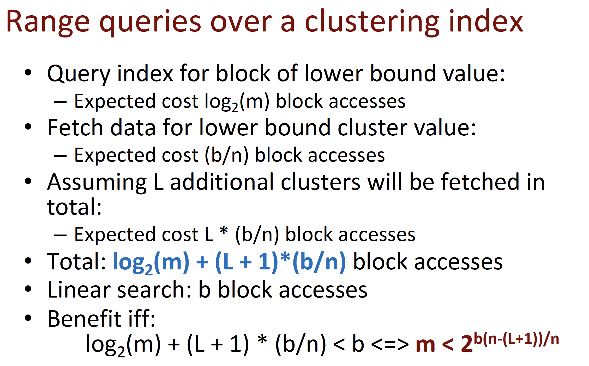

## DataBase
## 结构分析
1. **B树 (B-tree)**
   - **插入**: 平均和最坏情况下的时间复杂度都是 $O(\log n)$。
   - **Insertion**: The average and worst-case time complexities are both $O(\log n)$.
   - **检索**: 平均和最坏情况下的时间复杂度都是 $O(\log n)$。
   - **Search**: The average and worst-case time complexities are both $O(\log n)$.
   - **删除**: 平均和最坏情况下的时间复杂度都是 $O(\log n)$。
   - **Deletion**: The average and worst-case time complexities are both $O(\log n)$.
   - **优点**  - **Advantages**: 
     - 保持数据平衡。
     - Maintains data balance.
     - 对于范围查询非常有效。
     - Very effective for range queries.
     - 可以有效地处理大量数据的插入和删除。
     - Can efficiently handle large data insertions and deletions.
   - **缺点**  - **Disadvantages**: 
     - 相比哈希表，在某些情况下检索速度稍慢。
     - Slower search speed than hash tables in some cases.
     - 实现复杂。
     - Complex implementation.

2. **顺序排序 (Sequential)**
   - **插入**: 平均时间复杂度是 $O(n)$，最坏情况是 $O(n)$。
   - **Insertion**: The average time complexity is $O(n)$, and the worst case is $O(n)$.
   - **检索**: 平均时间复杂度是 $O(\log n)$（使用二分查找），最坏情况是 $O(n)$。
   - **Search**: The average time complexity is $O(\log n)$ (using binary search), and the worst case is $O(n)$.
   - **删除**: 平均时间复杂度是 $O(n)$，最坏情况是 $O(n)$。
   - **Deletion**: The average time complexity is $O(n)$, and the worst case is $O(n)$.
   - **优点** - **Advantages**: 
     - 检索非常高效，特别是使用二分查找。
     - Very efficient search, especially using binary search.
     - 简单易于实现。
     - Simple and easy to implement.
   - **缺点**   - **Disadvantages** : 
     - 插入和删除效率低，因为可能需要移动大量元素。
     - Low efficiency in insertion and deletion due to the potential need to move many elements.
     - 不适合频繁变动的数据集。
     - Not suitable for frequently changing datasets.

3. **哈希排序 (Hashing)**
   - **插入**: 平均时间复杂度是 $O(1)$，最坏情况是 $O(n)$（在哈希冲突严重时）。
   - **Insertion**: The average time complexity is $O(1)$, and the worst case is $O(n)$ (in cases of severe hash collisions).
   - **检索**: 平均时间复杂度是 $O(1)$，最坏情况是 $O(n)$。
   - **Search**: The average time complexity is $O(1)$, and the worst case is $O(n)$.
   - **删除**: 平均时间复杂度是 $O(1)$，最坏情况是 $O(n)$。
   - **Deletion**: The average time complexity is $O(1)$, and the worst case is $O(n)$.
   - **优点**- **Advantages**: 
     - 在没有冲突的情况下，提供快速的插入、检索和删除。
     - Provides fast insertion, search, and deletion when there are no conflicts.
     - 实现相对简单。
     - Relatively simple to implement.
   - **缺点**- **Disadvantages**:
     - 哈希冲突处理可能复杂。
     - Hash collision handling can be complex.
     - 不适合范围查询。
     - Not suitable for range queries.
     - 数据分布不均匀时性能下降。
     - Performance decreases when data distribution is uneven.
## 原理  
1. **B树 (B-tree)**
   - **实现原理**:
     - B树是一种自平衡树，用于存储排序后的数据，以便快速插入、删除和查找操作。
     - **Implementation Principle**:
     - A B-tree is a self-balancing tree structure that maintains sorted data for fast insertion, deletion, and search operations.
     - 它将数据分布在多个节点中，每个节点有多个键和子节点的指针。
     - It distributes data across multiple nodes, each holding multiple keys and pointers to child nodes.
     - 当数据被插入或删除时，B树会自动重组以保持平衡。
     - When data is inserted or deleted, the B-tree automatically restructures itself to maintain balance.
     - 这种结构特别适合大型数据集的数据库系统。
     - This structure is particularly well-suited for database systems with large datasets.

2. **顺序排序 (Sequential)**
   - **实现原理**:
     - 顺序排序是一种简单的数据存储技术，它将数据按照一定的顺序存储。
     - **Implementation Principle**:
     - Sequential sorting is a basic data storage technique where data is stored in a specific order.
     - 通常情况下，数据被顺序存放在存储介质上，如硬盘。
     - Typically, data is stored sequentially on a storage medium, like a hard drive.
     - 数据检索时，可以使用二分查找等高效算法。
     - For data retrieval, efficient algorithms such as binary search can be used.
     - 适用于数据变动不频繁的场景。
     - Suitable for scenarios where data does not change frequently.

3. **哈希排序 (Hashing)**
   - **实现原理**:
     - 哈希排序是基于哈希表的数据存储技术。
     - **Implementation Principle**:
     - Hashing is a data storage technique based on hash tables.
     - 它使用哈希函数将数据映射到一个固定大小的表中。
     - It uses a hash function to map data to a table of fixed size.
     - 每个数据项根据其键值经过哈希函数计算后存储在表中的特定位置。
     - Each data item is stored at a specific location in the table, calculated by a hash function based on its key value.
     - 在理想情况下，哈希排序可以提供接近常数时间的性能。
     - In ideal cases, hashing can provide near-constant time performance.
     - 但它需要有效地处理哈希冲突。
     - However, it requires efficient handling of hash collisions.

## Index计算
* Primary Index
* 
* Cluster Index
* 
* 
* Secondary Index
* 
* Multilevel Index
* 
* 
  
## 搜索树 Search Tree
1. **二叉搜索树 (Binary Search Trees, BSTs)**
   - **实现原理**:
     - 二叉搜索树是一种具有特定属性的树形数据结构，其中每个节点都有一个键和最多两个子节点。
     - **Implementation Principle**:
     - A Binary Search Tree is a tree-like data structure with specific properties, where each node has a key and at most two children.
     - 它要求左子节点的键值小于其父节点，右子节点的键值大于其父节点。
     - It requires that the left child's key is less than its parent's key, and the right child's key is greater than its parent's key.
     - 这种属性使得二叉搜索树在进行查找、插入和删除操作时非常高效。
     - This property makes binary search trees very efficient in search, insertion, and deletion operations.

   - **优点**:
     - **Advantages**:
     - 在平衡的情况下，查找、插入和删除操作的时间复杂度可以保持在 $O(\log n)$。
     - In balanced situations, the time complexity for search, insertion, and deletion operations can be maintained at $O(\log n)$.
     - 结构简单，易于理解和实现。
     - Simple structure, easy to understand and implement.
     - 比其他平衡树结构（如AVL树、红黑树）实现简单。
     - Simpler to implement than other balanced tree structures, like AVL or Red-Black Trees.

   - **缺点**:
     - **Disadvantages**:
     - 在最坏情况下（如插入的数据已排序），树可能变得非常不平衡，导致操作的时间复杂度退化到 $O(n)$。
     - In the worst case (e.g., inserting already sorted data), the tree can become highly unbalanced, leading to operations degrading to $O(n)$ time complexity.
     - 需要额外的逻辑来维持平衡（例如，在AVL树或红黑树中）。
     - Requires additional logic to maintain balance (as in AVL or Red-Black Trees).
     - 不适合数据频繁更新的场景。
     - Not suitable for scenarios with frequent data updates.

## B Tree
1. **B树 (B Tree)**
   - **实现原理**:
     - B树是一种自平衡的树形数据结构，用于高效地在磁盘等辅助存储设备上存储和检索大量数据。
     - **Implementation Principle**:
     - A B Tree is a self-balancing tree data structure that efficiently stores and retrieves large amounts of data on secondary storage devices like disks.
     - 它是一种多路搜索树，其中每个节点可以有多个子节点和键。
     - It is a multi-way search tree where each node can have multiple children and keys.
     - B树通过保持低树高和平衡的节点来减少访问磁盘的次数。
     - B Trees reduce the number of disk accesses by maintaining low tree heights and balanced nodes.
     - 它动态地调整其结构，以保持数据的排序和树的平衡。
     - It dynamically adjusts its structure to maintain the order of data and balance of the tree.
     - 这使得B树在处理大型数据库和文件系统时非常高效。
     - This makes B Trees very efficient in handling large databases and file systems.

1. **B+树 (B+ Tree)**
   - **关键思想**  - **Key Idea**:
     - B+树是B树的变种，其中所有的数据记录都存储在叶子节点上，并且叶子节点之间是相互链接的，这样便于进行范围查询。
     - A B+ Tree is a variant of B Tree where all data records are stored in the leaf nodes, and the leaf nodes are linked, facilitating range queries.
   - **结构** - **Structure**:
     - 其中内部节点只存储键值，不存储数据，而数据记录则被存储在叶节点中，且叶节点按键值顺序链接。
     - The internal nodes only store keys and not data; the data records are stored in the leaf nodes, which are linked in key order.
   - **优点** - **Advantages**:
     - 由于叶子节点的链式结构，范围查询速度快。
     - Due to the linked structure of leaf nodes, it allows fast range queries.
     - 所有叶子节点都在同一层，保证了查询性能的稳定性。
     - All leaf nodes are at the same level, ensuring consistent search performance.
     - 更少的页分裂操作，因为内部节点不存储实际的数据。
     - Fewer page splits as internal nodes do not store actual data.
   - **缺点** - **Disadvantages**:
     - 插入和删除操作可能导致更多的节点分裂和合并。
     - Insertions and deletions may lead to more node splits and merges.
     - 叶子节点的链接增加了结构的复杂性。
     - The linking of leaf nodes increases structural complexity.

2. **B-树 (B- Tree)**
   - **关键思想** - **Key Idea**:
     - B-树通常指的是标准的B树，是一种平衡树结构，用于数据库和文件系统中的索引和查找。
     - B- Tree typically refers to the standard B Tree, which is a balanced tree structure used for indexing and search in databases and file systems.
   - **结构** - **Structure**:
     - 一个节点可以包含多个键和子节点指针，节点的键将数据分为范围，并指向子节点，这些子节点的键位于这些范围内。
     - A node can contain multiple keys and child node pointers; the keys in a node divide the data into ranges and point to child nodes containing keys within those ranges.
   - **优点**- **Advantages**:
     - 保持数据平衡，所有的叶子节点具有相同的深度。
     - Maintains data balance with all leaf nodes at the same depth.
     - 节点分裂和合并的操作使得树能够在插入和删除时保持平衡。
     - Node splits and merges keep the tree balanced during insertions and deletions.
     - 适用于大型数据库系统，因为可以减少磁盘I/O操作。
     - Suitable for large database systems as it reduces disk I/O operations.
   - **缺点** - **Disadvantages**::
     - 在非叶子节点也存储数据，可能导致数据访问不如B+树那样快。
     - Storing data in non-leaf nodes may lead to slower data access compared to B+ Trees.
     - 不如B+树在进行范围查询时效率高。
     - Not as efficient for range queries as B+ Trees.
## 计算
要计算B树和B+树的阶数 $p$，以确保每个节点都适合一个数据块，我们可以使用给出的值来解决这个问题。在这个例子中，我们有一个块大小 $B = 512$ 字节，键大小 $V = 9$ 字节，数据指针大小 $Pr = 7$ 字节，树指针大小 $P = 6$ 字节。

1. **B+树内部节点**：
   - 节点大小：$p \times P + (p - 1) \times V$
   - 条件：$p \times P + (p - 1) \times V \leq B$
   - 重写条件：$p \leq \frac{B + V}{P + V}$

2. **B+树叶节点**：
   - 节点大小：$p_L \times (Pr + V) + P$
   - 条件：$p_L \times (Pr + V) + P \leq B$
   - 重写条件：$p_L \leq \frac{B - P}{Pr + V}$

3. **B树节点**：
   - 节点大小：$p \times P + (p - 1) \times (V + Pr)$
   - 条件：$p \times P + (p - 1) \times (V + Pr) \leq B$
   - 重写条件：$p \leq \frac{B + V + Pr}{P + V + Pr}$

根据这些条件，我们可以计算出B+树内部节点、B+树叶节点和B树节点的最大阶数 $p$。在具体计算时，我们需要确保结果是整数，并且节点的实际大小不会超过块大小。

## 排序
### 外部排序成本分析
使用排序-合并策略在磁盘访问方面的成本是：
$$(2b) + (2b \cdot \log_M(L))$$

- `b` 是文件块的数量。
- `M` 是合并的度数，即每次合并操作中参与的已排序块的数量。
- `L` 是初始已排序子文件的数量（在进入合并阶段之前）。
注：
- `M = 2` 时算法的性能是最差的情况，因为：
  - 原因：每一步只合并一对块。
- `M > 2`：每一步合并两个以上的块；即多路合并（M-way merging）。

### SELECT语句的策略
进行SQL `SELECT` 语句时可以采用以下策略： Different strategies can be applied when executing a SQL `SELECT` statement:

1. **线性搜索（S1）Linear Search (S1)**：
   - 执行全文件扫描，检查每条记录是否满足选择条件。 Retrieve every record from the file, and test whether it satisfies the selection condition.
   - **前提条件 Precondition**：无 None。
   - **预期成本 Expected Cost**：`b/2`。

2. **二分搜索（S2）Binary Search (S2)**：
   - 当选择条件涉及排序键时使用。 The selection condition involves an ordering key.
   - **前提条件 Precondition**：文件按SSN排序 File sorted by SSN。
   - **预期成本（已排序文件）Expected Cost (sorted file)**：`log2(b)`。
   - **预期成本（未排序文件）Expected Cost (unsorted file)**：`log2(b) + 2b + 2b*logM(L)`。

3. **使用主索引或哈希函数（S3）Use of Primary Index or Hash Function over a key (S3)**：
   - 当选择条件涉及键属性相等时使用。 The selection condition involves an equality on a key attribute with a Primary Index (ISAM) or a hash function.
   - **前提条件 Precondition**：主索引的级别 `t` 覆盖键 Primary Index of level t over the key, i.e., file is ordered by key。
   - **预期成本 Expected Cost**：`t + 1`。

4. **在范围内使用主索引（S4）Use of Primary Index in a Range (S4)**：
   - 选择条件是键属性的范围。 The selection condition is range: `>`, `>=`, `<`, `<=` on a key attribute with a Primary Index (ISAM).
   - **前提条件 Precondition**：主索引的级别 `t` 覆盖键 Primary Index of level t over the key。
   - **预期成本 Expected Cost**：`(t+1) + O(b)`。
   - **注意 Note**: 不要用哈希函数来处理范围查询！ Do not use Hashing for range queries!

5. **使用聚簇索引检索多条记录（S5）Use of Clustering Index to retrieve Multiple Records (S5)**：
   - 选择条件涉及非键属性的相等性。 The selection condition involves an equality on a non-key attribute with a Clustering Index.
   - **前提条件 Precondition**：聚簇索引的级别 `t` 覆盖非键 Clustering Index of level t over the non-key。
   - **预期成本 Expected Cost**：`(t+1) + O(b/c)`。

6. **使用次级索引（B+树）进行相等性检索（S6）Use of Secondary Index (B+ Tree) over Equality (S6)**：
   - 如果索引字段是唯一的，用于检索单条记录。 Retrieve a single record if the indexing field is unique.
   - **前提条件 Precondition**：文件不是按键排序的 File is not ordered by key。
   - **预期成本 Expected Cost**：`t + 1`。
   - 对于非键索引字段，检索多条记录。 Retrieve multiple records if the indexing field is not a key.
   - B+树的叶节点指向唯一块或指向具有相同SALARY的块的指针组。 B+ Leaf Node points at the unique block with MGR_SSN or a group of pointers to blocks with Salary = 40K.

7. **在范围内使用次级索引（B+树）（S7）Use a Secondary Index (B+ Tree) over a Range (S7)**：
   - 如果索引字段涉及范围，则检索多条记录。 Retrieve multiple records if the indexing field is involved in a range.
   - B+树叶节点包含有序索引字段值。 B+ Leaf Nodes contain the indexing field values sorted.
   - **方法 Methodology**：找到第一个叶节点并加载指针集群，沿树的叶节点指针重复操作。 Find the first Leaf Node, load the cluster of pointers, and repeat the same with the next-tree-pointers.
   - **预期成本 Expected Cost**：`t + 1 + O(b*n)`。

### SQL SELECT策略总结
在关系数据库管理系统中，执行SELECT语句可以采用以下策略：
## 析取SELECT（Disjunctive SELECT）
- 析取选择涉及到用OR连接的条件。
- 如果所有属性都有访问路径（如B+树、哈希或主索引），则分别使用每个条件检索记录集，然后对所有集合执行并集操作以获得最终结果。
- 如果没有属性有访问路径，则需要使用线性搜索。

## 合取SELECT（Conjunctive SELECT）
- 合取选择涉及到用AND连接的条件。
- 如果每个属性都有访问路径（索引），则使用它们分别检索满足相应条件的元组集合，例如，对于薪资大于40000的条件。
- 然后遍历这些记录集合，检查哪些记录也满足其他条件。
- 选择使用索引的最佳顺序通常基于选择性估计来进行，这是优化的一部分。

## JOIN策略
- JOIN被认为是最消耗资源的操作。
- 焦点是两路等值连接，即用等号`=`连接两个关系。
- 五种基本的JOIN处理策略：
  - 朴素连接（Naive join，没有访问路径）
  - 嵌套循环连接（Nested-loop join，没有访问路径）
  - 基于索引的嵌套循环连接（Index-based nested-loop join，使用B+树等索引）
  - 合并连接（Merge-join，用于已排序的关系）
  - 散列连接（Hash-join，用于已散列的关系）

### 数据库JOIN策略总结
在数据库系统中执行JOIN操作时可以采用以下五种不同的策略：

#### 朴素连接（Naïve Join）
- 这是一种简单的自然连接策略，不需要任何访问路径。
- 计算R和S的笛卡尔积，然后检查`R.A = S.B`来找到匹配的元组。

#### 嵌套循环连接（Nested-Loop Join）
- 这是一种更高级但仍然不需要访问路径的自然连接策略。
- 对R中的每个元组，遍历S中的元组，检查是否满足连接条件`r.A = s.B`。

#### 基于索引的嵌套循环连接（Index-based Nested-Loop Join）
- 使用索引来加速连接操作。
- 假设`R.A = S.B`，利用索引快速找到S中与R中每个元组相匹配的元组。

#### 排序合并连接（Sort-Merge Join）
- 使用两个有序关系上的合并排序算法来执行连接。
- 如果关系R和S在连接属性上不是预先排序的，那么需要先对它们进行排序。

#### 散列连接（Hash-Join）
- 使用散列函数将关系R和S分区，然后在内存中通过散列桶来快速匹配元组。
- 假设R是较小的文件，可以完全适配内存中的M个桶。

### 数据库JOIN策略及成本预测总结
## 嵌套循环连接（Nested-Loop Join）
- 总成本计算公式：`n_E + n_D * ceil(n_E / (n_B-2))`。
- Nested-Loop Cost (best): `nD + nE * ceil(nD/(nB-2)):`
- 表示对外部关系E的块读取次数和内部关系D的块读取次数。

## 基于索引的嵌套循环连接（Index-based Nested-Loop Join）
- 使用索引来快速匹配连接条件。
- 成本计算公式：`n_E + r_E * (x_D + 1)`，其中`x_D`是索引的层级，`r_E`是关系E中元组的数量。

## 排序合并连接（Sort-Merge Join）
- 如果两个关系已经在连接属性上排序，只需线性扫描各一次，成本为`n_E + n_D`。
- 如果未预先排序，需要外部排序，总成本为`n_E + n_D + 2 * n_E * log2(ceil(n_E / n_B)) + 2 * n_D * log2(ceil(n_D / n_B))`。

## 散列连接（Hash-Join）
- 散列连接的成本分为分区和探测两个阶段。
- 如果小的关系可以适配内存，总成本是`n_E + n_D`。
- 如果小关系不适合内存，总成本为`3 * (n_E + n_D)`。
